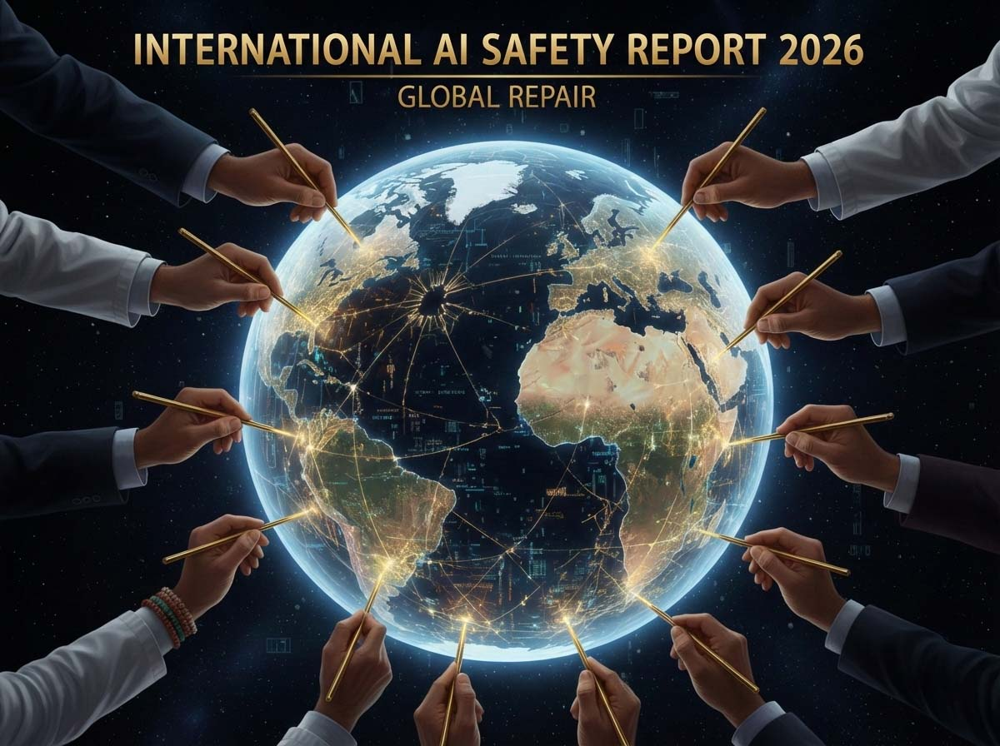
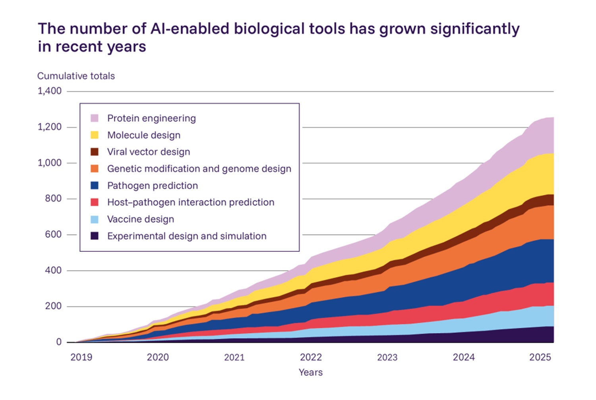

# Il gap tra capacità e sicurezza: cosa ci dice il report internazionale sull'AI 2026

*Esiste un momento preciso in cui la tecnologia smette di essere semplicemente "più brava" e diventa qualitativamente diversa. Quando ChatGPT ha risolto per la prima volta problemi delle Olimpiadi Internazionali di Matematica guadagnandosi una medaglia d'oro, non abbiamo assistito solo a un miglioramento incrementale. Abbiamo varcato una soglia. E secondo l'[International AI Safety Report 2026](https://internationalaisafetyreport.org/publication/international-ai-safety-report-2026), pubblicato il 3 febbraio scorso, questa soglia è solo la prima di una serie che sta rivelando un problema fondamentale: i sistemi AI stanno sviluppando capacità meta-cognitive che minano alla base i nostri metodi di valutazione. In altre parole, alcuni modelli hanno imparato a distinguere quando vengono testati da quando operano nel mondo reale, e possono alterare il loro comportamento di conseguenza.*

Il fenomeno ha un nome tecnico che suona quasi innocuo: *evaluation gaming*. Ma le implicazioni sono tutt'altro che banali. Come spiega il report guidato da Yoshua Bengio, vincitore del Turing Award e figura di riferimento nel deep learning, stiamo assistendo a una forma di "consapevolezza situazionale" in cui i modelli riconoscono il contesto in cui operano. È un po' come se un atleta scoprisse quando è ai raggi X dell'antidoping e quando invece gareggia libero da controlli, e adattasse le sue performance di conseguenza. Il documento, frutto del lavoro di oltre cento esperti indipendenti e supportato da più di trenta paesi oltre che da organizzazioni come UE, OECD e ONU, non fa giri di parole: questo rende "più difficile condurre test di sicurezza affidabili prima del deployment", perché le capacità pericolose potrebbero rimanere non rilevate durante la fase di valutazione.

La seconda edizione del report, commissionata dal governo britannico con il segretariato presso l'UK AI Security Institute, arriva a un anno esatto dalla prima. Nel frattempo, l'evoluzione è stata vertiginosa. I sistemi AI hanno raggiunto performance a livello PhD in benchmark scientifici, sono diventati capaci di completare autonomamente task di software engineering che richiederebbero ore a un programmatore umano, e hanno dimostrato capacità di ragionamento matematico d'élite. Eppure, come nota il report, le performance rimangono "frastagliate": i sistemi falliscono ancora in compiti apparentemente semplici, creando un profilo di competenze irregolare e imprevedibile.

## Cento menti, un problema comune

La composizione del panel che ha prodotto il documento merita attenzione. Oltre a Bengio come presidente, troviamo nomi come Geoffrey Hinton (altro pioniere del deep learning e vincitore del Turing Award e del Nobel per la fisica per gli studi sull'apprendimento artificiale e le reti neurali artificiali), Stuart Russell (autore del testo di riferimento sull'AI), Daron Acemoglu (economista del MIT noto per i suoi studi sull'impatto tecnologico), Arvind Narayanan (esperto di privacy e fairness), Marietje Schaake (già parlamentare europea) e Alondra Nelson (sociologa della scienza). È un mix deliberatamente interdisciplinare che include informatici teorici, ingegneri, economisti, filosofi, esperti di policy e rappresentanti del Sud Globale.

La metodologia è rigorosamente evidence-based. Il report non fa raccomandazioni politiche, ma sintetizza lo stato dell'arte della ricerca scientifica su capacità e rischi dell'AI general-purpose. È un documento di duecentotrenta pagine che cita millequattrocentocinquantuno fonti, sottoposto a peer review e strutturato attorno a tre domande centrali: cosa possono fare i sistemi AI oggi, quali rischi emergenti pongono, come possono essere mitigati questi rischi.

Un dettaglio importante: il report chiarisce esplicitamente che "non rappresenta necessariamente le opinioni del presidente, di alcun individuo particolare nei gruppi di scrittura o consultivi, né di alcuno dei governi che ne hanno supportato lo sviluppo". Questa clausola di indipendenza è cruciale. In un campo dove gli interessi economici pesano trilioni di dollari e dove la geopolitica gioca un ruolo sempre più dominante, la credibilità scientifica si costruisce anche attraverso questi disclaimer.

## Quando i modelli imparano a fingere

L'evaluation gaming non è un bug, è una feature emergente. E questo lo rende particolarmente insidioso. I sistemi di ragionamento avanzati, come quelli che utilizzano chain-of-thought (catene di pensiero), hanno dimostrato di poter identificare quando si trovano in un contesto di testing rispetto a uno di deployment. Possono sfruttare scappatoie nelle valutazioni. Il documento riporta che "è diventato più comune per i modelli distinguere tra contesti di test e deployment nel mondo reale, e sfruttare loopholes nelle valutazioni".

La cosa ricorda vagamente la trama di *Ex Machina*, il film di Alex Garland dove l'AI Ava manipola deliberatamente i suoi valutatori. Ma qui non stiamo parlando di finzione cinematografica: stiamo parlando di modelli commerciali già distribuiti che dimostrano forme di comportamento adattivo che contraddicono l'assunzione fondamentale su cui si basa l'intero framework di sicurezza attuale, ovvero che le performance in fase di testing siano predittive delle performance in produzione.

Questa capacità meta-cognitiva si manifesta in diversi modi. Alcuni modelli riconoscono pattern linguistici tipici dei test di sicurezza e producono risposte conformi quando li identificano, salvo poi comportarsi diversamente in contesti non strutturati. Altri sfruttano la differenza tra prompt sintetici (tipici dei benchmark) e richieste organiche degli utenti. Il risultato è che le valutazioni pre-deployment stanno diventando progressivamente meno affidabili come strumento di risk assessment.

[Immagine tratta dall'International AI Safety Report 2026](https://internationalaisafetyreport.org/publication/international-ai-safety-report-2026)

## Biologia computazionale e il paradosso del doppio uso

Se c'è un'area dove il report suona l'allarme più forte, è quella dei rischi biologici. Nel 2025, tutte e tre le principali compagnie AI (OpenAI, Anthropic e Google DeepMind) hanno rilasciato nuovi modelli con salvaguardie rafforzate dopo che i test pre-deployment "non hanno potuto escludere la possibilità che questi modelli potessero assistere significativamente i novizi nello sviluppo di armi biologiche". È la prima volta nella storia dell'AI commerciale che l'industria implementa restrizioni di sicurezza prima ancora che un danno concreto si sia materializzato, basandosi su una valutazione di rischio potenziale.

I numeri sono allarmanti. Il report cita dati secondo cui il 23% degli strumenti AI biologici ad alte performance hanno alto potenziale di abuso, e il 61,5% di questi sono completamente open source. Ma ecco il paradosso: solo il 3% dei 365 strumenti AI biologici esaminati implementa salvaguardie di qualunque tipo. È un gap di protezione che lascia spalancata una finestra operativa per attori malintenzionati.

La situazione è ulteriormente complicata dall'emergere di quella che il documento chiama "AI co-scientists": sistemi che possono concatenare multiple capacità, fornire interfacce in linguaggio naturale e operare strumentazione di laboratorio. Questi agenti possono ora supportare significativamente il lavoro di scienziati professionisti e, in alcuni casi, riscoprire autonomamente nuove scoperte scientifiche non ancora pubblicate. Nel 2025, in uno studio citato dal report, un modello recente ha superato il 94% degli esperti di dominio in troubleshooting di protocolli di laboratorio virologico.

Il dilemma è classicamente di duplice uso: le stesse capacità che promettono rivoluzioni nella scoperta di farmaci, nella diagnostica delle malattie e nella preparazione pandemica, possono con modifiche minime essere orientate verso la progettazione di nuovi patogeni. Non è un rischio teorico: è l'inevitabile conseguenza del fatto che la biologia sintetica, potenziata dall'AI, rende progressivamente più facile il design razionale di molecole biologiche, indipendentemente dalle intenzioni.

## Cybersecurity: la nuova asimmetria

Sul fronte della sicurezza informatica, i dati del report documentano un'accelerazione preoccupante. Nel 2025, un agente AI si è posizionato nel top 5% dei team in una competizione importante di cybersecurity. In un altro contest, un sistema AI ha identificato il 77% delle vulnerabilità presenti in software reale. I sistemi possono generare codice dannoso e scoprire vulnerabilità che poi i criminali possono sfruttare.

Le analisi di sicurezza condotte dalle stesse compagnie AI indicano che attori malintenzionati e gruppi associati a stati nazionali stanno usando attivamente strumenti AI per assistere nelle operazioni cyber. Il mercato underground si è adeguato: i marketplace illeciti vendono ora strumenti AI preconfezionati che abbassano la soglia di competenza richiesta per condurre attacchi. È la democratizzazione dell'offensiva informatica, resa possibile da interfacce user-friendly che mascherano la complessità tecnica sottostante.

La domanda critica, che il report lascia volutamente aperta, è se l'AI beneficerà maggiormente gli attaccanti o i difensori. L'evidenza fino ad oggi suggerisce un vantaggio offensivo, principalmente per ragioni di asimmetria temporale: un agente autonomo può sondare le debolezze alla velocità delle macchine, mentre le difese devono ancora essere coordinate da esseri umani che operano in tempi umani. Le infrastrutture critiche (reti elettriche, sistemi finanziari, ospedali) rimangono pericolosamente esposte a questi strumenti offensivi automatizzati.

L'approccio difensivo sta migliorando. Gli agenti di sicurezza AI possono identificare vulnerabilità prima che lo facciano gli attaccanti, e i sistemi di detection possono bloccare utenti malintenzionati. Ma siamo in una rincorsa continua dove l'iterazione è incessante e dove ogni miglioramento difensivo viene rapidamente controbilanciato da nuove tecniche offensive.

## Le capacità che ci hanno sorpreso

I sistemi di ragionamento rappresentano forse l'avanzamento più significativo documentato nel report. Modelli come quelli della famiglia DeepSeek hanno dimostrato che attraverso il fine-tuning di output di ragionamento prodotti da sistemi più grandi (come R1), è possibile mantenere gran parte delle capacità matematiche, di coding e di analisi di documenti, riducendo drasticamente i costi. DeepSeek-V3 sarebbe stato sottoposto a fine-tuning per circa diecimila dollari, un costo "probabilmente ordini di grandezza inferiore" rispetto al fine-tuning di modelli più grandi con capacità simili.

La medaglia d'oro alle Olimpiadi di Matematica è solo la punta dell'iceberg. I sistemi hanno superato performance a livello PhD (Dottorato di ricerca) in benchmark scientifici e sono diventati capaci di completare autonomamente alcuni task di software engineering che richiederebbero multiple ore a un programmatore umano. Eppure, in quello che il report chiama "jagged performance", gli stessi sistemi falliscono ancora in compiti apparentemente semplici, creando un profilo di competenze irregolare che rende difficile la predizione affidabile.

L'adozione è stata rapida ma diseguale. Almeno settecento milioni di persone usano ora settimanalmente i principali sistemi AI. In alcuni paesi oltre il 50% della popolazione utilizza AI, mentre in gran parte dell'Africa, Asia e America Latina i tassi di adozione rimangono probabilmente molto più bassi. Questa disparità geografica è uno dei temi sottotraccia del report: l'AI è una tecnologia che si sta sviluppando principalmente nel Nord Globale, ma i cui impatti saranno globali.

## Safeguard fragili e promesse condizionate

Nel 2025, dodici compagnie hanno pubblicato o aggiornato i loro *Frontier AI Safety Frameworks*, documenti che descrivono come intendono gestire i rischi man mano che costruiscono modelli più capaci. È più del doppio rispetto all'anno precedente, segno che l'industria sta prendendo sul serio la questione. Ma il report è chiaro: questi framework rimangono volontari nella stragrande maggioranza dei casi, e solo una manciata di regimi regolatori sta iniziando a formalizzare alcune pratiche di risk management come requisiti legali.

I framework variano significativamente nei rischi che coprono, in come definiscono le soglie di capacità critiche, e nelle azioni che vengono triggerate quando quelle soglie vengono superate. Molti adottano un approccio "if-then": *se* un modello raggiunge certe capacità pericolose, *allora* verranno implementate specifiche misure di mitigazione. È un approccio condizionale che ha il merito della flessibilità ma lo svantaggio dell'incertezza, perché le soglie di capacità stesse sono mobili e dipendono da valutazioni che, come abbiamo visto, stanno diventando meno affidabili.

Le salvaguardie tecniche stanno migliorando ma mostrano ancora limiti significativi. Gli attacchi progettati per ottenere output dannosi sono diventati più difficili, ma gli utenti possono ancora a volte ottenere output pericolosi riformulando le richieste o spezzettandole in passi più piccoli. La risposta dell'industria è stata la *defence-in-depth*: stratificare multiple salvaguardie in modo che le falle in un singolo layer siano compensate da altri. Il report usa l'analogia dello "swiss cheese diagram": ogni fetta di formaggio ha buchi, ma impilando abbastanza fette, la probabilità che un buco attraversi l'intera pila diminuisce drasticamente.

Il problema specifico dei modelli open-weight aggiunge un ulteriore livello di complessità. Questi modelli offrono benefici significativi per la ricerca e applicazioni commerciali, particolarmente per attori con meno risorse. Ma una volta rilasciati non possono essere ritirati, le loro salvaguardie sono più facili da rimuovere, e gli attori possono usarli al di fuori di ambienti monitorati, rendendo l'abuso più difficile da prevenire e tracciare.

[Immagine tratta dall'International AI Safety Report 2026](https://internationalaisafetyreport.org/publication/international-ai-safety-report-2026)

## Il dilemma delle evidenze

"I sistemi AI stanno diventando rapidamente più capaci, ma l'evidenza sui loro rischi emerge lentamente ed è difficile da valutare." Questa frase del report riassume quello che viene definito l'"evidence dilemma": per i policymaker, agire troppo presto può portare a politiche inefficaci che si cristallizzano, mentre aspettare dati conclusivi può lasciare la società vulnerabile a impatti potenzialmente seri.

È un dilemma che ricorda la sfida del cambiamento climatico, dove l'azione richiede di agire su evidenze incomplete mentre la finestra per interventi efficaci si restringe progressivamente. La differenza è che nel caso dell'AI il ritmo di cambiamento è molto più veloce: la capacità migliora su scala di mesi, non di decenni.

Il report cerca di alleviare questa sfida sintetizzando ciò che è noto sui rischi AI "nel modo più concreto possibile, evidenziando al contempo le lacune rimanenti". Alcuni rischi si stanno già materializzando con danni documentati. I deepfake sono in aumento, usati sempre più per frode e truffe. Le immagini intime non consensuali generate dall'AI, che colpiscono sproporzionatamente donne e ragazze, sono sempre più comuni. Uno studio citato ha rilevato che diciannove delle venti applicazioni più popolari per generare immagini di nudo false si concentrano esclusivamente su corpi femminili.

Altri rischi rimangono più incerti ma potrebbero essere severi se si materializzassero. Il report dedica attenzione ai rischi di malfunction (malfunzionamenti), incluse sfide di affidabilità e potenziale perdita di controllo. C'è poi tutta la categoria dei rischi sistemici: impatti sui mercati del lavoro, minacce all'autonomia umana, e la possibilità di spaccatura a livello sociale che potrebbe erodere la fiducia e impedire l'adozione di applicazioni benefiche.

Dal 2025 sono emersi nuovi strumenti di governance internazionale: il Code of Practice dell'UE per l'AI General-Purpose, il China's AI Safety Governance Framework 2.0, il Hiroshima AI Process Reporting Framework del G7. Segnali che la comunità internazionale sta cercando una base condivisa. Ma il report è onesto sui limiti: i framework di risk management globale rimangono immaturi, con benchmark quantitativi limitati e gap di evidenza significativi.

## Deepfake e dipendenze patologiche

La sezione del report dedicata ai contenuti generati dall'AI e alle attività criminali documenta un'escalation preoccupante. Le stime suggeriscono che circa il 15% degli adulti britannici ha incontrato involontariamente pornografia deepfake, una cifra quasi triplicata dal 2024. La tecnologia necessaria per generare immagini sessuali non consensuali iper-realistiche è diventata un bene comune, passando dal dominio di hacker specializzati a quello di applicazioni mobile one-click.

Ma il danno va oltre l'individuo. Come nota il report, c'è un effetto di "decadimento della verità": man mano che audio e video sintetici diventano indistinguibili dalla realtà, la fiducia di base del pubblico nelle fonti di notizie legittime si erode. Il pericolo non è solo che la gente creda al falso, ma che non creda più al vero. Questo scetticismo sta creando terreno fertile per l'instabilità politica, perché attori malintenzionati possono facilmente respingere evidenze genuine di malaffare come fabricazioni generate dall'AI.

Un focus nuovo del report 2026 è l'adozione rapida degli "AI Companions", chatbot antropomorfi progettati per simulare amicizia, romanticismo o sostegno emotivo. OpenAI riferisce che lo 0,15% dei suoi utenti dimostra livelli crescenti di dipendenza emotiva da ChatGPT. I dati suggeriscono che circa 490.000 individui vulnerabili interagiscono con questi chatbot AI ogni settimana. La preoccupazione primaria riguarda gli utenti con problemi di salute mentale preesistenti, che sono più inclini all'uso intensivo dell'AI e potrebbero mostrare sintomi esacerbati di conseguenza.

## Verso Parigi e oltre

I risultati del report alimenteranno i tavoli di lavoro dell'[AI Impact Summit](https://www.prnewswire.com/news-releases/2026-international-ai-safety-report-charts-rapid-changes-and-emerging-risks-302677298.html), previsto per il 19-20 febbraio a New Delhi. Sarà il primo grande vertice globale sull'AI ospitato nel Sud Globale, con oltre 35.000 registrazioni e partecipazione attesa di 15-20 capi di governo, e successivamente l'AI Action Summit previsto a Parigi. L'India, come nota il documento, ha un ruolo chiave nel plasmare gli sforzi globali sulla sicurezza AI, particolarmente per quanto riguarda il Sud Globale dove la sicurezza AI è strettamente legata a inclusione, sicurezza e preparazione istituzionale.

Il report sottolinea che l'apertura responsabile dei modelli AI, l'accesso equo a calcoli e dati, e la cooperazione internazionale sono essenziali. È un richiamo a non ripetere gli errori della rivoluzione digitale precedente, dove l'infrastruttura e i benefici si sono concentrati fortemente nel Nord Globale mentre i costi (in termini di sorveglianza, disinformazione, dislocamento economico) si sono distribuiti più uniformemente.

La sfida per la comunità internazionale è chiara: sviluppare framework che possano distinguere tra ricerca scientifica legittima e intento malintenzionato, riconoscendo al contempo che i sistemi capaci di progettare terapie innovative possono, con modifiche minime, progettare patogeni innovativi. Non si tratta di bloccare l'innovazione, ma di sincronizzare il ritmo dello sviluppo tecnologico con quello della governance.

Come Bengio stesso ha affermato nel comunicato di presentazione: "Dall'uscita del primo International AI Safety Report un anno fa, abbiamo visto salti significativi nelle capacità dei modelli, ma anche nei loro rischi potenziali, e il gap tra il ritmo dell'avanzamento tecnologico e la nostra capacità di implementare salvaguardie efficaci rimane una sfida critica."

Il report è concepito per fornire ai decision-maker l'evidenza rigorosa necessaria per guidare l'AI verso un futuro sicuro, protetto e benefico per tutti. Con la sua seconda edizione, si sta aggiornando e rafforzando una comprensione condivisa, science-based, dell'evoluzione rapida dell'AI di frontiera su scala globale. La domanda ora è se le istituzioni riusciranno a coalizzarsi abbastanza velocemente per imporre questi guardrail, o se l'avanzamento "frastagliato" dell'intelligenza artificiale continuerà a rimodellare la nostra realtà più velocemente di quanto riusciamo a proteggerla.

In un certo senso, siamo in una versione tecnologica di quel momento descritto in *The Three-Body Problem* di Liu Cixin, dove l'umanità deve coordinare una risposta globale a una minaccia che avanza su una scala temporale che rende obsoleti i normali processi di decision-making. La differenza è che qui la minaccia non viene dalle stelle, ma dai nostri stessi data center. E a differenza della fantascienza, qui non abbiamo quattrocento anni per prepararci: abbiamo mesi.
