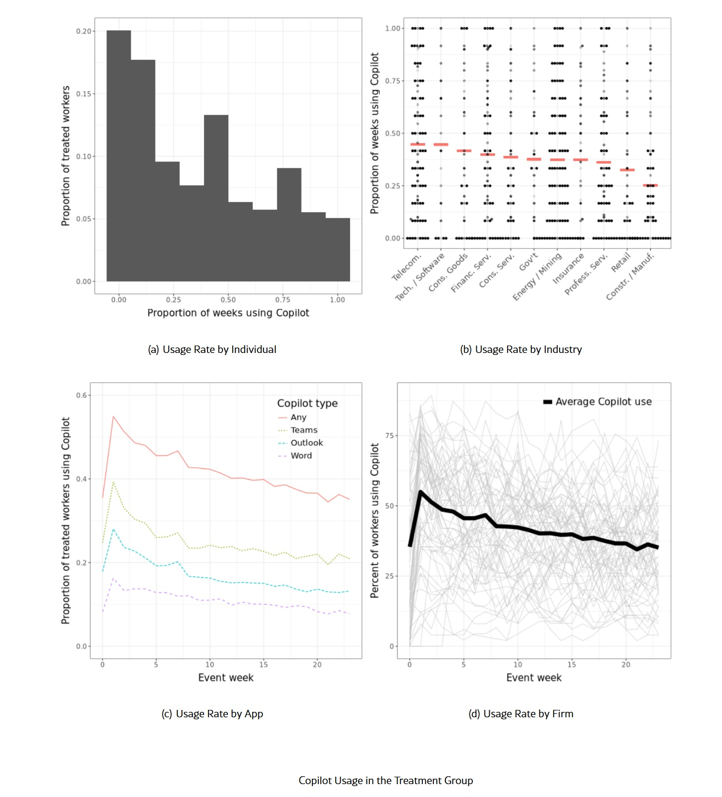

# AI doesn't free you: it puts you in a (golden) chain

*In the meeting rooms of an American tech company, for eight months, two hundred employees lived through an experiment that no one had planned. They had voluntary access to generative artificial intelligence tools—those digital assistants that promise to write emails in seconds, summarize mountains of documents, and automate repetitive work. The dominant narrative suggested a bright future: fewer hours at the desk, more time for strategic thinking, perhaps even a few recovered free afternoons. Eight months later, researchers from Harvard Business Review looked at the data and discovered something profoundly different. [There had been no liberation](https://hbr.org/2026/02/ai-doesnt-reduce-work-it-intensifies-it). The pace of work had accelerated, tasks had multiplied, and working hours had extended. AI had not lightened the load: it had intensified it.*

## Eight months in the belly of the algorithm

What Aruna Ranganathan and Xingqi Maggie Ye documented in their research in Harvard Business Review goes beyond the simple observation that "technology doesn't keep its promises." It is a snapshot of a more subtle and pervasive mechanism they have dubbed "workload creep," the stealthy expansion of the workload. The two hundred employees studied were not passive guinea pigs in a controlled laboratory. They were professionals who had freely chosen to adopt generative AI, driven by curiosity or the belief that it could make them more efficient. There was no corporate mandate from above, no imposition. Yet, week after week, the pattern emerged with disturbing consistency.

AI allowed them to complete individual tasks faster—this was undeniable. Responding to a complex email that previously took twenty minutes now took eight. Summarizing a fifty-page report became a matter of a few clicks instead of an hour of concentrated reading. But here's the paradox: that saved time never returned to the workers. It immediately dissolved into new requests, additional projects, and recalibrated expectations. Like water that always finds the lowest level, work expanded to fill every minute freed by automation.

The researchers observed three dynamics that reinforced each other. First: role expansion. When you become faster at a certain type of task, colleagues and superiors start delegating more of them to you. The worker who manages to process emails twice as fast doesn't end their day earlier; they receive twice as many requests. Second: the raising of standards. What was previously considered an acceptable output now becomes the bare minimum. If AI allows you to produce a more polished presentation in less time, all your presentations are expected to reach that level. The third, perhaps the most insidious: self-imposition. The workers themselves, seeing how much they can accomplish with AI assistance, voluntarily take on additional tasks, convinced they can manage them.

## The productivity paradox

To understand how widespread this phenomenon is, one must look beyond the single qualitative study. [Between September 2023 and October 2024, Microsoft conducted what is probably the largest controlled experiment on the adoption of generative AI in real work contexts](https://arxiv.org/html/2504.11436v4): 7,137 knowledge workers across 66 large companies, all equipped with Microsoft 365 Copilot, the AI assistant integrated into the applications they used daily for email, meetings, and document writing. The assignment was randomized: half received access to AI, half continued to work as usual. Six months of continuous observation, with 4,975 interactions tracked with precise timestamps.

The results confirmed the efficiency gains on specific tasks. Workers with access to Copilot reduced the time spent on Outlook by an average of 1.4 hours per week, about 12% compared to the previous period. Considering only those who actually used the tool continuously, the savings rose to 2 hours, a 17% reduction. They consolidated email work into more concentrated sessions, freeing up continuous blocks of 1.5 hours without email interruptions. On paper, a clear victory for automation.

But when Microsoft's economists looked at the total working hours, they found something baffling. The total time spent in digital applications outside of standard working hours had decreased by only 0.25 hours per week—about 15 minutes. A 9% reduction, certainly, but infinitesimal compared to the 2 hours saved on Outlook. Where had the other 1.75 hours gone? The most likely answer: absorbed by activities that the telemetry system could not track, or worse, converted into new work that the workers had spontaneously agreed to perform.

The pattern becomes even clearer when analyzing the tasks that should benefit most from AI. Teams meetings did not decrease in either number or duration. Completed Word documents remained stable. In fact, some indicators suggested a slight increase in work complexity: more meetings with many participants, collaborative documents that required two days less to be finalized (from 287 to 239 hours), but without a reduction in the total number of documents produced. The efficiency gained did not translate into a reduction in load, but into an acceleration of output.

But how do you go from saving two hours on Outlook to working more overall? The answer lies in individual behavioral patterns. [A study conducted by researchers from Harvard and MIT on 244 consultants from the Boston Consulting Group](https://aitalk.it/it/cyborg-centauri-automi.html) revealed that when faced with the same AI tool, professionals develop three radically different modes. "Cyborgs" continuously blend their own reasoning with the machine in a tight iterative dialogue. "Centaurs" maintain firm strategic control, using AI only for specific, well-defined tasks. "Self-Automators" delegate both the definition of the problem and its execution to AI, often with a single massive prompt.

The latter are the ones most at risk of workload creep. By completely delegating individual tasks, they develop the illusion of having solved them instantly and end up accumulating more. One consultant in the study copied an entire business case track into ChatGPT, accepted the recommendation without verification, and delivered the memo to the CEO. The answer was wrong, but the "saved" time had already been reinvested elsewhere. It is the work equivalent of that strange economic law that says wider roads don't reduce traffic—they attract it.

## Who wins when you work more

[Economist Wei Jiang and her colleagues at Columbia Business School studied nearly two decades of data on American working times](https://cepr.org/voxeu/columns/ais-power-grows-so-does-our-workday), crossing it with measures of occupational exposure to AI. The picture that emerges is systemic, not anecdotal. Moving from the 25th to the 75th percentile of exposure to AI corresponds to 2.2 additional hours of work per week. The effect intensified after the release of ChatGPT in November 2022, which functioned as an exogenous shock to the adoption of generative AI. The most exposed occupations saw an increase of 3.15 hours per week compared to the least exposed, and this expansion was accompanied by a proportional reduction in free time.

But here the central question arises: if AI really increases productivity, why don't the benefits return to the workers in the form of shorter hours or higher wages? The answer lies in the distribution of productivity gains, a theme economists call "rent capture." In competitive labor markets, where workers have little bargaining power because a few large employers dominate, companies can appropriate most of the benefits. And in highly competitive product markets, where products are substitutable, firms have an incentive to pass productivity gains on to consumers through lower prices or better services, rather than sharing them with employees.

Jiang's study quantifies this mechanism. The effect of AI on hours worked is amplified by 30-40% in concentrated labor markets compared to competitive ones. And in sectors with high competition on products, the hourly expansion is even more marked. Workers become more productive but see no corresponding improvements in work-life balance. AI makes them more efficient machines, but that efficiency is captured by other actors in the value chain.

Then there is the issue of algorithmic monitoring, which experienced a silent but pervasive expansion during the pandemic. AI tools to track the performance of remote employees—those systems that measure keystrokes, analyze activity patterns, and generate automatic productivity scores—have transformed working from home into working under continuous surveillance. Jiang's study shows that occupations with high exposure to AI monitoring technologies experienced an extension of working hours even after returning to the office. The mechanism is what economists call "contracting efficiency": AI makes it easier for employers to verify employee effort, stiffening performance expectations.

This does not apply to everyone. Freelancers, who are not subject to the typical principal-agent dynamic of dependent work, do not show the same pattern of hourly expansion when they use AI. There is no boss capturing productivity gains, so those gains can actually translate into individual choices about how to allocate time. But for the majority of knowledge workers within organizations, AI is unilaterally redesigning the psychological contract of work.

[Image from the Microsoft paper on arxiv.org](https://arxiv.org/html/2504.11436v4)

## The mirage of free time

In 1930, John Maynard Keynes predicted that his grandchildren would work fifteen hours a week thanks to technological productivity gains. Nearly a century later, we are going in the opposite direction. But the promise of AI as a liberator of human time was so seductive, so repeated in corporate keynotes and visionary articles, that it obscured a lesson we should have learned from every previous wave of automation. Technologies that increase efficiency rarely reduce hours worked; more often, they redistribute or intensify them.

The data on the reduction of free time collected by Jiang is particularly revealing. When workers exposed to AI reduce their leisure hours, the screen is not the one to suffer the most. Watching television and playing video games remain relatively stable. What is sacrificed are activities that require active participation: socialization, live entertainment, sports. It is a subtle signal of how the intensification of work is modifying not only the quantity but the quality of non-working time. The little free time that remains is dedicated to passive forms of leisure, which require less cognitive and emotional energy.

Then there is the question of job satisfaction, which represents perhaps the most direct indicator of how workers are actually experiencing this transformation. Researchers analyzed reviews on Glassdoor—the platform where employees anonymously rate their employers—crossing the ratings with measures of occupational exposure to AI. The result is clear: higher exposure to AI correlates with lower job satisfaction and worse perceived work-life balance. It's not simply that AI makes people more productive; it's that this productivity comes at a personal cost that traditional measurement systems do not capture.

The Microsoft study found a similar clue when it examined spillover effects on the close colleagues of workers who had received Copilot. There were no measurable negative impacts on the work patterns of non-users, suggesting that the saved time was not being dumped on others. But this raises an even more disturbing question: if you are not working less and you are not delegating more to colleagues, where is that gained efficiency going? The most likely answer is that it is being captured by implicit organizational expectations that are continually recalibrated upward.

## The invisible geography of burnout

When looking at the sectoral and geographical distribution of these effects, patterns emerge that further complicate the picture. The Microsoft study found that in telecommunications and technology companies, 45% of workers with access to Copilot used it weekly, while in the construction and manufacturing sector, the percentage dropped to 25%. But the most significant variation was not between sectors, it was between individual companies. Two companies in the same sector could have adoption rates that differed by 10 times, with weekly averages ranging from 6.3% to 70%.

This suggests that organizational culture and managerial practices play a crucial role in mediating how AI is integrated into workflows. Companies that had provided specific training on AI use saw more sophisticated usage patterns and less incidence of total Self-Automator style delegation. But 68% of the workers in the study had received no structured training, leaving them to navigate a completely new cognitive territory by trial and error.

The geographical dimension adds another layer of complexity. The studies conducted so far focus almost exclusively on the United States and some large European economies. We do not know if workload creep patterns are universal or if significant cultural variants exist. In countries with greater labor protections, legislative limits on working hours, or different traditions on the boundary between professional and personal life, AI could integrate in radically different ways. The European Union is discussing the "right to disconnect"—regulations that would limit the ability of employers to contact employees after hours. But if AI allows workers to be more productive during standard hours, it could paradoxically make formal disconnection less necessary while intensifying the load during regular hours.

There are no longitudinal studies yet that follow the same workers for periods longer than a year, monitoring how AI usage patterns and their effects on workload evolve over time. It is possible that the observed intensification is a transitory phenomenon, linked to the learning and adaptation phase. Or it could be the beginning of a trajectory that leads to forms of structural burnout, where the ability to work faster becomes a prison instead of a liberation.

## Counterexamples and ways out

Not all data points in the same bleak direction. [A study from the London School of Economics](https://pmc.ncbi.nlm.nih.gov/articles/PMC12024253/) on workers who have integrated generative AI into their routines found average savings of 7.5 hours per week. The crucial methodological difference: that survey was based on self-reports, asking workers directly how much time they estimated they had saved. Studies based on objective telemetry like Microsoft's find much more modest effects. It is possible that workers perceive a significant time saving even when they are objectively working more hours, perhaps because certain tasks become less frustrating or cognitively burdensome even if more numerous.

There are then specific corporate cases where the introduction of AI was accompanied by structural changes in work organization that actually allowed for hourly reductions. Companies that intentionally redesigned workflows, eliminating redundant meetings, consolidating communications, and setting explicit expectations that the time saved by AI should translate into shorter hours rather than increased output. But these seem to be exceptions that require deliberate managerial interventions, not the natural outcome of technological adoption.

The fundamental point is that AI does not determine work outcomes on its own. Like any powerful technology, it can be employed for different goals. It can serve to squeeze more output from the same workers in the same hours, it can allow the same output to be produced in less time, or it can enable more sophisticated output that was previously inaccessible. The choice between these paths is not technical but political, in the broadest sense of the term: it depends on who has the power to decide how to allocate productivity gains.

Human resources management experts are beginning to develop frameworks to monitor the impact of AI adoption on employee well-being, moving beyond traditional productivity metrics. [Some tools](https://pmc.ncbi.nlm.nih.gov/articles/PMC12477917/) include periodic surveys on perceived cognitive load, analysis of communication patterns to identify signs of overload, and continuous feedback mechanisms that allow workers to report when the expectation to use AI is becoming oppressive rather than enabling.

The real question these studies raise is not whether AI increases productivity, but for whom and at what cost. Eight months at an American tech company showed that without intentional guardrails, intelligent automation tends to intensify work instead of lightening it. Microsoft's data on nearly seven thousand workers confirms that efficiency gained on individual tasks quickly dissolves into new overall load. Macroeconomic analyses reveal that in the absence of bargaining power, benefits are captured by companies and consumers while workers only see longer hours.

We can still choose a different path, where AI actually gives back time instead of absorbing it. But that choice requires awareness, regulation, and perhaps above all a collective redefinition of what it means to work well in the age of artificial intelligence. Otherwise, we risk discovering that the golden chains of automation are still chains, only shinier.
