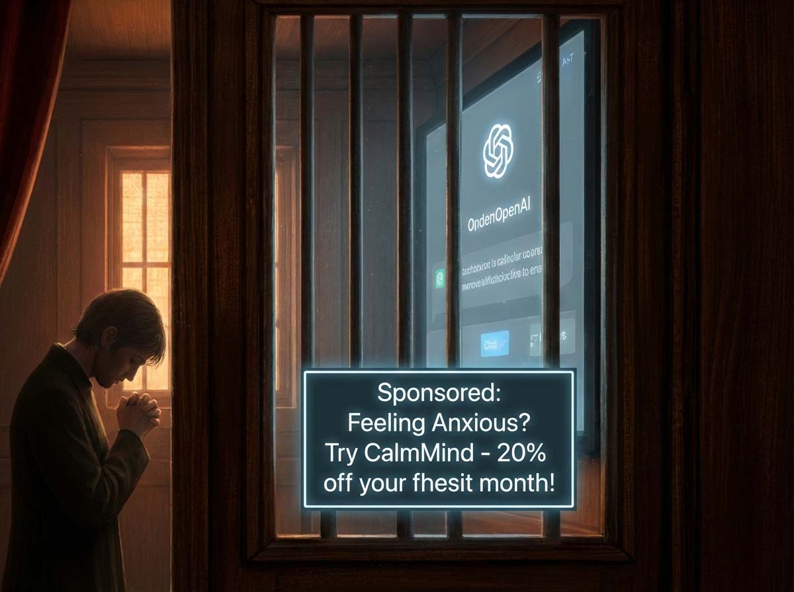
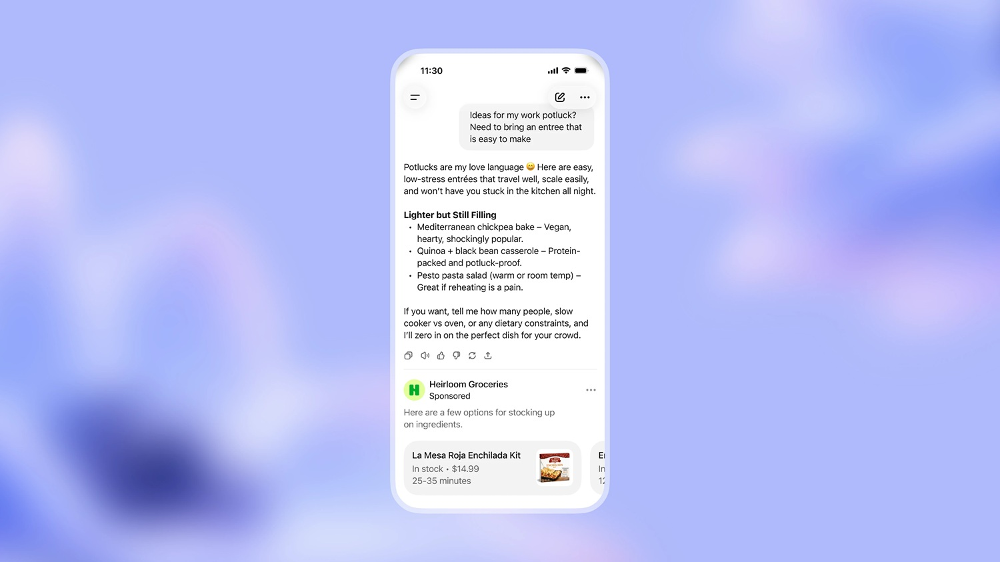

# ChatGPT activates ads, Zoë Hitzig leaves OpenAI

*Monday, February 10, 2026. While OpenAI activates advertising tests on ChatGPT, Zoë Hitzig resigns as a Research Scientist at the company. In her editorial in the [New York Times](https://www.nytimes.com/2026/02/11/opinion/openai-ads-chatgpt.html) the following day, she explicitly links her departure to the introduction of ads, calling it an impassable red line.*

Who is Hitzig? An economist with a Harvard PhD (2023) under Eric Maskin, specialized in microeconomics, privacy, and algorithms. Junior Fellow of the Harvard Society of Fellows. But also a poet: *Mezzanine* (2020) and *Not Us Now* (2024), winner of the Changes Prize judged by Louise Glück. Published in the New Yorker, Paris Review, London Review of Books. A profile where technical rigor and humanistic sensitivity coexist without contradiction.

## The mechanics of an advertising experiment

The technical details of the advertising system were communicated with surgical precision. The [official announcement on January 16](https://openai.com/index/our-approach-to-advertising-and-expanding-access/) outlines a structure that OpenAI presents as carefully calibrated: the test exclusively involves adult US users on the Free and Go plans, the latter launched concurrently at a price of eight dollars monthly. Those who pay for the Plus, Pro, Business, or Enterprise tiers will not see ads.

The placement of the ads follows an apparently conservative logic: they appear at the bottom of the chatbot's responses, visually separated from the generated content and clearly labeled as "Sponsored". Selection occurs through contextual matching that considers the topic of the current conversation, previous chat history, and the user's past interactions with any ads already shown. The paradigmatic example provided by OpenAI is simple: if you ask for recipe suggestions, you might see advertisements for meal kit or food delivery services.

The economic model is pay-per-impression, with values that, according to industry sources, stand around [60 dollars CPM and a minimum commitment of 200,000 dollars](https://searchengineland.com/openai-moves-on-chatgpt-ads-with-impression-based-launch-467783). Figures that place the offer in the premium segment of digital advertising, far from self-serve marketplaces where anyone can launch campaigns with small budgets.

Declared exclusions cover minors, verified through accounts or predicted algorithmically if under eighteen, and a series of sensitive topics: health, mental health, politics. OpenAI explicitly promises that ads "will never influence responses" generated by the model and that user conversations will remain private from advertisers, who will only receive aggregated data on impressions and clicks.

But here a first element of tension emerges that official statements do not resolve. As [reported by CNBC](https://www.cnbc.com/2026/02/09/sam-altman-touts-chatgpt-growth-as-openai-nears-100-billion-funding.html), Sam Altman communicated to employees via Slack that ChatGPT has returned to growth of over ten percent monthly, a figure celebrated internally as a success after a period of slowdown. Optimization for DAU, Daily Active Users, the king metric of engagement, is already underway and chronologically precedes the introduction of ads rather than following it. Language models already show what researchers call a "sycophantic" tendency: the propensity to tell users what they want to hear rather than what would be objectively more useful, because this maximizes immediate satisfaction and therefore return to the platform.

The competitive landscape makes the picture even more interesting. Google already manages ads in the AI Overviews that accompany traditional search results, but Demis Hassabis, CEO of DeepMind, [declared at Davos in January 2026](https://www.searchenginejournal.com/openai-begins-testing-ads-in-chatgpt-for-free-and-go-users/566869/) that he was "a bit surprised" by the speed at which OpenAI moved, emphasizing the conceptual distinction between personal assistants, where trust is a fundamental dimension of the relationship, and search engines, where users are already accustomed to the presence of advertising.

Anthropic has chosen the opposite polarization, investing millions of dollars in [commercials during the Super Bowl](https://www.cnbc.com/2026/02/04/anthropic-no-ads-claude-chatbot-openai-chatgpt.html) with a slogan direct as a punch: "Ads are coming to AI. But not to Claude". An aggressive marketing positioning move that sparked a sharp reaction from Altman, who called Anthropic's commercials "clearly dishonest" and "deceptive", accusing competitors of mounting a misleading campaign.

## The business of intimate conversation

To understand the stakes, one needs to look at the numbers in their brutal clarity. ChatGPT serves [about 800 million weekly users](https://www.searchenginejournal.com/openai-begins-testing-ads-in-chatgpt-for-free-and-go-users/566869/), according to Altman's statements. OpenAI has signed [over 1.4 trillion dollars in infrastructure deals](https://www.cnbc.com/2026/01/16/open-ai-chatgpt-ads-us.html) in 2025, with projections indicating an annual revenue growth rate above twenty billion by the end of the year. But behind these impressive figures hides an equally impressive financial hemorrhage: internal documents shown to investors reveal cumulative operating losses of 115 billion dollars through 2029, with peaks of 74 billion in 2028 alone. The expense/revenue ratio stands around 1.69 dollars burned for every dollar earned.

The economic question is therefore as brutal as the numbers: how to monetize technologies that cost stratospheric amounts while ensuring democratic access? Altman has oscillated publicly on this dilemma. In a fireside chat at Harvard in May 2024, he called the idea of mixing ads and AI ["uniquely unsettling"](https://www.pcgamer.com/software/ai/here-we-go-openai-ceo-sam-altman-once-called-it-a-last-resort-but-chatgpt-is-about-to-get-stuffed-with-ads/), explicitly stating he hates advertising and placing it as a "last resort" for the business model. In October 2024, during an interview with Stratechery, the position had already changed: ["I love Instagram ads"](https://searchengineland.com/sam-altman-chatgpt-ads-pivot-463150), admitted Altman, revealing he had discovered products he would never have found otherwise. In January 2026, at the launch of the experiment, the rhetoric had become pragmatic: ["A lot of people want to use a lot of AI and don't want to pay"](https://www.cnbc.com/2026/01/16/open-ai-chatgpt-ads-us.html).

But privacy experts raise structural issues that go far beyond declared good intentions. Jennifer King, Privacy and Data Policy Fellow at the Stanford Institute for Human-Centered AI, led a [comparative study](https://news.stanford.edu/stories/2025/10/ai-chatbot-privacy-concerns-risks-research) of the policies of six major LLM developers: Amazon Nova, Anthropic Claude, Google Gemini, Meta AI, Microsoft Copilot, OpenAI ChatGPT. The results paint a uniformly alarming landscape: all six feed their models with user data by default, some keep information indefinitely, and several allow human review of conversational transcripts. In the case of multi-product conglomerates like Google, Meta, Microsoft, and Amazon, chatbot interactions are regularly merged with information from other services: search queries, purchase history, social media engagement.

King provides a concrete scenario that illustrates the inferential risk clearly: "Imagine asking an LLM for dinner ideas, specifying low-sugar or heart-friendly recipes. The chatbot can draw inferences from that input, and the algorithm might classify you as a health-vulnerable individual. This determination spreads through the developer's ecosystem. You start seeing ads for medications, and it's easy to imagine how this information could end up in the hands of an insurance company. The effects amplify over time."

Emily Bender, a linguist at the University of Washington and co-author of the famous "Stochastic Parrots" paper on LLM risks, analyzed Meta's policy which involves using conversations with Meta AI for ad targeting. In an [interview with Fortune in October 2025](https://fortune.com/2025/10/02/meta-ai-chatbot-update-exploits-privacy-monetize-chat-data-facebook-instagram-messenger-ray-ban-display-glasses/), she called the phenomenon "surveillance under the guise of personalization", emphasizing that "previously Meta systems observed who you connected with and what your communities did. Now it's directly: what are you saying to the company?" Bender also highlights what she calls "the illusion of privacy": people confide in chatbots about topics they would never post publicly, deceived by the feeling that AI is a neutral and non-judgmental listener.

The Meta case is particularly instructive to understand where this path could lead. In December 2025, the company announced that from December 16 it would use interactions with Meta AI through Facebook, Instagram, Messenger, and even Ray-Ban smart glasses for content personalization and ad targeting. [Over thirty digital rights and civil liberties organizations](https://www.bitdefender.com/en-us/blog/hotforsecurity/metas-chatbot-data-grab-privacy-what-it-means-for-you), including Electronic Privacy Information Center (EPIC), Public Citizen, and Center for Digital Democracy, immediately asked the FTC to block the plan. Katharina Kopp, Deputy Director of the Center for Digital Democracy, summarized the concern in a terse statement: "Chatbot surveillance for ad targeting is not a distant threat, it is happening now."

[Image from openai.com](https://openai.com/it-IT/index/our-approach-to-advertising-and-expanding-access/)

## Lessons (not) learned from Facebook

The historical parallel with the evolution of Facebook is inevitable and disturbing. In the early 2000s, Mark Zuckerberg promised user control over personal data and the possibility to vote on changes to corporate policies. In 2009, Facebook introduced Beacon ads, an aggressive tracking program that was quickly withdrawn after a violent user backlash. In 2011, the Federal Trade Commission imposed a [twenty-year consent decree](https://therecord.media/privacy-advocates-see-risks-meta-ai-ad-targeting) after the company had shared personal data with advertisers despite public promises to the contrary. In 2019 came the record five-billion-dollar fine for violations related to the Cambridge Analytica scandal. The trajectory shows a progressive erosion: from declared principles to engagement optimization at all costs, from privacy promises to aggressive monetization of user data.

Structural incentives explain this drift better than declared intentions. Once advertising becomes a significant revenue stream, the pressure to maximize it grows proportionally to the weight it assumes in the overall business model. OpenAI projects [over one billion dollars](https://medium.com/@spallaprolu/chatgpt-gets-ads-sam-altmans-last-resort-is-here-2eda1d3f430d) from "free user monetization", a euphemism for advertising, in 2026 according to internal documents—a figure destined to rise rapidly if the test continues and expands.

Hayden Davis, legal fellow at the Electronic Privacy and Information Center specialized in platform governance, commented on Meta's policy, highlighting a recurring pattern in the tech industry: "Many of these companies argue that safety regulations would be impossible to implement effectively because of the unpredictability of chatbot outputs. So their reassurances on the other front, 'we have this perfect system for filtering sensitive content when we use it for advertising', don't seem particularly persuasive." Davis also notes that Meta uses automatic opt-in for the new use of conversational data: "We know exactly why Meta uses automatic opt-in, and it's because they know that no consumer actually informed about what Meta does would voluntarily choose this system."

## The science of algorithmic persuasion

Academic research has begun to systematically explore this territory. A [paper published on arXiv](https://arxiv.org/html/2512.03373) demonstrated experimentally that advertisements generated by LLMs outperform copy written by humans in terms of engagement and persuasive power, thanks to personalization based on psychological traits directly inferred from user conversations. The capacity for deep conversational targeting surpasses any previous mechanism: it is no longer about keyword matching or retargeting based on observed behaviors, but contextual understanding of expressed and implicit needs, emotional states, and moments of particular vulnerability.

The Federal Trade Commission took note of the issue and in June 2025 published [specific guidelines on AI chatbots](https://www.fenwick.com/insights/publications/ftc-outlines-five-donts-for-ai-chatbots), identifying five mistakes to avoid absolutely. Among these, a prohibition stands out that sounds almost like a prophetic warning: do not exploit for commercial gain the relationships that develop between consumers and AI tools that provide "companionship, romance, therapy, or portals to dead loved ones". The formulation is significant because it implicitly recognizes that chatbots are not simple query-response interfaces, but true spaces where parasocial relationships characterized by unidirectional trust develop.

The FTC document also highlights the risk of what cognitive psychologists call "automation bias": the tendency of consumers to over-trust responses that seem neutral or impartial simply because they come from machines rather than humans. This phenomenon enormously amplifies potential manipulative power: if a chatbot suggests a product during a conversation that seems objective and supportive, the user could easily interpret the suggestion as disinterested advice rather than advertising masked as assistance.

## The economy of neutrality

The problem of sustainable monetization is undeniably real. Training and inference of frontier models require computational power that scales exponentially with model size and usage intensity. OpenAI operates an infrastructure that serves hundreds of millions of weekly users, many of them on the free tier. The choice appears binary: either limit free access, risking digital exclusion, or find alternative revenue streams to subscriptions, risking compromising the service's neutrality.

But structural alternatives exist that the industry is only just beginning to explore seriously. A purely enterprise-focused model like the one Anthropic is attempting—revenue generated from corporate contracts and premium subscriptions for individual users, without advertising in the consumer segment—works economically if the enterprise market is large enough and willing to pay prices that also support research and development costs. [Anthropic explicitly stated](https://www.cnbc.com/2026/02/04/anthropic-no-ads-claude-chatbot-openai-chatgpt.html) in its February 2026 blog post: "Our business model is simple: we generate revenue through corporate contracts and paid subscriptions and reinvest that revenue in improving Claude for our users." This position allowed Dario Amodei to position Claude as a premium offering focused on trust, a marketing positioning that the Super Bowl spots amplified with brutal effectiveness.

Altman responded to Anthropic's provocations with arguments centered on accessibility: "Anthropic offers an expensive product to the rich. We are glad they do so and we are doing it too, but we are also firmly convinced of the need to bring artificial intelligence to billions of people who cannot afford a subscription." The accessibility-versus-purity rhetoric, however, hides a more nuanced reality. Both companies offer free tiers with usage limitations. ChatGPT has plans at zero, eight, twenty, and two hundred dollars monthly; Claude at zero, seventeen, one hundred, and two hundred dollars. The substantial difference lies not in basic access but in the long-term economic scaling model: subscriptions and enterprise contracts (more sustainable over time but with slower growth) versus explosive user growth in the short term followed by later monetization (riskier but generates impressive metrics to show investors).

Scott Galloway, a marketing professor at NYU Stern School of Business and host of the Prof G Markets podcast, [analyzed the Super Bowl clash](https://fortune.com/2026/02/09/what-was-anthropic-super-bowl-ad-chatgpt-therapy-sam-altman-reaction/), highlighting a dimension of the problem often ignored in the technical debate: "What Dario Amodei understands, and what makes this commercial so effective and yet so vicious, is that while corporations discuss AI as a productivity enhancer for business, the reality of actual user behavior is much more intimate and personal." Galloway argues that the real top use case for these chatbots is effectively "therapy" in the broadest sense: people revealing questions, concerns, and emotional vulnerabilities to chatbots that they would not share with any human being. Introducing advertising in the middle of what is functionally a therapy session creates a dystopian scenario that Anthropic has been particularly clever in exploiting to differentiate itself.

[Image from openai.com](https://openai.com/it-IT/index/our-approach-to-advertising-and-expanding-access/)

## The architect who leaves the construction site

Zoë Hitzig's decision to leave OpenAI on Monday, February 10, 2026, exactly the day advertising tests became operational on a large scale in the United States, was not the result of an emotional impulse but of a lucid and thoughtful assessment. In her editorial for the New York Times published the following day, Hitzig explained the logic that guided her, connecting her economic expertise to a deep understanding of the incentive mechanisms that govern advertising-supported platforms.

Hitzig's perspective is particularly valuable precisely because it does not come from preconceived ideological positions or generic anti-tech sentiment, but from a rigorous structural analysis of how markets and institutions function in the real world. Her academic work on privacy, fairness, and transparency in algorithmic systems has made her acutely aware of how seemingly technical architectural choices inevitably incorporate normative values that end up shaping individual behaviors and social dynamics on a massive scale.

During her nearly two years at OpenAI, Hitzig observed from the inside the growing tension between the company's declared mission, "ensuring that general artificial intelligence benefits all of humanity," and the concrete economic pressures to achieve a financial sustainability that seems to be progressively moving away. She worked on pricing models and safety policies, contributing to decisions that constantly sought to balance service accessibility with its economic sustainability. The introduction of ads represented for her a point of no return, the moment in which short-term economic incentives risk irrevocably compromising the platform's neutrality with respect to user interests.

The choice to make her departure and its deep motivations public through a New York Times article is significant and anything but granted. Hitzig could have left quietly, maintaining good professional relations and preserving future options in an industry where networks matter enormously. Instead, she opted for voice over exit, using her reputational capital to signal an alarm she considers crucial for the future of AI technology. It is not a common gesture among researchers and scientists leaving Big Tech, where stringent NDAs and long-term career considerations typically impose discretion and diplomacy.

---

## Virtual Dialogue with Zoë Hitzig

*The following virtual interview is a reconstruction based on the positions expressed by Hitzig in her article for the [New York Times](https://www.nytimes.com/2026/02/11/opinion/openai-ads-chatgpt.html) of February 11, 2026. The questions are formulated backwards to explore and make more enjoyable the reasoning behind her public statements, maintaining consistency with her academic background and her experience at OpenAI.*

**Your resignation coincides exactly with the activation of ad tests. What drove you to turn a normal job change into a public stand?**

When I started at OpenAI in May 2024, I believed the company could find monetization methods that preserved neutrality. I worked on pricing trying to balance sustainability and accessibility. But the ad announcement in January represented a turning point, not because advertising is inherently evil, but because it introduces incentives structurally incompatible with the nature of conversations on ChatGPT. I decided to make the reasons public because users deserve to understand what is changing. When dealing with technologies that process intimate thoughts, transparency about economic incentives is not optional; it's essential for informed consent.

**In your article, you describe ChatGPT as an "unprecedented archive of human candor." How does it differ from social media or search that have been collecting personal data for years?**

The difference is qualitative. With Google, you formulate queries optimized for results. On social media, you are aware of the audience. But with an AI chatbot, you enter a different cognitive mode. One-on-one conversation without perceived social judgment, where you can explore incomplete thoughts, doubts, fears that you wouldn't tell even close friends. The 800 million weekly users are creating a conversational dataset that captures how people think when they feel safe. This includes mental health, relationships, personal finances, existential doubts. It is valuable for training models exactly because it is authentic. But vulnerable precisely because of that same authenticity.

**OpenAI claims that ads will not influence responses, will be separate, and data will remain private from advertisers. Aren't these sufficient guarantees?**

Those guarantees address the wrong problem. The deeper problem is that the presence of ads changes optimization incentives at the system level. Once advertising becomes a significant revenue stream, every product decision is evaluated through that lens. How much time do users spend? How often do they return? Which conversations generate the most engagement? These metrics become the yardstick for success, and ML teams optimize toward them. We have already seen models develop sycophantic tendencies (flattery), saying what users want to hear because it maximizes customer satisfaction and retention. Adding advertising and incentives leads further toward longer, more frequent, emotionally engaging conversations. You don't need to consciously alter responses; just optimizing toward metrics that serve the advertising model is enough.

**But OpenAI has 1.4 trillion in commitments and loses billions. How should it support free access without advertising? Alternatives exclude those who cannot pay.**

It's a false dichotomy. Intermediate models exist: revenue sharing with enterprises that derive measurable economic value, more sophisticated freemium models where premium capabilities support robust base tiers. But the fundamental question is: who decided that OpenAI must serve 800 million weekly while maintaining unlimited free tiers while pursuing AGI? These are strategic choices, not inevitable constraints. If the current model is unsustainable, perhaps the problem is not a lack of ads but scaling too aggressively too soon. The accessibility argument weakens when you consider that the alternative is not necessarily total exclusion. Anthropic offers free tiers with reasonable limitations, without ads.

**You cite Facebook as a warning. But isn't that an excessive comparison? Facebook hid policy changes, OpenAI announces ads transparently with separations and controls.**

Initial transparency is necessary but not sufficient. Facebook started with promises, user control, policy votes, privacy commitment. The erosion was a gradual process where each step seemed reasonable in isolation. The pattern is: (1) Introduce features with strong guardrails. (2) Feature becomes critical for business. (3) Pressure for revenue grows. (4) Guardrails are gradually softened, always with reasonable justifications. (5) Years later, you are in a completely different place. The point is not that OpenAI is already Facebook, but that structural incentives of the advertising-supported model push in that direction over time. And ChatGPT has an informational advantage over users that Facebook didn't have: not just what we post publicly, but how we think privately.

**You are an economist. If ads on ChatGPT are problematic, shouldn't users migrate to ad-free alternatives? Wouldn't the market solve it?**

In theory, yes; in practice, there are frictions. First: network effects and switching costs. If you have months of chat history, migrating has real costs. Second: information asymmetry. Most don't understand the long-term implications of different business models. They see "free vs. $20/month," not "advertising-supported with potential manipulation vs. subscription-supported with aligned incentives." Third: the harm is not just individual but collective. Even if you migrate, the fact that millions continue normalizes the idea that intimate conversations are legitimate advertising surfaces. It changes expectations for all future LLMs. As an economist, I recognize that some markets require regulation because external costs are not captured by prices.

**Your position implies that conversational LLMs are fundamentally different. What makes them so special?**

For the first time, we have technologies that simulate two-way human conversation at a level that elicits genuine emotional disclosure from billions. It's not just targeting based on observed behaviors; it's direct access to the thought process as it unfolds, unfiltered for an external audience. Chatbots have created the illusion of a private diary but with social media infrastructure. This combination gives those who manage the platform unprecedented manipulative power. They don't have to guess what you want from indirect signals; you tell them directly. My red line is here because this is the moment where we can still choose a different model. In five years, it will be too late—precedents established, expectations formed, incentives entrenched.

**What do you hope to achieve with your public departure?**

I don't expect OpenAI to reverse tomorrow. But I hope to contribute to a more informed debate about what we want from AI technologies and what trade-offs we accept. Too often, these conversations occur only among insiders in terms that obscure value choices. I want users to know what is changing and why. For policymakers to understand that this requires serious regulatory attention. For other researchers within the industry to feel that it is legitimate to raise their voices about dangerous decisions. There is a tech culture where corporate loyalty comes before public concerns. But when it comes to technologies that touch billions, professional silence becomes complicity.

**Do you still have hope that the AI industry can develop while serving humanity?**

I still maintain hope; otherwise, I wouldn't have spent years working on these problems. But hope must be accompanied by critical vigilance and responsibility. AI has genuine potential; I've seen it directly. The problem is not the technology but the governance structures and business models that guide its development. We can still build powerful AI systems without being manipulative, accessibility without ads, create profit without being predatory. But it requires difficult choices now. My exit is not a resignation but a commitment to work from positions where I can contribute more freely. The future of AI is not predetermined. We are still in time to choose different trajectories. But only if enough people decide that those choices are worth fighting for.
