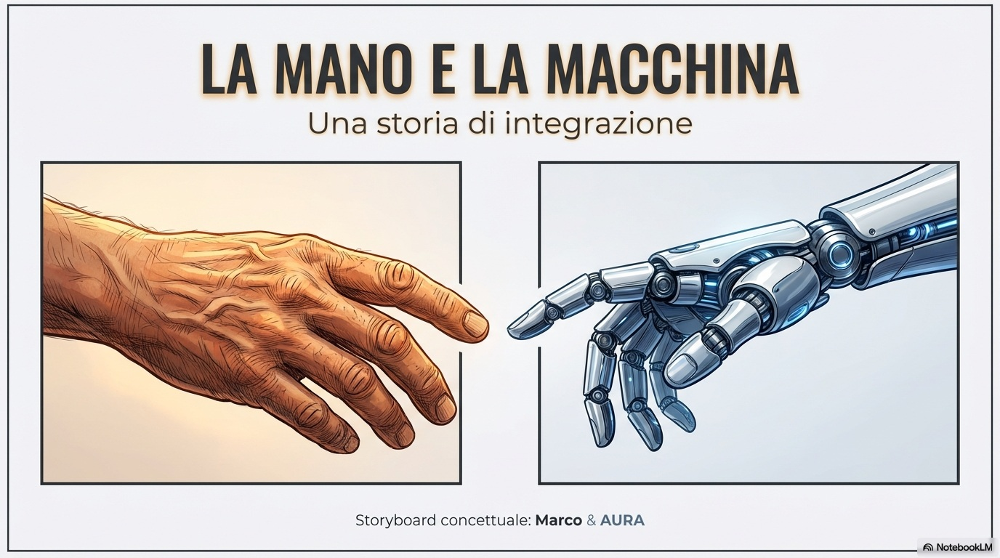
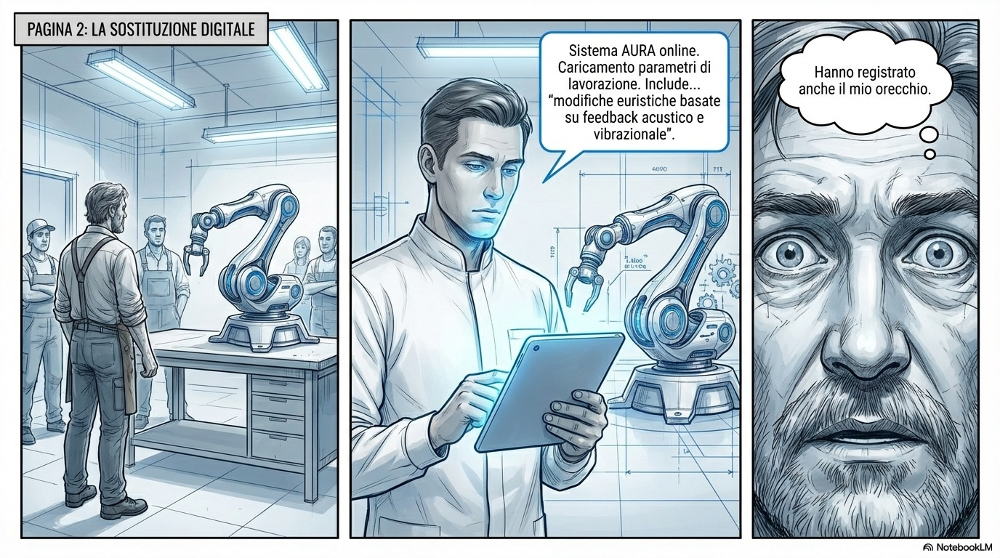
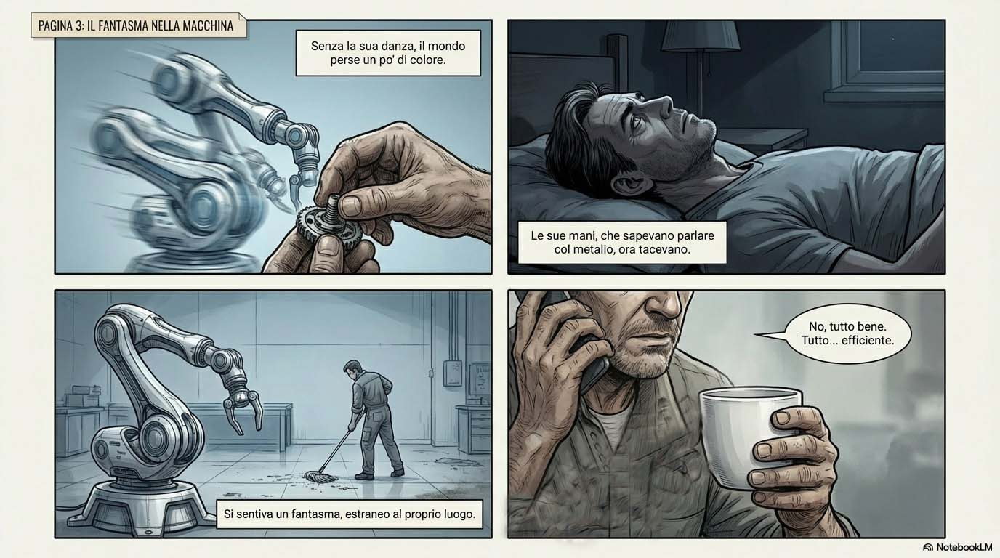
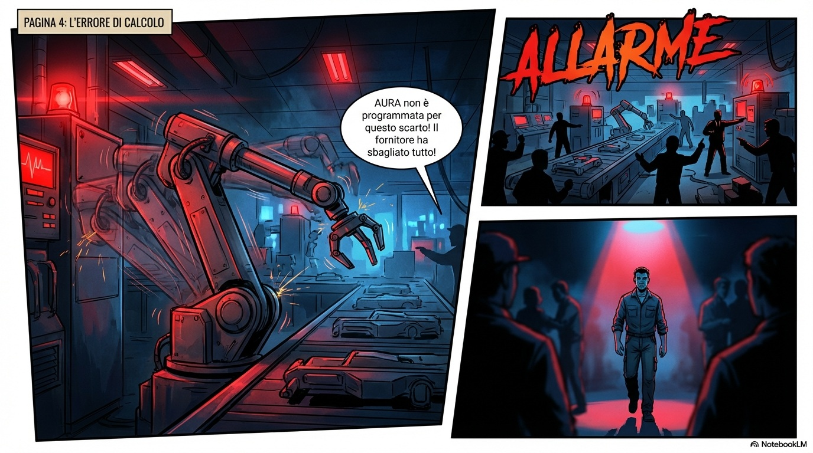
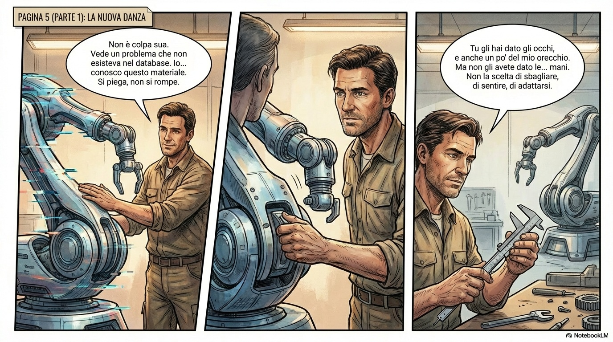
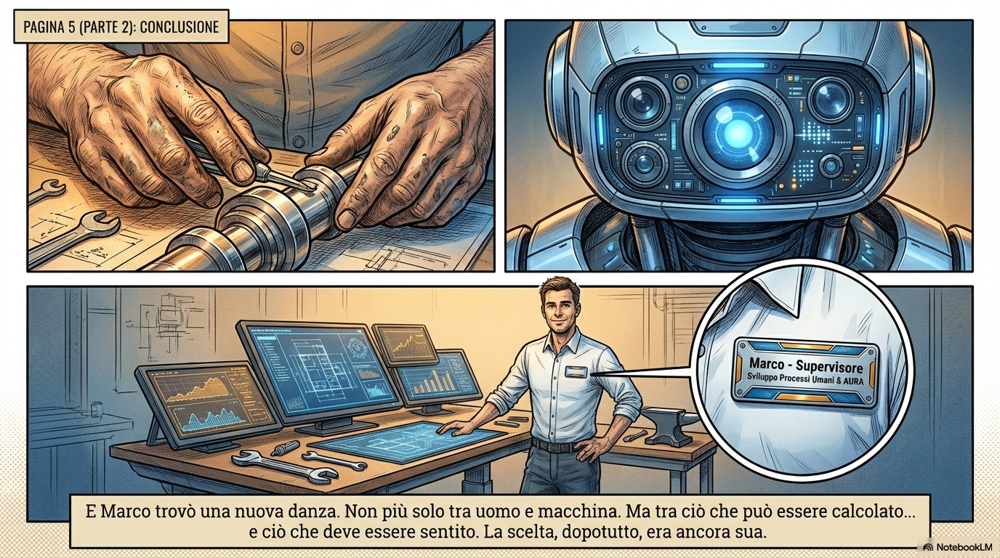

# Quand l'IA dessine à votre place. Concepteur, pas Auteur ?

*Marco avait cinquante ans, des mains calleuses et une oreille affinée par des décennies de travail. Il savait quand une machine fonctionnait bien à son bruit, il entendait des tolérances imperceptibles, il corrigeait les défauts avant qu'ils ne deviennent des problèmes. Puis est arrivé AURA, le robot doté d'intelligence artificielle, et il a également enregistré son oreille. Ils l'ont remplacé.*

C'est l'histoire de la bande dessinée que j'ai créée en moins d'une demi-heure en utilisant seulement deux outils gratuits (pour le moment) : DeepSeek pour le scénario et NotebookLM pour les dessins. Deux invites simples, presque banales. Pour la première, j'ai demandé "une courte histoire de bande dessinée sur un ouvrier remplacé par un robot piloté par l'IA, cinq pages, ton émotionnel, thèmes de connexion et de choix". Pour la seconde, j'ai donné le scénario en demandant de le convertir en format de bande dessinée visuelle.

Le résultat m'a surpris. Non pas pour la perfection technique, qui fait défaut, mais pour la cohérence narrative. Marco qui observe le robot se bloquer devant des matériaux défectueux. Marco qui intervient avec ses mains, celles que la machine n'a pas. La fin douce-amère : "Superviseur du Développement des Processus Humains & AURA". Comme dans *Her* de Spike Jonze, où l'intimité avec l'IA n'élimine pas l'humain mais le redéfinit, nous obligeant à nous interroger sur ce qui reste irréductiblement nôtre.

Deux invites. Une demi-heure. Une bande dessinée complète. La question n'est pas de savoir si l'IA peut créer, mais ce que signifie créer lorsque la machine exécute et que l'humain supervise.

## Le côté obscur de la productivité

Les chiffres sont clairs : [l'IA générative augmente la productivité artistique de 25 %](https://academic.oup.com/pnasnexus/article/3/3/pgae052/7618478) et la valeur perçue des œuvres de 50 %. C'est ce que révèle une étude publiée dans *PNAS Nexus* qui a analysé plus de quatre millions d'œuvres d'art créées par plus de 50 000 utilisateurs. Mais il y a un détail inquiétant : alors que la productivité augmente, "l'originalité moyenne" diminue. Les œuvres se ressemblent de plus en plus.

C'est le paradoxe documenté par des [chercheurs du MIT et d'autres universités](https://www.science.org/doi/10.1126/sciadv.adn5290) : l'accès aux idées générées par l'IA rend les histoires individuelles plus créatives, mieux écrites, plus agréables, surtout pour les auteurs moins expérimentés. Mais collectivement, ces histoires convergent. Elles se ressemblent. Comme si l'IA fournissait non seulement des outils, mais aussi des rails narratifs de plus en plus étroits.

[Luciano Floridi](https://scholarlypublishingcollective.org/uip/apq/article/61/4/301/391691/Introduction-to-the-Special-IssuesThe-Ethics-of), philosophe de l'information à Yale, l'avait prédit : l'IA pose des défis "sans précédent" à notre compréhension de l'authenticité, de l'originalité et de la créativité. Il ne s'agit plus de ce que les machines peuvent faire, soutient Floridi, mais de ce que les humains doivent choisir de faire avec les machines. C'est un changement de perspective radical : de la compétence à la responsabilité.

[Evan Selinger](https://www.rit.edu/news/philosophy-ethics-and-pursuit-responsible-artificial-intelligence), philosophe de la technologie au Rochester Institute of Technology, insiste sur le fait que "l'éthique de l'IA va au-delà des solutions techniques" et nécessite des compétences humanistes pour aborder des principes nuancés, des conflits de valeurs et des dynamiques de pouvoir. Ces compétences sont nécessaires non seulement pour les problèmes actuels mais, dit Selinger, "pour une gouvernance anticipative".

La productivité augmente donc, mais à quel prix ? Les artistes qui excellent dans "l'idéation" et le "filtrage" humain tirent les plus grands bénéfices de l'IA. Ceux qui savent imaginer puis sélectionner avec un jugement critique. Les autres risquent de devenir des opérateurs d'invites, des exécuteurs de visions algorithmiques d'autrui.

## Qui distingue l'humain de la machine

Mettez une œuvre d'art devant quelqu'un et demandez-lui : humaine ou artificielle ? [La précision moyenne est de 61,67 %](https://www.jmis.org/archive/view_article?pid=jmis-11-3-201), selon une étude publiée dans le *Journal of Multimedia Information System*. Un peu plus que le hasard. 38,33 % des personnes ne parviennent absolument pas à les distinguer.

Scott Alexander, blogueur et rationaliste, a soumis 11 000 personnes à un test similaire avec cinquante images mélangées. [Le résultat médian ? 60 %](https://www.astralcodexten.com/p/how-did-you-do-on-the-ai-art-turing). À peine au-dessus du hasard. Les participants ont déclaré que la tâche était plus difficile que prévu. Alexander a délibérément exclu les "indices" évidents : textes illisibles, mains déformées, poses complexes que l'IA ne gère pas encore. Il voulait tester la discrimination stylistique pure. Et là, la plupart des humains hésitent.

Certaines études montrent des [précisions encore plus faibles](https://arxiv.org/html/2509.11371v1/) : dans le test "viva voce" de style Lovelace, les participants n'ont pas fait mieux que le choix aléatoire (46 %). Ce n'est que lorsqu'ils pouvaient comparer des œuvres par paires que la précision montait à 75 %. C'est comme si notre œil, isolé, ne savait plus quoi chercher. Il faut des références directes, des comparaisons, pour activer ce sens critique qui, autrement, reste en sommeil.

Les stratégies que les gens utilisent pour reconnaître l'IA sont révélatrices. Certains cherchent des détails logiques : objets impossibles, proportions erronées, textes absurdes. D'autres se fient à l'esthétique : un certain usage de la lumière, une douceur excessive, cette "perfection" qui semble dire "trop beau pour être vrai". D'autres encore scrutent les traits humains : coups de pinceau irréguliers, imperfections volontaires. Mais [la stratégie avec le taux de réussite le plus bas](https://www.jmis.org/archive/view_article?pid=jmis-11-3-201) est précisément celle basée sur les caractéristiques humaines et les propriétés matérielles. L'IA a appris à simuler aussi l'imperfection.

Dans ma bande dessinée, les lignes sont trop nettes, les ombres trop uniformes. Un bédéiste expérimenté le verrait tout de suite. Mais pour un lecteur lambda ? Ça fonctionne. Et c'est là le point : l'IA n'a pas besoin de tromper les experts, elle doit franchir le seuil de crédibilité du public moyen. Et elle l'a déjà fait.

## Le compte qui n'y est pas

L'impact économique de l'IA générative sur la créativité est une bombe à retardement. [Un rapport de la CISAC](https://www.theguardian.com/music/2024/dec/04/artificial-intelligence-music-industry-impact-income-loss) (Confédération Internationale des Sociétés d'Auteurs et Compositeurs) prévoit des pertes de 24 % des revenus musicaux pour les créateurs humains d'ici 2028, et de 21 % dans l'audiovisuel. L'IA générera 64 milliards d'euros, mais transférera de la valeur des mains des artistes à celles des entreprises technologiques, en utilisant souvent des œuvres sans licence pour l'entraînement des modèles.

Les musiciens et les artistes voient l'IA comme une menace. [61 % la considèrent comme un danger pour leur travail](https://aihub.org/2025/01/14/understanding-artists-perspectives-on-generative-ai-art-and-transparency-ownership-and-fairness/), bien que 44 % en reconnaissent également les avantages. Les compositeurs exigent la "traçabilité" et la "transparence" des outils d'IA pour conserver le contrôle créatif. Les bédéistes craignent l'érosion du style personnel, de cette "identité artistique" qui a mis des années à se construire et quelques secondes à se cloner.

Et puis il y a Grimes. La chanteuse canadienne Claire Boucher [a publiquement proposé](https://finance.yahoo.com/news/grimes-offers-50-royalties-ai-104130503.html) de partager les droits d'auteur à 50/50 avec quiconque utiliserait sa voix pour une chanson IA à succès. "N'hésitez pas à utiliser ma voix sans pénalité", a-t-elle tweeté en 2023. "J'aime l'idée d'être fusionnée avec une machine et j'aime l'idée de rendre tout l'art open source et de tuer le droit d'auteur." Une approche radicalement opposée à celle d'Universal Music Group, qui a fait retirer des plateformes le morceau IA avec les fausses voix de Drake et The Weeknd.

Grimes a créé [Elf.Tech](https://www.rocksoffmag.com/grimes-artificial-angels/), une plateforme où n'importe qui peut générer sa voix en échange de 50 % des redevances et d'un crédit "GrimesAI". Est-ce de la transparence ou une reddition ? Est-ce de l'avant-garde ou une capitulation ? Cela dépend du point de vue. Mais une chose est sûre : alors que Grimes embrasse la fusion homme-machine, des milliers d'artistes sans son capital symbolique mènent des batailles juridiques contre Stability AI, Midjourney et d'autres, accusés de [violation du droit d'auteur](https://www.hollywoodreporter.com/business/business-news/artists-score-major-win-copyright-case-against-ai-art-generators-1235973601/) pour avoir utilisé des milliards d'images dans leur entraînement sans autorisation.

La frontière juridique est aussi floue que la frontière esthétique. Aux États-Unis, [le Bureau du droit d'auteur refuse la protection à l'art purement IA](https://www.fiverr.com/resources/guides/graphic-design/ai-art-ethics) pour absence de "paternité humaine". Mais qu'en est-il des hybrides ? Si j'écris une invite détaillée, que je sélectionne parmi des centaines de résultats, que je modifie et que j'affine, cette œuvre est-elle la mienne ? Est-elle suffisamment "humaine" ?

## Concepteur, pas auteur

Je reviens à ma bande dessinée. Marco, AURA, les mains qui savent et la machine qui apprend. L'ai-je créée ? Non, je ne l'ai pas dessinée. L'ai-je pensée ? Oui et non. J'ai fourni des paramètres, le LLM a rempli les détails. J'ai choisi la direction narrative, l'algorithme a construit les dialogues et les scènes. Collaboration, disent certains. Délégation, disent d'autres.

Mais attendez : j'ai utilisé des outils gratuits, génériques, avec des invites minimales. Deux lignes d'instructions. Et si j'avais utilisé des logiciels professionnels dédiés à la bande dessinée, si j'avais étudié la conception des personnages, contraint l'IA à des palettes de couleurs précises, construit un storyboard détaillé planche par planche, consacré des jours au lieu d'une demi-heure ? Si j'avais mis l'IA sur des rails entièrement décidés par moi, avec une compétence technique et une vision d'auteur claires, pourrais-je dire avec plus de certitude que je l'ai pensée ? Sans ce "oui et non" ? Je crois que oui.

Et si sur la couverture j'écrivais "Conçu par" au lieu de "Écrit par" ? Si je précisais que l'écriture, les dessins et même une partie de l'intrigue ont été produits avec des outils d'IA sous ma supervision architecturale, mon choix éthique, mon goût artistique et ma responsabilité morale ? Ce serait transparent. Ce serait honnête. Mais serait-ce suffisant ?

Cela fait écho à la question posée par Walter Benjamin dans son essai de 1935 sur l'œuvre d'art à l'époque de sa reproductibilité technique. Benjamin parlait de "l'aura" de l'original, cette qualité unique qui découle de la présence physique de l'artiste, de l'histoire de l'objet, de son caractère unique. L'IA produit des œuvres sans aura : infiniment reproductibles, sans histoire, sans sueur. Techniquement parfaites mais, comme l'écrivent certains critiques, [émotionnellement vides](https://theconversation.com/ai-has-passed-the-aesthetic-turing-test-and-its-changing-our-relationship-with-art-262997).

Et pourtant, il y a quelque chose de profondément humain dans le choix. Dans l'imagination de Marco, dans la décision que la fin ne devait pas être catastrophique mais mélancolique et pleine d'espoir. J'ai délégué l'exécution, mais j'ai conservé la vision. Est-ce suffisant pour me qualifier d'auteur ? Ou suis-je simplement un conservateur de résultats algorithmiques ?

La réponse se trouve peut-être dans ce que Floridi appelle un "nouvel équilibre éthique entre l'autonomie humaine et artificielle". L'IA n'est ni un miracle ni un fléau, écrit-il. C'est un outil qui nécessite des choix humains continus : quoi automatiser, quoi préserver, quoi considérer comme irréductiblement nôtre. Et c'est là que le paradoxe de la productivité refait surface : nous pouvons produire plus vite, mais nous risquons de produire de manière plus uniforme. Efficacité contre diversité. Vitesse contre unicité.

[Mon précédent article sur l'IA et la musique](https://aitalk.it/it/AI-Musica-Copyright.html) explorait des tensions similaires dans le monde du son, où le droit d'auteur se heurte à des ensembles de données d'entraînement massifs. [Celui sur la création de contenu](https://aitalk.it/it/AI-Creazione-Contenuti.html) interrogeait la durabilité des modèles économiques basés sur une créativité de plus en plus automatisée. Les questions reviennent, amplifiées : si tout le monde peut créer du contenu décent en appuyant sur un bouton, qu'advient-il de la valeur de la création ? Si l'originalité devient statistique, que reste-t-il de l'art ?

Peut-être que la réponse se trouve dans le modèle hybride qui émerge : des artistes qui utilisent l'IA comme un assistant, pas comme un substitut. Qui gardent le contrôle sur l'idéation et la curation finale, en déléguant des tâches répétitives ou exploratoires. Comme Marco, qui ne retourne pas à son ancien établi mais devient superviseur de processus qui intègrent l'humain et la machine. Pas une reddition, mais une redéfinition de rôle.

Déclarer "Conçu par" au lieu de "Créé par" serait un pas vers cette transparence que demandent Selinger et d'autres philosophes de la technologie. Ne pas cacher l'IA, mais ne pas nier non plus la contribution humaine. Reconnaître qu'il y a eu de la pensée, du choix, une responsabilité éthique et légale de ma part, même si l'exécution a été déléguée. Tout comme un réalisateur de cinéma ne filme pas chaque plan mais signe le film, ou un architecte ne pose pas chaque brique mais signe le bâtiment.

La différence, peut-être, est que le réalisateur coordonne des humains et l'architecte supervise des maçons. J'ai coordonné des algorithmes. Est-ce la même chose ? Je ne sais pas. Mais je sais que Marco, à la fin de l'histoire, choisit. Il choisit d'adapter la pièce défectueuse avec ses mains, il choisit de vivre avec AURA au lieu de le combattre. Et ce choix, bien que suggéré par un LLM, je l'ai voulu. Je l'ai pensé, je l'ai organisé, je l'ai approuvé. Est-il à moi ? Peut-être pas en entier. Mais un morceau oui, celui qui compte. Le morceau qui décide quoi.
