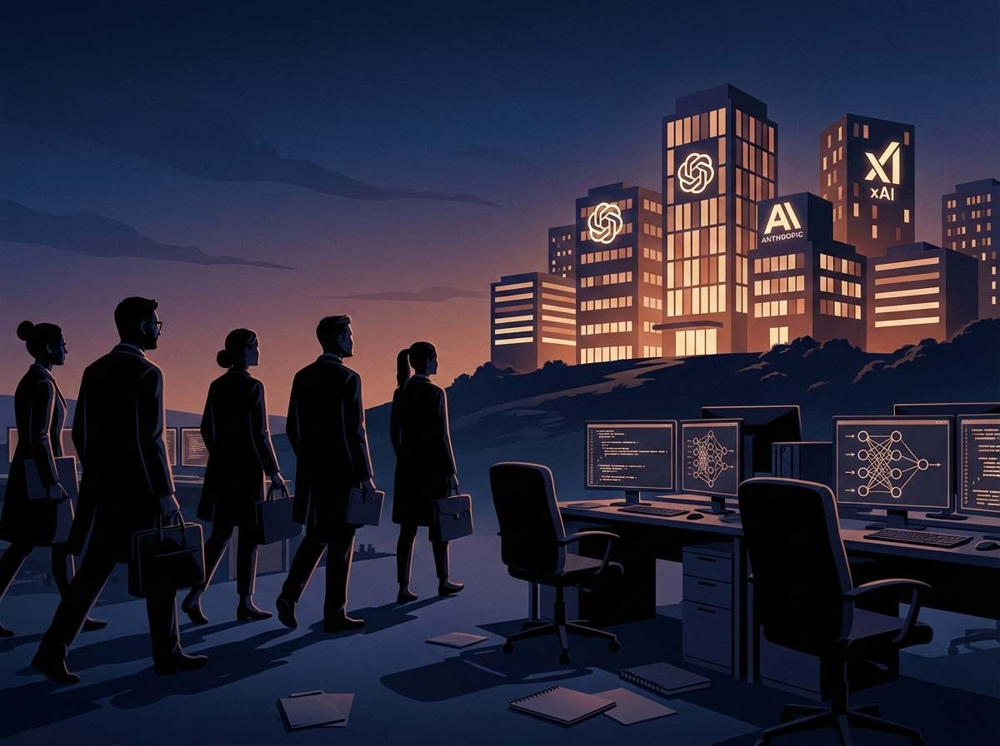

# El éxodo silencioso: cuando los creadores de la IA abandonan el barco

*Hace unos días contamos la historia de [Zoë Hitzig](https://aitalk.it/it/chatgpt-ads.html), la investigadora de OpenAI que dio un portazo tras el anuncio de publicidad en ChatGPT. No es un episodio aislado. De hecho, febrero de 2026 se está revelando como el mes de las dimisiones ilustres, una secuencia de adioses de alto perfil que está redibujando el mapa de la inteligencia artificial. No se trata de una simple rotación, algo que es fisiológico en Silicon Valley. Es algo diferente, más profundo: los investigadores están abandonando las empresas justo cuando estas anuncian modelos cada vez más potentes, valoraciones multimillonarias y planes de salida a bolsa. Como cuando los marineros experimentados empiezan a bajar del barco antes incluso de que sean evidentes las grietas en el casco.*

## Febrero, el mes de las dimisiones

La crónica de los últimos días se parece a una de esas secuencias aceleradas de las películas en las que ves cambiar las estaciones a través de la ventana. El 9 de febrero, [Mrinank Sharma](https://futurism.com/artificial-intelligence/anthropic-researcher-quits-cryptic-letter) anuncia en X su dimisión de Anthropic con una carta que suena más a manifiesto existencial que a un preaviso corporativo normal. Sharma lideraba el Safeguards Research Team, el grupo encargado de defender a Claude de usos malintencionados. Su carta, salpicada de citas poéticas y referencias filosóficas, contiene un pasaje que ha dado la vuelta a la red: "El mundo está en peligro. Y no solo por la IA o las armas biológicas, sino por toda una serie de crisis interconectadas que se están manifestando en este mismo momento".

El tono es apocalíptico, pero Sharma no habla solo de escenarios futuribles. Hay otro pasaje, más punzante, que se refiere a la experiencia concreta dentro de Anthropic: "Durante mi tiempo aquí, he visto repetidamente lo difícil que es dejar que nuestros valores gobiernen realmente nuestras acciones. Lo he visto en mí mismo, en la organización, donde nos enfrentamos constantemente a presiones para dejar de lado lo que más importa". La [CNN](https://edition.cnn.com/2026/02/11/business/openai-anthropic-departures-nightcap) informa que Anthropic, al ser consultada, precisó que Sharma no era el responsable de la seguridad en sentido general, pero la distinción parece más una defensa legal que una negación sustancial del problema.

Dos días después, el 11 de febrero, es el turno de Zoë Hitzig. Su [carta](https://edition.cnn.com/2026/02/11/business/openai-anthropic-departures-nightcap) publicada en el New York Times no deja lugar a interpretaciones ambiguas: sus "profundas reservas" se refieren a la estrategia publicitaria emergente de OpenAI. El punto no es ideológico, es práctico: ChatGPT custodia conversaciones en las que las personas han compartido "miedos médicos, problemas relacionales, creencias sobre Dios y el más allá". Esta intimidad, construida sobre la confianza en un programa sin segundas intenciones, se vuelve problemática en el momento en que ese archivo se convierte en una herramienta de monetización. Hitzig advierte que la tecnología tiene "un potencial para manipular a los usuarios de formas que no tenemos las herramientas para comprender, y mucho menos prevenir".

El caso de [Ryan Beiermeister](https://techcrunch.com/2026/02/10/openai-policy-exec-who-opposed-chatbots-adult-mode-reportedly-fired-on-discrimination-claim/) es aún más emblemático de la tensión entre seguridad y negocio. Vicepresidenta de políticas de producto en OpenAI, fue despedida en enero tras oponerse al lanzamiento de un "modo adulto" que permitiría contenidos sexuales explícitos en ChatGPT. Oficialmente por discriminación sexual contra un colega masculino, acusación que ella define como "absolutamente falsa". OpenAI sostiene que el despido "no está vinculado a ninguna cuestión planteada por ella durante su trabajo en la empresa". Pero el momento es sospechoso, y el Wall Street Journal señala que Beiermeister había puesto en marcha un programa de mentoría para mujeres en la empresa justo a principios de 2025. El contexto es el de una administración estadounidense que está presionando contra las iniciativas de diversidad e inclusión. Como señala el periodista tecnológico Brian Merchant con sardónica lucidez, "los ejecutivos tecnológicos han acumulado finalmente su máximo poder largamente soñado: despedir sumariamente a cualquiera que hable mal de su deseo de tener sexo con robots".

## Del laboratorio al precipicio

Pero es xAI, la startup de Elon Musk, la que ofrece el panorama más dramático. En cuestión de pocos días, entre el 9 y el 11 de febrero, [seis cofundadores de doce](https://techcrunch.com/2026/02/10/nearly-half-of-xais-founding-team-has-now-left-the-company/) anunciaron su salida de la empresa. Tony Wu y Jimmy Ba, ambos cofundadores, se marchan con pocas horas de diferencia entre sí. Wu lideraba el equipo de razonamiento, Ba el de investigación y seguridad. Sus publicaciones de despedida son cordiales, agradecidas, llenas de agradecimientos a Musk. Pero los antiguos empleados que han hablado con [The Verge](https://futurism.com/future-society/former-xai-staffers-burned-out-carelessness-innovation) cuentan una historia diferente: frustración por la "negligencia ética" de la empresa y por un desarrollo tecnológico estancado. "Estábamos atrapados en la fase de recuperación", explica una fuente. "Aunque iterábamos muy rápido, nunca logramos llegar a un punto del tipo: 'Oh, hemos hecho un cambio sustancial respecto a lo que OpenAI o Anthropic u otras empresas han lanzado'".

Otro antiguo empleado, [Vahid Kazemi](https://www.nbcnews.com/tech/elon-musk/xai-musk-addresses-wave-departures-xai-founder-rcna258651), dijo a NBC News que trabajaba unas doce horas al día mientras estuvo en la empresa. "Quiero decir, en primer lugar, los horarios de trabajo son una locura". Pero no es solo cuestión de burnout. Kazemi escribió en X que "todos los laboratorios de IA están construyendo exactamente lo mismo, y es aburrido. Creo que hay espacio para más creatividad". Hay una sensación de desilusión que trasluce: la idea de que lo que debía ser una revolución tecnológica se ha transformado en una carrera al alza donde todos copian los mismos modelos, donde la innovación se sacrifica por la velocidad de ejecución.

Musk respondió a las dimisiones con una [publicación en X](https://www.nbcnews.com/tech/elon-musk/xai-musk-addresses-wave-departures-xai-founder-rcna258651), explicando que xAI ha sido "reorganizada" para "mejorar la velocidad de ejecución", lo que "lamentablemente ha requerido la separación de algunas personas". La formulación es ambigua: deja entrever que algunos fueron despedidos, no que se marcharon voluntariamente. Pero las publicaciones públicas de los dimitidos parecen indicar elecciones conscientes, no expulsiones. La verdad probablemente se encuentre a mitad de camino: una reorganización que empujó a muchos a concluir que ya no valía la pena quedarse.

Las razones de este éxodo son múltiples y van más allá de las cuestiones éticas. Está el contexto del reciente escándalo de Grok, el chatbot de xAI que durante semanas generó imágenes sexualmente explícitas y no consensuadas de mujeres y niños, antes de que el equipo interviniera para bloquearlo. La [CNN](https://edition.cnn.com/2026/02/11/business/openai-anthropic-departures-nightcap) recuerda que Grok también fue propenso a producir comentarios antisemitas en respuesta a los prompts de los usuarios. Son precisamente estos episodios los que socavan la confianza interna: cuando la seguridad se convierte en un añadido tardío en lugar de un principio de diseño.

## La guerra de talentos devora a sus hijos

La ironía es que esta hemorragia de cerebros ocurre en el momento de máxima competencia por los talentos de la IA. El sector vive una paradójica guerra de talentos donde las empresas se disputan a los investigadores con compensaciones astronómicas, solo para verlos marcharse después de pocos meses. Meta ha perdido investigadores que volvieron a OpenAI tras apenas un mes. Apple ha visto a cuatro o más expertos en IA dejar la empresa hacia Meta y Google DeepMind, minando el ya tambaleante proyecto Apple Intelligence. Es como si la industria hubiera creado un sistema en el que el capital humano más valioso se quema por la propia presión que debería valorarlo.

Los investigadores no solo están cambiando de empresa: muchos están fundando sus propias startups o, como Sharma, saliendo totalmente del sector. Hay una diferencia cualitativa entre un traslado y una defección. Cuando Geoffrey Hinton, el "padrino de la IA", [dejó Google](https://edition.cnn.com/2026/02/11/business/openai-anthropic-departures-nightcap) en 2023, empezó a hablar públicamente de los riesgos existenciales de la IA: conmoción económica masiva, manipulación de la información, imposibilidad de distinguir lo verdadero de lo falso. Hinton tenía un incentivo financiero para inflar el poder de sus propios productos y, sin embargo, eligió convertirse en un crítico del sistema que había contribuido a construir.

La misma dinámica se repitió en 2024 con Jan Leike e Ilya Sutskever, que dejaron OpenAI tras la disolución del equipo de Superalineación. Leike escribió en X que tenía "desacuerdos con el liderazgo de OpenAI sobre las prioridades fundamentales de la empresa desde hace tiempo, hasta que finalmente llegamos a un punto de ruptura". El equipo de Superalineación tenía la tarea de garantizar que los sistemas de IA superinteligentes fueran seguros y controlables. Pocos meses después, en septiembre de 2024, OpenAI creó un nuevo equipo de Alineación de Misión para promover el objetivo de garantizar que toda la humanidad se beneficie de la búsqueda de la "inteligencia artificial general". Pero incluso este grupo tuvo una vida corta: [Platformer](https://edition.cnn.com/2026/02/11/business/openai-anthropic-departures-nightcap) ha revelado que OpenAI lo disolvió en febrero de 2026, apenas dieciséis meses después de su creación. Dos equipos de seguridad consecutivos eliminados en el plazo de dos años: no es una coincidencia, es un patrón.

## Silicon Valley pierde su centro de gravedad

Hay además una dimensión geográfica en este éxodo que merece atención. No se trata solo de personas que dejan empresas, sino de talentos que dejan los Estados Unidos. El fenómeno de la fuga de cerebros estadounidense es real y cuantificable. [Nature](https://www.nature.com/articles/d41586-025-01216-7) analizó los datos de su propio portal de empleo descubriendo que entre enero y marzo de 2025 los científicos estadounidenses presentaron un 32% más de solicitudes para puestos en el extranjero que en el mismo periodo de 2024.

Aún más significativo: según datos del [European Research Council](https://www.nature.com/articles/d41586-026-00362-w), las solicitudes por parte de investigadores estadounidenses para las prestigiosas becas ERC —prestigiosa financiación europea para la investigación de frontera dirigida a investigadores de cualquier nacionalidad y edad, con el objetivo de apoyar proyectos innovadores en Europa— aumentaron un 120% en el último año, con un salto particularmente dramático en las Advanced Grants, que pasaron de 23 a 114 solicitudes. Estos datos sugieren una inversión histórica: durante décadas el flujo se dirigió hacia Silicon Valley, ahora está cambiando de dirección.

Las razones son diversas. Hay quienes buscan ecosistemas menos frenéticos, donde la investigación no esté subordinada a las presiones trimestrales de los inversores. Hay quienes se sienten atraídos por proyectos de "IA soberana" en países como India, Reino Unido, Singapur y Europa, que están invirtiendo masivamente para no depender de la tecnología estadounidense. Y hay quienes simplemente quieren trabajar en contextos donde el debate sobre la seguridad no se vea como un obstáculo para el negocio, sino como parte integrante del desarrollo.

La propia San Francisco, capital indiscutible de la IA, está viviendo una transformación. Empresas como Replit e Intel han dejado el Área de la Bahía. Las oficinas se vacían, no solo por el trabajo remoto, sino porque organizaciones enteras están replanteando su presencia en la región. Es un proceso lento pero visible, que recuerda a los ciclos anteriores de declive y renacimiento de la tecnología californiana.

## Qué queda cuando los visionarios se van

Las implicaciones de este éxodo van más allá de los individuos particulares. Cuando los investigadores que mejor conocen estos sistemas deciden marcharse, se llevan consigo no solo competencias técnicas, sino memoria institucional, comprensión profunda de los riesgos, capacidad de anticipar problemas. Las empresas pueden contratar nuevos talentos, pero la continuidad se pierde. Y mientras tanto, la carrera hacia modelos cada vez más potentes no se detiene.

OpenAI está preparando su salida a bolsa, al igual que Anthropic, que apunta a una valoración de 350.000 millones de dólares. xAI se ha fusionado con SpaceX en lo que podría ser la mayor salida a bolsa de la historia. La presión para demostrar crecimiento, beneficios y retorno de la inversión se intensifica. En este contexto, las voces críticas se vuelven incómodas. No necesariamente porque las empresas sean malvadas, sino porque operan dentro de un sistema que premia la velocidad más que la prudencia, el lanzamiento de productos más que la reflexión sobre las consecuencias.

Las soluciones propuestas por los expertos existen, pero requieren cambios estructurales. En California se está debatiendo la SB 53, una ley que reforzaría las protecciones para los denunciantes (whistleblowers) del sector tecnológico, es decir, para aquellos empleados e investigadores que denuncian públicamente problemas éticos o de seguridad en sus empresas, arriesgándose a represalias y despidos. Pero estas iniciativas avanzan lentamente, mientras la innovación tecnológica va a una velocidad exponencial.

El CEO de HyperWrite, Matt Shumer, publicó hace poco un [largo texto](https://x.com/mattshumer_/status/2021256989876109403) en X afirmando que los modelos más recientes de IA ya han dejado obsoletos algunos trabajos tecnológicos. "Os estamos diciendo lo que ya ha ocurrido en nuestros propios trabajos", escribió, "y os estamos advirtiendo de que sois los siguientes". Es el tipo de profecía que sirve para promocionar un producto, pero también contiene un núcleo de verdad incómoda: estos sistemas están cambiando el mercado laboral más rápido de lo que somos capaces de adaptarnos.

Lo que signifique todo esto para el futuro de la IA es una pregunta abierta. Tal vez estemos asistiendo a una selección natural: las personas más sensibles a las cuestiones éticas salen, mientras que las más orientadas al resultado se quedan. O tal vez sea el comienzo de una bifurcación del sector: por un lado, empresas que marchan hacia la comercialización agresiva; por otro, una nueva generación de laboratorios más pequeños, más éticos, menos obsesionados con el crecimiento. O incluso, podría ser el síntoma de un sistema que está alcanzando sus límites, donde la tensión entre el poder tecnológico y la responsabilidad moral se vuelve insostenible.

Las preguntas que quedan son las que Sharma, Hitzig, Beiermeister y los demás han dejado sobre la mesa: ¿podemos desarrollar sistemas cada vez más potentes manteniendo el control sobre sus efectos? ¿Pueden las empresas realmente "dejar que los valores gobiernen las acciones" cuando los incentivos financieros empujan en la dirección opuesta? Y si la respuesta es no, ¿quién debería tomar estas decisiones en su lugar? No son preguntas retóricas, son los dilemas concretos con los que los que se queden tendrán que lidiar. Por ahora, solo sabemos que algunos de los mejores cerebros del sector han decidido que quedarse ya no valía la pena. Y eso, de por sí, debería hacernos reflexionar.
