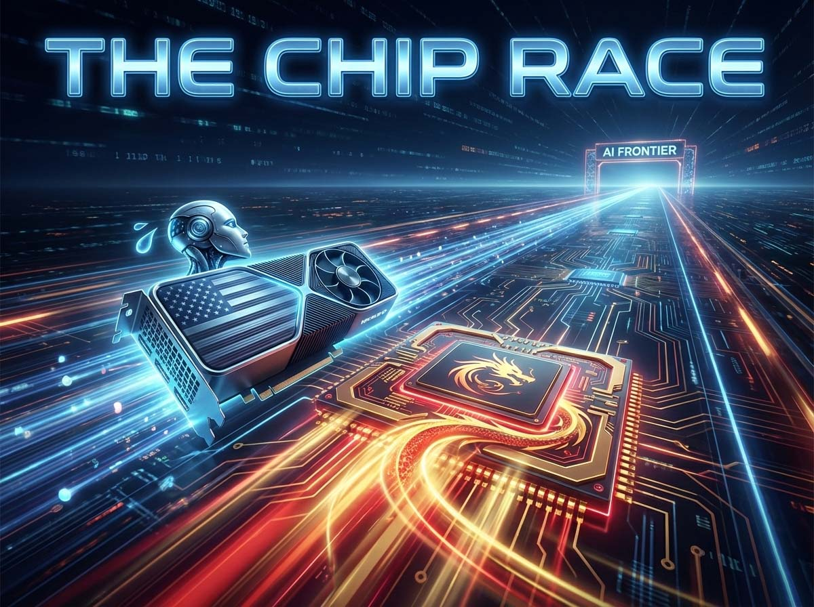
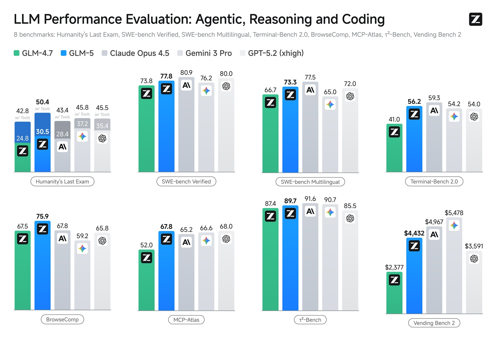

# GLM-5: Das auf chinesischen Chips trainierte Modell

*Ein Modell mit 744 Milliarden Parametern, das vollständig auf heimischen Huawei-Chips trainiert wurde und in einigen der relevantesten Tests die Leistung der besten proprietären amerikanischen Modelle erreicht. Und das alles ohne einen einzigen NVIDIA-Prozessor. Das Rennen um die technologische Autonomie Chinas ist kein Zukunftsversprechen mehr: Es hat bereits stattgefunden, und GLM-5 ist der bisher eloquenteste Beweis dafür.*

Wer dieses Portal schon länger verfolgt, weiß, dass wir etwas beobachten, das größer ist als eine Serie von Modellveröffentlichungen. Mit [Kimi K2.5](https://aitalk.it/it/kimik2.5.html), [DeepSeek MHC](https://aitalk.it/it/deepseek-mhc.html) und [Kimi K2 Thinking](https://aitalk.it/it/kimi-k2-thinking.html) haben wir die Puzzleteile eines Mosaiks beschrieben, das nun mit der Ankunft von [GLM-5](https://z.ai/blog/glm-5) seine Gesamtform deutlicher zeigt. Es handelt sich nicht um isolierte Ausnahmemodelle. Es handelt sich um eine systematische, koordinierte Bewegung, die die chinesische Open-Source-KI in nur wenigen Monaten von der Verfolgung zur Parität und in einigen Fällen zum Überholen der renommiertesten amerikanischen Labore geführt hat.

GLM-5 wurde am 11. Februar 2026 von [Z.ai](https://z.ai/blog/glm-5) vorgestellt, dem internationalen Namen, unter dem Zhipu AI seit 2025 auftritt – ein Unternehmen, das 2019 als Spin-off der Tsinghua-Universität in Peking gegründet wurde. Der Start hätte symbolträchtiger nicht sein können: am Vorabend des Mondneujahrs, in dem, was einige Analysten bereits als die „Frühlingsfest-Offensive“ der chinesischen KI bezeichnen. Ein Zufall? Schwer zu glauben.

## Im Inneren des Motors: Engineering im großen Maßstab

Um zu verstehen, was GLM-5 aus technischer Sicht darstellt, ist eine Analogie hilfreich. Stellen Sie sich ein großes Tonstudio vor. Alte Modelle waren wie Orchester in Standardgröße, bei denen alle Musiker gleichzeitig spielen. „Mixture of Experts“-Modelle (MoE) wie GLM-5 funktionieren hingegen wie ein riesiges Orchester, bei dem für jedes Stück nur die am besten geeigneten Musiker auf die Bühne gerufen werden. Das Endergebnis ist reicher, aber die Kosten für die Ausführung sind viel niedriger, als man es aufgrund der Gesamtgröße des Ensembles erwarten würde.

Konkret: GLM-5 verfügt über insgesamt 744 Milliarden Parameter (das Äquivalent zum im neuronalen Netz gespeicherten „Wissen“), aktiviert aber für jede einzelne Anfrage nur 40 Milliarden. Im Vergleich zum Vorgänger GLM-4.5, der bei insgesamt 355 Milliarden Parametern mit 32 Milliarden aktiven stehen blieb, ist dies ein beträchtlicher Sprung, sowohl in Bezug auf die Kapazität als auch auf die Effizienz bei der Bewältigung der Rechenlast.

Hinzu kommt eine weitere relevante technische Entscheidung: die Integration des von DeepSeek entwickelten Sparse-Attention-Mechanismus, bekannt als DeepSeek Sparse Attention. Ohne in mathematische Details zu gehen, ermöglicht diese Technik dem Modell die Verarbeitung sehr langer Texte mit bis zu 200.000 Text-„Tokens“ (entspricht etwa 150.000 Wörtern), ohne dass die Rechenkosten proportional zur Länge explodieren. Es ist dieselbe Logik, die DeepSeek ermöglicht hat, die Betriebskosten seiner Modelle drastisch zu senken: keine Ressourcen für jedes einzelne Wort des Kontextes verschwenden, sondern sich auf die relevantesten konzentrieren.

Die Trainingsdaten wuchsen von 23 auf 28,5 Billionen Token an, auf denen das Modell „trainiert“ wurde, bevor es durch Reinforcement Learning weitere Verfeinerungen erhielt – eine Technik, die, vereinfacht gesagt, das Modell belohnt, wenn es bessere Antworten liefert, und es korrigiert, wenn es Fehler macht, ähnlich wie ein Athlet mit einem anspruchsvollen Coach trainiert wird. Um diesen Prozess in so großem Maßstab zu bewältigen, entwickelte das Zhipu-Team eine Trainingsinfrastruktur namens [Slime](https://github.com/THUDM/slime), die den Rechenfluss asynchron optimiert und die Ausfallzeiten zwischen den einzelnen Trainingszyklen reduziert.

Ein praktischer Hinweis für alle, die über eine eigenständige Installation nachdenken: Das Modell benötigt in seiner Originalversion mit maximaler Präzision etwa 1.490 Gigabyte Speicher, mehr als anderthalb Terabyte. Das sind Zahlen für ein Rechenzentrum, nicht für eine heimische Workstation. Es gibt jedoch eine Version mit reduzierter Präzision (FP8), die diese Anforderung halbiert und das Modell für gängigere, wenn auch immer noch anspruchsvolle Infrastrukturen zugänglich macht.

## Wo es siegt, wo es schwächelt: Die Zahlen ohne Filter

Die Leistungsanalyse ist der Punkt, an dem die Rhetorik der Pressemitteilungen auf die Realität der Tests trifft. Und hier hält GLM-5 einige Überraschungen bereit, in beide Richtungen.

An der Front der agentischen Fähigkeiten – der Fähigkeit des Modells, komplexe Aufgaben autonom auszuführen und nicht nur einzelne Fragen zu beantworten – erreicht GLM-5 Ergebnisse, die bis vor wenigen Monaten als exklusives Vorrecht kostenpflichtiger proprietärer Modelle galten. Nach den Messungen von [Artificial Analysis](https://artificialanalysis.ai/articles/glm-5-everything-you-need-to-know), das einen zusammengesetzten Index namens GDPval-AA verwendet, um den praktischen Nutzen bei realen Arbeitsaufgaben zu messen, erzielt GLM-5 einen ELO-Score von 1412. Damit belegt es den dritten Platz weltweit, unmittelbar nach Claude Opus 4.6 von Anthropic und GPT-5.2 von OpenAI. Es ist das erste unter allen Open-Source-Modellen mit einem signifikanten Vorsprung vor Wettbewerbern derselben Kategorie wie Kimi K2.5 und DeepSeek V3.2.

Noch bedeutsamer ist der Sprung nach vorn gegenüber seinem direkten Vorgänger: GLM-4.7 erzielte im Artificial Analysis Intelligenz-Index eine Punktzahl von 42; GLM-5 erreicht 50 und ist damit das erste Open-Source-Modell, das diesen Schwellenwert in Version 4.0 des Index erreicht und überschreitet. Das ist keine willkürliche Zahl: Sie markiert den Moment, in dem der Abstand zwischen offenen Modellen und High-End-Proprietärmodellen auf etwas wirklich Messbares geschrumpft ist.

Im Bereich der Programmierung erreicht GLM-5 77,8 % im SWE-bench Verified Benchmark, der die Fähigkeit misst, reale Probleme in bestehenden Code-Repositories zu lösen – ein Test, der der täglichen Arbeit eines Entwicklers viel näher kommt als theoretische Tests. Claude Opus 4.5 stoppt bei 80,9 %, GPT-5.2 bei 80,0 %: Der Abstand ist da, liegt aber im Bereich von wenigen Prozentpunkten, nicht in einem Abgrund.

Das vielleicht überraschendste Ergebnis betrifft Halluzinationen – jenes Phänomen, bei dem Sprachmodelle Informationen mit der gleichen Sicherheit „erfinden“, mit der sie wahre Fakten wiedergeben, eines der schwierigsten Probleme der generativen KI. GLM-5 reduziert seine Halluzinationsrate im Vergleich zu GLM-4.7 um 56 % und erreicht damit das niedrigste Niveau unter allen von Artificial Analysis getesteten Modellen. Der verwendete Mechanismus ist schlicht ehrlich: Wenn das Modell etwas nicht weiß, verzichtet es auf eine Antwort, anstatt etwas zu erfinden. Eine Entscheidung, die die Vollständigkeit der Antworten leicht beeinträchtigt, aber die Zuverlässigkeit der gelieferten Antworten radikal verbessert.

Es gibt jedoch konkrete Grenzen, die nicht unterschätzt werden sollten. GLM-5 ist derzeit ein reines Textmodell: Es analysiert keine Bilder und produziert keine Multimedia-Inhalte, während Wettbewerber wie Kimi K2.5 bereits visuellen Input unterstützen. Die Inferenzgeschwindigkeit von etwa 17-19 Token pro Sekunde ist spürbar niedriger als bei Modellen, die auf NVIDIA-Hardware der neuesten Generation trainiert wurden und 25 Token und mehr erreichen. Und das maximale Kontextfenster von 200.000 Token bleibt trotz seiner Größe unter der Million, die Claude Opus 4.6 erreicht. Keine vernachlässigbaren Mängel, aber Elemente, die im Verhältnis zu Kosten und Verfügbarkeit abgewogen werden müssen.

[Bild von z.ai](https://z.ai/blog/glm-5)

## Der Huawei-Schachzug: Viel mehr als ein technisches Detail

Hier macht die technische Analyse Platz für etwas Größeres. GLM-5 wurde vollständig auf Huawei Ascend-Chips trainiert, ohne einen einzigen NVIDIA-Prozessor. Um jedoch das Gewicht dieser Aussage zu verstehen, ist ein Rückblick von einigen Monaten erforderlich.

Am 14. Januar 2026 hatte Zhipu AI bereits ein Ergebnis angekündigt, das unter dem Radar für Schlagzeilen gesorgt hatte: GLM-Image, ihr generatives Bildmodell, war das erste High-End-Multimodalmodell der Welt, das seinen gesamten Trainingszyklus auf chinesischer Hardware absolvierte, speziell auf Huawei Ascend Atlas 800T A2 Servern. Das war bereits ein Meilenstein. Mit GLM-5 hat Zhipu diese Erfahrung in einem viel größeren Maßstab wiederholt und erweitert und auf ihr Flaggschiff-Sprachmodell ausgeweitet.

Der geopolitische Kontext ist unverzichtbar. Das US-Handelsministerium hat Zhipu AI auf seine Liste von Unternehmen gesetzt, die gegen die nationalen Sicherheitsinteressen der Vereinigten Staaten handeln, und dabei angebliche Verbindungen zu chinesischen Militärstrukturen angeführt. Die praktische Folge war die Sperrung des Zugangs zu NVIDIA H100- und A100-Prozessoren – den Grafikkarten, die zum De-facto-Standard für das Training fortschrittlichster Sprachmodelle geworden sind. Die Antwort von Zhipu bestand nicht darin, Abkürzungen oder alternative westliche Hardware zu suchen: Sie bestand darin, die Zusammenarbeit mit Huawei zu beschleunigen und zu beweisen, dass man die gleiche Arbeit mit chinesischen Werkzeugen erledigen kann.

Die Ascend 910B- und 910C-Prozessoren von Huawei bieten einzeln etwa 60-80 % der Rechenleistung einer NVIDIA H100. Eine nicht zu vernachlässigende Lücke, die Zhipu durch zwei parallele Strategien schloss: tiefgreifende Softwareoptimierung durch Huaweis MindSpore-Framework und horizontale Skalierbarkeit – mehr Maschinen, die parallel arbeiten, um die geringere individuelle Leistung jeder einzelnen zu kompensieren. Huaweis CloudMatrix 384 System, das fast 400 Ascend-Chips zu einer einzigen logischen Einheit zusammenfasst, erreicht eine Gesamtrechenleistung von 300 Petaflops – eine beeindruckende Zahl, die mit einem Ansatz erzielt wurde, der mehr Hardware erfordert, aber die Praktikabilität der „heimischen“ Alternative beweist.

Es lohnt sich, in einem Punkt präzise zu sein: GLM-5 ist nicht das erste große chinesische Sprachmodell, das auf Nicht-NVIDIA-Chips trainiert wurde. Aber es ist das erste dieser Generation – der Generation von Modellen mit hunderten Milliarden Parametern, die mit den besten amerikanischen Laboren konkurrieren –, das dies in einem solchen Maßstab auf rein chinesischer Hardware tut und Ergebnisse erzielt, die dem Vergleich mit den weltweiten Spitzenmodellen standhalten. Die Unterscheidung ist technischer Natur, aber die strategische Tragweite ist enorm.

Es ist bezeichnend, dass Zhipu sich nicht auf Ascend beschränkt hat. Die offizielle Dokumentation auf [GitHub](https://github.com/zai-org/GLM-5/blob/main/example/ascend.md) listet die Unterstützung für Moore Threads, Cambricon, Kunlun Chip, MetaX, Enflame und Hygon auf – praktisch das gesamte Ökosystem alternativer chinesischer KI-Chips zu NVIDIA. Ein Signal, dass die Richtung nicht einfach nur „wir benutzen Huawei, weil wir gezwungen sind“ lautet, sondern „wir bauen ein Ökosystem auf, das von keinem ausländischen Lieferanten abhängt“.

## Open Source als strategische Waffe

GLM-5 wird unter der MIT-Lizenz vertrieben, der permissivsten unter den Open-Source-Lizenzen, die eine kommerzielle Nutzung, Änderung und Weiterverbreitung ohne nennenswerte Einschränkungen erlaubt. Die Gewichte des Modells sind auf [Hugging Face](https://huggingface.co/zai-org/GLM-5) und ModelScope frei downloadbar. Die API ist über die Plattform [Z.ai](https://docs.z.ai/guides/llm/glm-5) zu Preisen zugänglich, die deutlich unter denen der proprietären Wettbewerber liegen: etwa 1 Dollar pro Million Eingabe-Token und 3,2 Dollar pro Million Ausgabe-Token, gegenüber 15 Dollar und mehr bei Modellen von OpenAI und Anthropic auf gleichem Niveau.

Diese Entscheidung für radikale Offenheit hat etwas Besonderes und Bewusstes. Zhipu AI ist ein an der Hongkonger Börse (HKEX: 2513) notiertes Unternehmen, dessen Börsengang am 8. Januar 2026 abgeschlossen wurde und etwa 558 Millionen Dollar einbrachte. Es ist kein gemeinnütziges akademisches Projekt: Es hat Investoren, Aktionäre und Renditeerwartungen. Dennoch verteilt es sein fortschrittlichstes Modell kostenlos und unter einer sehr freien Lizenz.

Die Logik, die wir bereits bei DeepSeek und Kimi gesehen haben, ist die des Ökosystems: Je mehr Entwickler weltweit auf GLM-5 aufbauen, desto mehr wächst die Akzeptanz der Z.ai-Plattform, der API-Dienste und der Marke. Es ist ein Geschäftsmodell, bei dem die Offenheit des Modells das effektivste Marketingprodukt ist und gleichzeitig im aktuellen geopolitischen Kontext ein Instrument des Soft Power-Einflusses auf das globale Ökosystem der künstlichen Intelligenz darstellt.

Es muss jedoch eine Frage gestellt werden, die bei Diskussionen über chinesische Open-Source-Modelle oft im Hintergrund bleibt: die Auswirkungen in Bezug auf Sicherheit und Einhaltung gesetzlicher Vorschriften. Zhipu AI unterliegt der chinesischen Gerichtsbarkeit mit allen daraus resultierenden Verpflichtungen in Bezug auf nationale Sicherheit und Datenzugriff. Das Modell selbst ist nach dem Download unabhängig von dem Unternehmen, das es erstellt hat, aber wer die API von Z.ai nutzt, verlässt sich auf eine Infrastruktur, die chinesischen Gesetzen unterliegt. Für viele westliche Unternehmen, insbesondere in regulierten Sektoren, ist dies kein vernachlässigbares Detail. Für einzelne Entwickler oder Unternehmen in weniger sensiblen Kontexten garantiert die MIT-Lizenz einen Ausweg: die Gewichte herunterladen, das Modell autonom laufen lassen, ohne externe Abhängigkeiten.

Das Thema Bias in den Trainingsdaten, das für jedes auf menschlichen Textkorpora trainierte Modell unvermeidlich ist, bleibt ebenfalls eine offene Frage. Zhipu hat noch keinen detaillierten technischen Bericht veröffentlicht (das Team kündigte an, dass er „in Arbeit“ sei), was es schwierig macht, die bei der Datenauswahl und in der Phase der Werteausrichtung getroffenen Entscheidungen unabhängig zu bewerten. Ein Versäumnis, das kein nebensächliches Detail ist: Genau auf diesem Punkt haben amerikanische Labore wie Anthropic und OpenAI einen bedeutenden Teil ihres Rufs aufgebaut, mit umfangreicher öffentlicher Dokumentation und expliziten Richtlinien.

## Das Bild, das sich abzeichnet

Betrachtet man die in den letzten Wochen auf diesem Portal veröffentlichten Artikel, ist das Muster unverkennbar. In einem komprimierten Zeitraum haben DeepSeek, Moonshot (mit Kimi) und Zhipu (mit GLM) Modelle veröffentlicht, die nicht nur „fast“ die besten amerikanischen Labore erreichen: In spezifischen Benchmarks und Anwendungsfällen übertreffen sie diese, oft zu einem Bruchteil der Kosten. Dies ist kein zeitlicher Zufall: Es ist das Signal eines Sektors, der eine kritische Masse an Kompetenzen, Kapital und, was noch wichtiger ist, eine Entwicklungsfähigkeit auf heimischer Hardware erreicht hat, die die amerikanischen Sanktionen nicht stoppen konnten, sondern eher beschleunigt haben.

Die Reaktion der Märkte auf chinesische Modelle ist im Februar 2026 kein Novum. Der spektakulärste Präzedenzfall datiert vom 27. Januar 2025, als die Ankündigung von DeepSeek R1 an einem einzigen Tag fast 600 Milliarden Dollar an Börsenkapitalisierung von Nvidia vernichtete – der schnellste Einbruch in der Geschichte des amerikanischen Aktienmarktes. GLM-5 fügt sich in diese Spur ein: Es hat keinen vergleichbaren Schock ausgelöst, festigt aber das Narrativ, das der Markt bereits metabolisiert hat – das eines chinesischen Ökosystems, das nicht langsamer werden muss.

Für den Sektor als Ganzes ist die Lektion von GLM-5, wie schon von DeepSeek und Kimi zuvor, dass das Rennen um die künstliche Intelligenz kein Wettbewerb zwischen nur zwei Teams mehr ist. Wer Infrastrukturen plant, wer Anbieter bewertet, wer Investitionsentscheidungen im Technologiesektor trifft, muss sich mit einem genuinely multipolaren Ökosystem auseinandersetzen, in dem geopolitische Variablen, Lizenzentscheidungen und Hardwareabhängigkeiten zu einem integralen Bestandteil der technischen Analyse geworden sind.

GLM-5 ist auf [Hugging Face](https://huggingface.co/zai-org/GLM-5) frei verfügbar, über die API auf [Z.ai](https://chat.z.ai) testbar und kann im technischen Detail auf dem offiziellen [GitHub-Repository](https://github.com/zai-org/GLM-5) eingesehen werden. Wer sich eine fundierte Meinung bilden möchte, dem steht das gesamte Material zur Verfügung.
