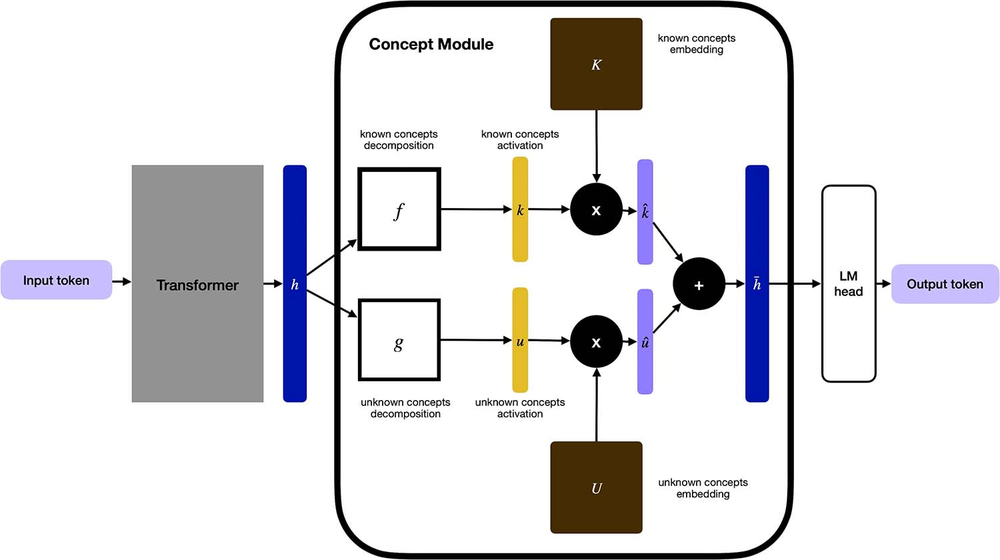

# Steerling: cuando la IA te explica sus pensamientos

*Hay una paradoja en el corazón de la inteligencia artificial moderna que rara vez se dice en voz alta: los sistemas más potentes que hemos construido son también los que menos entendemos. Un modelo lingüístico de miles de millones de parámetros puede escribir código, sintetizar investigaciones científicas, razonar sobre contratos legales y, sin embargo, nadie, ni siquiera quienes lo entrenaron, es capaz de decirte con precisión *por qué* escribió esa palabra y no otra. Es como tener un colaborador extraordinariamente capaz al que, sin embargo, nunca puedes pedirle que te muestre su razonamiento.*

Las consecuencias de esta opacidad no son abstractas. Cuando Grok de xAI mostró repetidamente resultados políticamente extraños, el equipo de mantenimiento tuvo que realizar largas sesiones de "interrogatorio" al modelo, refinando prompts, ajustando parámetros, esperando que el comportamiento se estabilizara. Cuando ChatGPT terminó bajo fuego por su tendencia a la sycophancy (sicofancia), es decir, a dar la razón al usuario incluso cuando se equivoca, el problema era imposible de localizar quirúrgicamente: todo estaba distribuido en miles de millones de conexiones, en todas partes y en ninguna. Toda la investigación sobre la llamada XAI, la *IA explicable*, nace de esta frustración e intenta responderla con herramientas aplicadas a posteriori, técnicas como LIME o SHAP que analizan un modelo ya entrenado intentando reconstruir su funcionamiento desde el exterior, como arqueólogos que excavan entre las ruinas de una civilización perdida.

Guide Labs, una startup fundada en San Francisco, ha decidido abordar el problema desde un ángulo completamente diferente. En lugar de estudiar el modelo después de su nacimiento, ha buscado hacer de la transparencia una parte integrante de la arquitectura, algo que no se añade sino que se diseña dentro, desde el principio.

## El problema que 2020 puso de relieve

Para entender lo que ha construido Guide Labs vale la pena partir de donde nació el proyecto. Julius Adebayo, CEO y cofundador de la empresa junto a la Directora Científica Aya Abdelsalam Ismail, comenzó este camino durante su doctorado en el MIT. En 2020 co-firmó un [paper académico](https://arxiv.org/abs/1810.03292) que tuvo un impacto significativo en el campo: la investigación mostraba que los métodos entonces en uso para "explicar" las decisiones de los modelos de aprendizaje profundo no eran fiables. Las herramientas de interpretabilidad post-hoc, las que se aplican a un modelo ya construido para entender qué hace, producían explicaciones que parecían sensatas pero que no correspondían necesariamente a cómo razonaba realmente el modelo.

Es un descubrimiento que suena casi filosófico, pero tiene implicaciones prácticas enormes. Si no puedes confiar en las herramientas que te dicen por qué un modelo tomó una decisión, no puedes usar esas explicaciones para corregir errores, para verificar el cumplimiento normativo o para garantizar que el modelo no esté discriminando sobre bases que no debería considerar. La explicabilidad se convertía, en ese marco, en una forma de consuelo narrativo más que de control real.

Adebayo llegó a una conclusión radical: la única forma de tener una interpretabilidad auténtica es construirla dentro del modelo, no aplicarla encima. «El tipo de interpretabilidad que se hace habitualmente es como hacer neurociencia en un modelo», dijo en una [entrevista a TechCrunch](https://techcrunch.com/2026/02/23/guide-labs-debuts-a-new-kind-of-interpretable-llm/). «Nosotros, en cambio, diseñamos el modelo desde la base para que no necesites hacer neurociencia».

## La arquitectura: un cuello de botella que se ve

El 23 de febrero de 2026 Guide Labs hizo público [Steerling-8B](https://github.com/guidelabs/steerling), un modelo lingüístico de 8.000 millones de parámetros con licencia Apache 2.0, entrenado con 1,35 billones de tokens. La elección de hacer el modelo de código abierto, con pesos disponibles en [Hugging Face](https://huggingface.co/guidelabs/steerling-8b) y código en GitHub, es parte de una estrategia precisa: hacer que el enfoque sea examinado por la comunidad científica y recoger comentarios reales.

La innovación central se llama *concept module* (módulo de concepto): un nivel arquitectónico insertado entre el núcleo transformer del modelo y su capa de salida. En un modelo lingüístico tradicional, las representaciones internas se transforman en predicciones del siguiente token a través de un camino opaco y altamente no lineal. En Steerling, ese camino se rompe: antes de producir cualquier resultado, cada representación debe pasar por este cuello de botella conceptual, donde se traduce a términos comprensibles.

¿Cómo funciona en la práctica? El modelo trabaja con dos familias de conceptos. La primera comprende unos 33.000 conceptos "conocidos", etiquetados manualmente, categorías como *legal*, *médico*, *ironía*, *tono analítico*, *biología molecular*. La segunda incluye unos 100.000 conceptos "descubiertos" autónomamente por el modelo durante el entrenamiento, sin supervisión humana. Cada predicción de token debe pasar a través de una combinación lineal de estos conceptos, lo que significa que la contribución de cada concepto a cada salida es matemáticamente calculable, no aproximada.

El resultado práctico es notable: para cualquier grupo de tokens generados por Steerling, es posible remontarse a tres niveles de origen. El primero es el *contexto de entrada*, es decir, qué partes del prompt han influido más en esa porción de respuesta. El segundo son los *conceptos*, con una lista ordenada por relevancia de qué categorías semánticas han guiado la generación. El tercero es quizás el más sorprendente: los *datos de entrenamiento*, con la distribución de las fuentes de entrenamiento que han alimentado los conceptos activados durante la generación, ArXiv, Wikipedia, FLAN, etc.

Es como tener, en cada párrafo generado por la IA, una nota al pie que explica de dónde viene.

## El coste de la honestidad: ¿cuánto se paga en rendimiento?

La pregunta que surge espontáneamente es obvia: si obligas al modelo a pasar por un cuello de botella conceptual, ¿estás renunciando a algo en términos de capacidad? La respuesta de Guide Labs, respaldada por los datos que publicó en el documento técnico [Scaling Interpretable Models to 8B](https://www.guidelabs.ai/post/scaling-interpretable-models-8b/), es que el coste existe pero es manejable y previsible.

Los experimentos muestran que la interpretabilidad se comporta como una «tasa fija»: un pequeño peaje constante que no empeora al aumentar el tamaño del modelo. Las curvas de aprendizaje entre el modelo base y el que tiene el concept module son casi superponibles. En benchmarks estándar como HellaSwag, OpenBookQA, ARC-Challenge, PIQA y WinoGrande, el modelo interpretable mantiene rendimientos comparables al modelo base sin el concept module, y la diferencia de precisión se estrecha aún más a medida que el modelo crece.

Steerling-8B, según lo declarado por Guide Labs, alcanza el 90% de las capacidades de modelos equivalentes entrenados en conjuntos de datos de 2 a 7 veces más grandes. Lo cual es notable no solo como resultado de interpretabilidad, sino también como eficiencia de entrenamiento.

Sin embargo, hay un aspecto crítico que merece atención: estos benchmarks miden el rendimiento lingüístico general, no la calidad de las explicaciones. Que los conceptos identificados por el modelo sean realmente informativos y no circulares, es decir, que "explicar" no signifique simplemente nombrar la categoría obvia, es una pregunta aún abierta. El campo de la interpretabilidad no dispone de métricas compartidas y consolidades para evaluar objetivamente la calidad de una explicación. Guide Labs mide su propia interpretabilidad con métricas internas (como el AUC de detección de conceptos respecto a anotaciones de referencia), pero aún no existe un estándar industrial o académico universalmente aceptado.

Además, hay otra limitación estructural que considerar. Toda la arquitectura depende de un sistema previo llamado [ATLAS](https://www.guidelabs.ai/post/atlas-concept-annotated-pretraining-release/), desarrollado por el mismo equipo, que se encarga de anotar el corpus de pre-entrenamiento con las etiquetas conceptuales. Este sistema utiliza a su vez modelos de IA para clasificar los datos. Es una solución ingeniosa, pero introduce una dependencia: la calidad de la interpretabilidad final está vinculada a la calidad de las anotaciones previas. Si ATLAS es impreciso, las explicaciones de Steerling lo serán también, aunque nadie lo note inmediatamente desde el exterior.

[Imagen tomada de guidelabs.ai](https://www.guidelabs.ai/post/scaling-interpretable-models-8b/)

## Qué cambia realmente: control, no solo explicación

Uno de los aspectos más interesantes de Steerling, y probablemente el que tiene las implicaciones prácticas más inmediatas, no es la capacidad de explicar, sino la de controlar. Dado que cada predicción es una función lineal de las activaciones conceptuales, es posible modificar esas activaciones directamente, en tiempo de ejecución, sin reentrenar el modelo.

Esto se llama *steering conceptual* (dirección conceptual), y tiene consecuencias que van más allá de la simple explicabilidad. ¿Quieres que el modelo deje de hacer referencia a cierto tipo de contenido? Suprime el concepto correspondiente. ¿Quieres que responda con un tono más técnico? Amplifica los conceptos asociados al registro especializado. ¿Quieres eliminar el conocimiento relativo a un tema específico sin reentrenar desde cero? Intervén quirúrgicamente a nivel conceptual.

Adebayo ilustró esta capacidad con un ejemplo concreto particularmente revelador, citado en la [entrevista a TechCrunch](https://techcrunch.com/2026/02/23/guide-labs-debuts-a-new-kind-of-interpretable-llm/): en los modelos tradicionales, el concepto de género se distribuye en cientos de millones de parámetros de forma caótica e interconectada. Modificarlo de forma fiable requiere enormes esfuerzos de fine-tuning que a menudo producen efectos secundarios no deseados. En Steerling, si el concepto de género es rastreable y Controlable, puedes intervenir en él directamente. No es una garantía de ausencia de sesgo (los conceptos mismos reflejan los datos con los que se entrenó el modelo), pero es un mecanismo de intervención mucho más preciso que cualquier alternativa post-hoc.

Esto tiene consecuencias concretas en al menos tres contextos de alto riesgo. En el ámbito médico, donde un sistema de IA que ayuda al diagnóstico debe poder demostrar en qué evidencia se basa una recomendación. En el ámbito financiero, donde un modelo que evalúa solicitudes de crédito no puede considerar criterios como la etnia o el género, y debe poder demostrarlo. En el ámbito legal, donde la trazabilidad del razonamiento es a menudo un requisito del sistema, no algo opcional.

## El contexto normativo: el EU AI Act como acelerador

Steerling llega en un momento en que la presión regulatoria sobre la interpretabilidad de los sistemas de IA es concreta y creciente. El [EU AI Act](https://digital-strategy.ec.europa.eu/en/policies/regulatory-framework-ai) clasifica los sistemas de IA en categorías de riesgo, estando los sistemas de alto riesgo (los utilizados en medicina, justicia, crédito, selección de personal) sujetos a requisitos explícitos de transparencia y verificabilidad. El marco NIST en Estados Unidos se mueve en la misma dirección.

El enfoque de interpretabilidad intrínseca de Guide Labs se alinea estructuralmente con estos requisitos de una manera que los métodos post-hoc no pueden garantizar. Una explicación construida dentro del modelo es, por definición, fiel a su funcionamiento. Una explicación construida fuera puede ser informativa pero sigue siendo una aproximación, y en contextos donde esa explicación debe resistir un análisis legal, la diferencia es sustancial.

Dicho esto, la verificabilidad real de Steerling dependerá de cuánto sea capaz la comunidad externa de verificar sus afirmaciones de forma independiente. El código es público, los pesos están disponibles, y esto es un buen comienzo. Pero la validación de un enfoque tan nuevo requiere tiempo, reproducibilidad y crítica sistemática por parte de investigadores independientes. Todavía estamos al principio de ese proceso.

## El equipo y el camino

Guide Labs completó el programa Y Combinator y en noviembre de 2024 cerró una ronda seed de 9 millones de dólares liderada por Initialized Capital. Entre los asesores figura Jonathan Frankle, investigador conocido en el campo de la eficiencia de los modelos neuronales. La elección de Apache 2.0, licencia permisiva que permite el uso comercial sin restricciones, es deliberada: Guide Labs quiere que Steerling sea adoptado, examinado y mejorado por la comunidad. El siguiente paso declarado es el desarrollo de modelos más grandes y la apertura de acceso API y agéntico.

## Las preguntas que quedan abiertas

Steerling es un proyecto genuinamente interesante y técnicamente sólido, pero sería ingenuo presentarlo como la solución definitiva al problema de la opacidad de los modelos de IA. Hay preguntas legítimas a las que nadie ha respondido aún de forma satisfactoria.

La primera se refiere a la escalabilidad hacia los modelos frontera. Steerling-8B funciona con 8.000 millones de parámetros. Los modelos más potentes en circulación tienen una escala diferente, y no es en absoluto evidente que la sobrecarga del concept module siga siendo una «tasa fija» también en esas dimensiones. Guide Labs afirma que las leyes de escala se preservan, pero la demostración a escala de modelo de frontera aún no existe.

La segunda se refiere a la calidad intrínseca de los conceptos. Rastrear un token hasta un concepto etiquetado como "legal" o "tono analitico" es informativo, pero ¿hasta qué punto esas etiquetas corresponden realmente a lo que sucede dentro del modelo? Existe el riesgo concreto de construir una narrativa de explicación que sea coherente consigo misma pero no con la realidad interna del sistema. En ese caso, la interpretabilidad se convertiría no en un control sino en una forma más sofisticada de teatro de la transparencia: el modelo parece explicable, pero las explicaciones no corresponden a mecanismos reales.

La tercera pregunta se refiere a la ética de las atribuciones. Si podemos rastrear cada resultado hasta los datos de entrenamiento, también podemos identificar qué fuentes han contribuido a una respuesta problemática. Es un poder que puede usarse bien, para eliminar sesgos, para respetar los derechos de autor, para garantizar la precisión. Pero también puede usarse para atribuir responsabilidades de forma selectiva, o para construir mecanismos de control sobre lo que el modelo "sabe" o no sabe, con implicaciones que van mucho más allá de lo técnico.

Finalmente, está la pregunta más fundamental de todas: ¿qué significa realmente "entender" un modelo lingüístico? La respuesta de Guide Labs —rastrear cada token hasta sus contribuciones conceptuales y sus fuentes de entrenamiento— es elegante y operativamente útil. Pero ¿es un modelo que se explica en estos términos realmente más comprensible, o es simplemente más articulado al describir su propia opacidad?

Es una pregunta que la industria y la investigación deberán abordar juntas a medida que enfoques como el de Guide Labs se vuelvan más maduros y difundidos. Por ahora, Steerling-8B es el intento más serio y documentado de responder mediante ingeniería a un problema que hasta ahora parecía pertenecer casi exclusivamente al ámbito filosófico. Vale la pena seguirle la pista.
