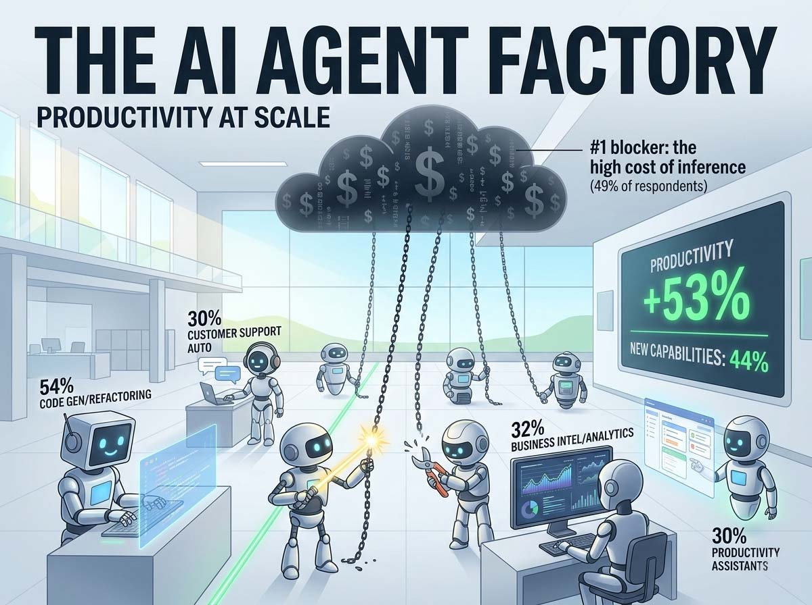
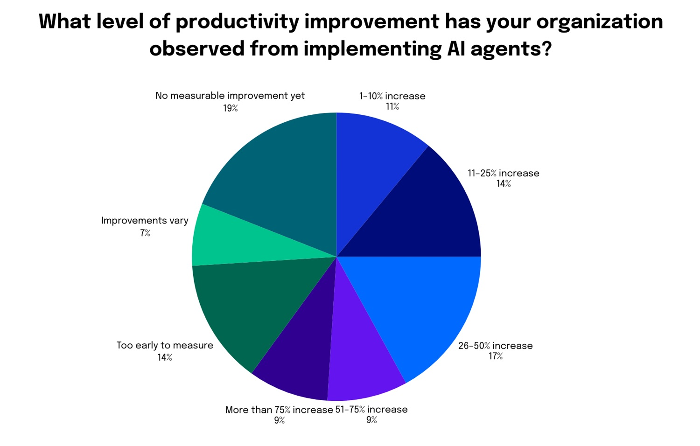
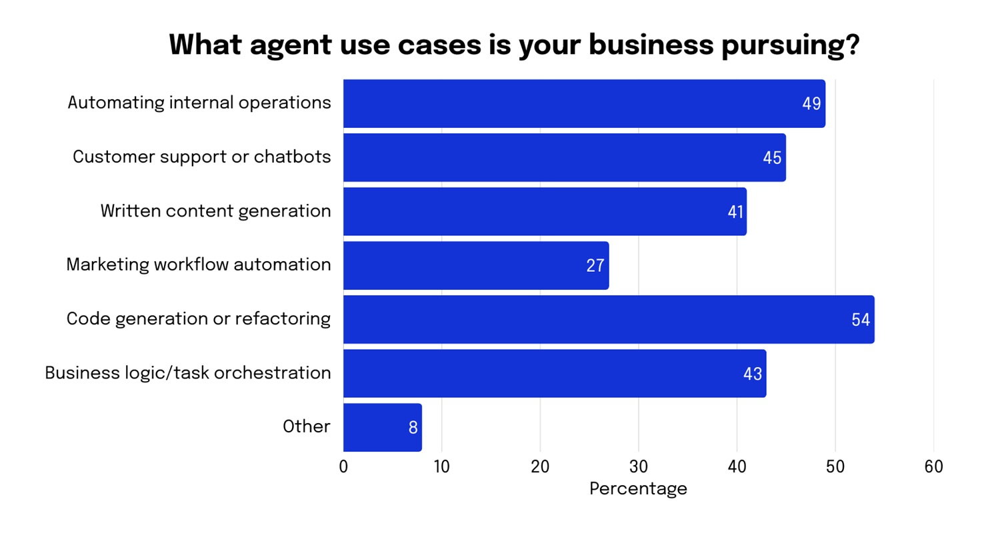

# AI Agents are Working. And the Numbers Add Up

## From Enthusiasm to Production

*There is a figure in the new [DigitalOcean report published in February 2026](https://www.digitalocean.com/currents/february-2026) that seems to contradict itself. The percentage of companies that claim to use artificial intelligence has slightly *fallen*, from 79% in 2024 to 77%, yet, during the same period, the share of those who are actually implementing it in their processes has almost *doubled*, jumping from 13% to 25%. A paradox only in appearance. That 2% decrease is not a defection: it's a cleanup. After the season of technological tourism, where everyone experimented but few built, the field has been left to those who are serious.*

The report, called *Currents*, is a periodic study that DigitalOcean conducts on the state of artificial intelligence in growing tech companies. The February 2026 edition is based on over 1,100 responses collected between October and November 2025 from developers, technical directors, and founders across 102 countries. The most represented are the United States at 28%, followed by the United Kingdom with 7%, Canada with 6%, India with 4%, Germany and the Netherlands with 3% each, and Italy with 2%. It is a broad, varied, and sufficiently global sample to offer a credible overview of the state of the art.

The central message is unequivocal: we have entered a new phase. 52% of the surveyed companies are now in one of the three most advanced stages of their AI journey: active implementation, performance optimization, or adoption as a central element of their strategy. In 2024, the same percentage stood at only 35%. Seventeen percentage points in twelve months is not a gradual evolution.

## Models aren't being built, they're being used

One of the most debated points in the public narrative about artificial intelligence concerns a dilemma that every company eventually faces: building their own models, maintaining full control over data and infrastructure, or relying on external providers, accepting the risks of dependency, data sovereignty, and confidentiality that this entails. The report's data does not resolve the dilemma, but it clearly shows which choice is winning in practice.

Only 15% of respondents are primarily engaged in training models from scratch. For everyone else, the work lies elsewhere: 64% integrate third-party APIs into their applications, and 61% use a combination of different tools rather than a single integrated solution. Artificial intelligence, for the vast majority of those who actually use it, has become a service to connect to, not a technology to build.

This shift has a specific name: inference. If training is the phase where a model learns—expensive, long, and reserved for a few laboratories—inference is the phase where that model is *used* to generate answers, analyze documents, write code, or respond to customers. This is where the bulk of investments is now concentrated: 44% of respondents allocate between 76% and 100% of their AI budget specifically to inference. The comparison with the cloud transition of a decade ago is inevitable: back then, the majority stopped worrying about hardware and learned to work with remote services. Artificial intelligence is going through the same phase.

## The hidden cost of intelligence

If there is an obstacle that strongly emerges from the report, it is the cost of inference at scale. 49% of respondents identify it as the main limit to the growth of their AI use. Not technical complexity, not legal risks: the cost.

When a system based on language models is brought into production, when it must respond to thousands or millions of requests per day, the bill grows in ways that are not always predictable. And predictability, according to the data, is one of the most felt concerns. For those using multiple tools and different providers, the problems multiply: 50% of respondents operating with multiple infrastructures report the need to manage separate interfaces, 49% struggle to predict costs, and 48% encounter difficulties in orchestrating and deploying systems.

Only 23% of respondents work with a single provider that integrates models, data, and infrastructure. All others must deal with a fragmented supply chain, where each piece requires specific skills, contracts, and attention. Artificial intelligence, at least in its current phase, is not a turnkey product: it is a permanent construction site, with all that this entails in terms of management complexity.

[Image taken from digitalocean.com](https://www.digitalocean.com/currents/february-2026)

## Who rules among the models

The report offers a sharp snapshot of the most used language model landscape, and the numbers confirm some intuitions but hold a few surprises.

OpenAI maintains a dominant position: 72% of respondents use its models. The first-mover advantage still translates into significant market shares. But the margin is narrowing: Google is at 50%, Anthropic at 47%. Both have gained ground rapidly, and the gap with the leader is no longer abysmal.

The real surprise comes from the world of open models. Meta with Llama and DeepSeek both reach 21%. DeepSeek is particularly noteworthy: it entered the market only at the end of 2024 and has already reached the same level of adoption as Llama, which has years of advantage. Open-source models offer concrete advantages: flexibility in adaptation, no dependency on a single provider, and the possibility of running on own infrastructure without sending data to third parties. For many companies, especially in contexts where confidentiality is crucial, they are not a fallback choice but a conscious strategy. The model market is neither a monopoly nor a Tower of Babel: it is a rapidly evolving oligopoly, where those betting on a single provider assume a strategic risk that many prefer to avoid.

## Agents: what they are, what they do, how well they work

The word "agent" is perhaps the most overused in the technological vocabulary of the last twelve months. It is worth defining it precisely.

An AI agent is a system capable of performing tasks autonomously, making decisions and taking actions—searching for information, writing code, sending messages, updating archives—without every single step requiring human intervention. The difference from a simple conversational assistant is substantial: an assistant answers questions, an agent *does* things. It is the distance between a navigator that indicates where to turn and a self-driving car.

The data shows that this technology has stopped being just a promise. 53% of companies using agents have observed time savings and productivity increases. 44% have recorded the creation of new operational capabilities that they were previously unable to offer. 32% have reduced the need for new hires. Overall, 67% of those who adopted agents found some form of productivity improvement: 25% in the range of 1-25%, 17% between 26% and 50%, 9% between 51% and 75%, and a further 9% with gains exceeding 75%.

These percentages are significant, but they should be read with caution. 14% have not yet seen concrete benefits. Above all, the level of autonomy actually granted to agents remains, in most cases, rather limited. Only 10% of respondents have fully autonomous agents in production. 40% still have all outputs reviewed by a human being. 58% use human approval points as their main control measure. Agents work, but under supervision.

The most widespread type of agent is one specialized in a single task (44%), followed by those capable of handling multiple tasks (29%) and systems in which multiple agents collaborate with each other (17%). The most popular use case, declared by 54% of respondents, is code generation and rewriting: no surprise here, given that the sample is predominantly composed of developers. This is followed by data analysis (41%), customer support automation (40%), information searching and summarization (39%), and internal workflow management (38%).

However, there is a figure that goes beyond individual use cases and reveals something more structural: 60% of respondents identify applications and agents as the level of the technological stack with the greatest long-term value. Not infrastructure, mentioned by only 19%, not development platforms, at 17%. It is a clear signal of where the market thinks the real game is being played: not in owning computing power or the underlying models, but in building the systems that put them to work in a useful and measurable way. It is the difference between owning a power plant and knowing how to build the appliances people actually want to use.

## The gap widens: those who start now risk chasing

One of the report's most explicit messages concerns the growing distance between those who have already integrated artificial intelligence into their processes and those still sitting on the sidelines. 50% of respondents state they are experimenting with or deploying agents. But of these, only 10% have integrated them systematically. 33% are in the phase of small experiments, 28% are still exploring basic concepts, and 23% have started the first real workloads.

Among those not yet using agents, the prospects for 2026 are worrying. 44% state they have no plans to experiment with them. Only 26% have planned tests or pilot trials. The reason why this gap risks worsening is related to the nature of organizational learning. Adopting artificial intelligence is not like installing a program: it requires months of experimentation, adjustments, building internal skills, and process revision. Those starting now are already at a structural disadvantage compared to those who began a year ago. The same dynamic was seen with the adoption of e-commerce, cloud, and social media: companies that bet early built advantages that were hard to close.

37% of respondents expect to increase the budget for applications and agents over the next twelve months, the most cited investment category overall. And 38% of those who have not yet started experiments state they will begin in 2026. But stating is not doing, and the history of large technological transformations is full of intentions not translated into actions.

[Image taken from digitalocean.com](https://www.digitalocean.com/currents/february-2026)

## Technical issues to resolve

The DigitalOcean report offers a precise snapshot of the current state, but some questions remain unanswered and will accompany the sector throughout 2026.

The first concerns reliability. 41% of respondents identify the lack of predictability of agents as the main obstacle to their adoption. A system that performs actions in the real world, updates archives, sends messages, and executes operations must be consistent. Current models have made enormous progress but have not yet reached the threshold that many production use cases require. This is also why 40% still maintain systematic human control: not out of philosophical choice, but out of practical necessity. 31% of respondents then indicate integration with existing applications as the second main obstacle: companies do not start from zero; they have management systems, archives, and flows built over years, often decades, and connecting an intelligent agent to this ecosystem requires time, skills, and thorough testing to prevent the new system from introducing unexpected behaviors.

The second issue is the concentration of power. Three providers—OpenAI, Google, Anthropic—together control the dominant share of models in use globally. If these models become critical infrastructure for millions of companies, the decisions these three actors make regarding prices, access, content censorship, and terms of use effectively turn into industrial policies elected by no one. Open models like Llama and DeepSeek offer a concrete alternative, but they require deployment skills and infrastructure resources that not all organizations can afford. Dependency is not a theoretical risk: it is already visible in the data, and the fact that only 21% of respondents use open models signals how difficult it is, in practice, to break free from the commercial triumvirate.

## Work, Europe, and remaining questions

The third question is about work. 32% of those using agents have already reduced the need for new hires. The productivity gains documented by the report do not automatically translate into widespread well-being. If the savings remain concentrated in the most capitalized companies, the gap between those who win and those who lose in the transformation will widen further. If instead the same productivity is used to expand supply, open new markets, and offer previously inaccessible services, the effect can be positive even for those who work. Technology does not decide: organizations, public policies, and the choices of those with economic power decide.

For Italy and Europe, present but not dominant in the sample, the question remains how to reconcile the urgency of adopting these technologies with a complex regulatory context. The European AI Act, which came into force in 2024, imposes requirements for compliance, transparency, and risk assessment that many companies are still trying to interpret. The regulation is not in itself a brake on development, but it requires investments in legal and governance skills that add to technical ones, raising the overall cost of entry. For small and medium-sized Italian enterprises, the backbone of the national productive fabric, the obstacle is not only economic or regulatory but also organizational: adopting capable agents requires a willingness to challenge consolidated processes, a tolerance for experimentation and error, and an ability to attract technical profiles that the Italian labor market struggles to produce in sufficient quantity. The figure of 2% of Italian respondents in the sample should not be read as an index of lack of interest, but probably as a mirror of a still peripheral participation in conversations taking place elsewhere.

According to the data, 2026 is the year many companies will move from experimentation to production. It is also the year some of these questions will start to have concrete answers, not always the ones we would hope for. Looking at the numbers honestly, as this report strives to do, is at least a good starting point.
