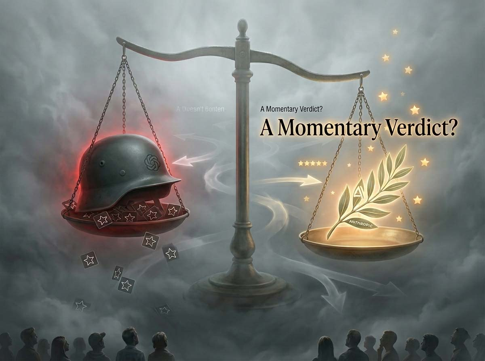
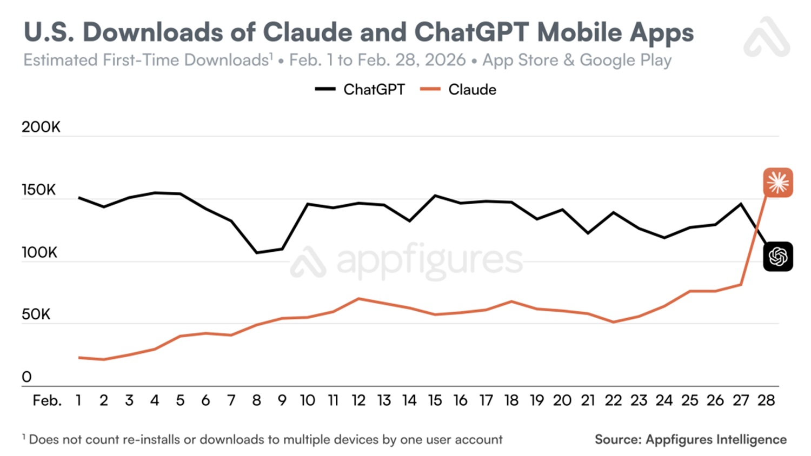

# Pentagon: Anthropic lehnt ab, OpenAI akzeptiert, wer herunterlädt und wer deinstalliert, und dann?

*Es gibt Wochen, die sich wie Jahrzehnte anfühlen, und die letzte Februarwoche 2026 war eine davon. Innerhalb von sechsundneunzig Stunden lehnte Anthropic die Bedingungen des US-Verteidigungsministeriums ab, das von der Trump-Administration in „Department of War“ umbenannt worden war, wurde zum Risiko für die nationale Lieferkette erklärt, geriet ins Visier eines Präsidialdekrets, sah seinen Chatbot an die Spitze des US-App-Stores klettern und kündigte an, gerichtlich dagegen vorzugehen. OpenAI unterzeichnete unterdessen eine Vereinbarung mit demselben Pentagon in einer so kurzen Zeit, dass sein eigener CEO dies öffentlich als „überstürzt“ bezeichnete. Die Nutzer reagierten auf ihre Weise: durch Deinstallation. Die Antwort auf die Frage, was wirklich passieren wird, ist ehrlich gesagt nur eine: Wir werden sehen.*

## Die Grenze, die niemand ziehen wollte

Um zu verstehen, was passiert ist, muss man davon ausgehen, was das Pentagon wollte und was Anthropic zu gewähren verweigerte. Der Kern des Streits betrifft [zwei präzise rote Linien](https://techcrunch.com/2026/02/27/anthropic-vs-the-pentagon-whats-actually-at-stake/): den Einsatz künstlicher Intelligenz zur Massenüberwachung amerikanischer Bürger und den Einsatz vollautonomer Waffensysteme, die in der Lage sind, Ziele ohne menschliches Eingreifen auszuwählen und zu eliminieren. Dario Amodei blieb auch dann standhaft, als Verteidigungsminister Pete Hegseth ein Ultimatum setzte – Freitag, 17:01 Uhr – und damit drohte, das Unternehmen als „Risiko für die Lieferkette“ einzustufen.

Die Position des Pentagons bestand in ihrer offiziellen Formulierung nicht darin, explizit Killerdrohnen zu fordern. Sprecher Sean Parnell erklärte auf X, dass das Ministerium kein Interesse an inländischer Massenüberwachung oder autonomen Waffen habe, sondern dass die Forderung einfacher gewesen sei: dem Pentagon die Nutzung der Modelle von Anthropic für „alle rechtmäßigen Zwecke“ zu gestatten. Der Reibungspunkt liegt genau dort. Wer entscheidet, was rechtmäßig ist? Hegseths Antwort war unmissverständlich: Sicherlich nicht der Anbieter.

Der regulatorische Kontext trägt nicht zur Beruhigung bei. Gemäß einer [Richtlinie des Verteidigungsministeriums aus dem Jahr 2023](https://www.esd.whs.mil/portals/54/documents/dd/issuances/dodd/300009p.pdf) können KI-Systeme Ziele ohne menschliches Eingreifen auswählen und bekämpfen, sofern sie bestimmte Standards erfüllen und von hochrangigen Beamten genehmigt wurden. Es gibt kein kategorisches Verbot für autonome Waffen im US-Militärapparat. Anthropic, das diesen Rahmen kannte, wollte nicht, dass seine Modelle in ein System gelangen, in dem die „rechtmäßige Nutzung“ in Zukunft automatisierte tödliche Entscheidungen beinhalten könnte. Die Sorge ist nicht unbegründet: Ein KI-System, das in Hochrisikokontexten platziert ist, kann irreversible Fehler mit der Geschwindigkeit eines Prozessors begehen. Der Unterschied zwischen einem Modell, das berät, und einem, das handelt, ist in bestimmten Szenarien der Unterschied zwischen einem korrigierbaren Fehler und einer Katastrophe.

Hegseth reagierte mit dem Beil. Trump erließ ein Dekret, das alle Bundesbehörden anweist, die Nutzung von Anthropic-Technologien innerhalb von sechs Monaten einzustellen. Anthropic hat angekündigt, die Entscheidung vor Gericht anzufechten.

## Die Zahlen, die Lärm machen

Während offizielle Mitteilungen kursierten, kam die unmittelbarste Reaktion aus den App-Stores, und die Daten sind ausreichend verifiziert, um punktuelle Aufmerksamkeit zu verdienen.

Laut [Sensor Tower](https://techcrunch.com/2026/03/02/chatgpt-uninstalls-surged-by-295-after-dod-deal/) stiegen die US-Deinstallationen von ChatGPT am 28. Februar auf Tagesbasis um 295 %. Zur Einordnung: Die typische tägliche Deinstallationsrate von ChatGPT, gemessen in den dreißig Wochen zuvor, lag bei 9 %. Das ist keine Schwankung, das ist ein Sprung. Die Downloads von ChatGPT sanken am Samstag um 13 % und am Sonntag um weitere 5 %. Auf der Gegenseite sah Claude seine US-Downloads am Freitag, dem 27. Februar – dem Tag von Amodeis Ablehnung –, um 37 % und am Samstag, dem 28. Februar, um weitere 51 % steigen. Die Folge war, dass Claude den ersten Platz im US-App-Store-Ranking erreichte, ein Sprung um mehr als zwanzig Plätze gegenüber dem 22. Februar.

Appfigures, ein zweiter unabhängiger Datenanbieter, bestätigt, dass die täglichen Downloads von Claude in den USA am Samstag zum allerersten Mal die von ChatGPT übertrafen, mit noch höheren Wachstumsschätzungen: +88 % auf Tagesbasis. Appfigures meldet auch, dass Claude in sechs Ländern auf Platz eins der kostenlosen iPhone-Apps lag: Belgien, Deutschland, Kanada, Luxemburg, Norwegen, Schweiz und den Vereinigten Staaten. Sensor Tower fügt ein besonders aussagekräftiges Sentiment-Datum hinzu: Die Ein-Sterne-Bewertungen für ChatGPT stiegen am Samstag, dem 28. Februar, um 775 %, mit einer weiteren Verdoppelung am Sonntag. Die Fünf-Sterne-Bewertungen sanken im gleichen Zeitraum um 50 %.

Methodisch redlich muss gesagt werden, dass Similarweb beobachtete, dass die Downloads von Claude in der letzten Woche etwa zwanzigmal höher waren als im Januar, aber auch präzisierte, dass der Anstieg andere Ursachen als die politische Frage haben könnte. Alles der ethischen Entscheidung von Anthropic zuzuschreiben, wäre eine Vereinfachung. Die zeitliche Übereinstimmung ist jedoch schwer zu ignorieren.

[Abbildung von techcrunch.com](https://techcrunch.com/2026/03/02/chatgpt-uninstalls-surged-by-295-after-dod-deal/)

## OpenAI, die überstürzte Vereinbarung und die diskutierten Guardrails

Sam Altman [gab es auf X](https://x.com/sama/status/2027911640256286973) ohne große Umschweife zu: Das Abkommen mit dem Verteidigungsministerium sei „definitiv überstürzt“ gewesen und „die Aussichten sehen nicht gut aus“. Es ist ein seltener Eingeständnis eines CEO, der eine eigene strategische Entscheidung öffentlich kritisiert, während er sie noch verteidigt.

Die Chronologie ist wie folgt: Freitagabend scheitern die Verhandlungen zwischen Anthropic und dem Pentagon endgültig; Samstag kündigt OpenAI sein Abkommen für den Einsatz von Modellen in geheimen Umgebungen an. Die Schnelligkeit warf sofort Fragen auf: Hatte OpenAI wirklich dieselben roten Linien wie Anthropic? Wenn ja, wie war es dem Unternehmen gelungen zu unterschreiben, wo Anthropic gescheitert war?

OpenAI antwortete mit [einem Blogpost](https://openai.com/index/our-agreement-with-the-department-of-war/) und listete drei Bereiche auf, die vom Abkommen ausgeschlossen sind: inländische Massenüberwachung, autonome Waffensysteme und automatisierte Entscheidungen mit hohem Risiko. Das Unternehmen argumentierte, dass sein Ansatz im Gegensatz zu anderen Betreibern, die ihre „Sicherheits-Guardrails in militärischen Implementierungen reduziert oder entfernt“ hätten, vielschichtig sei: vollständige Kontrolle über den Sicherheits-Stack, ausschließlicher Cloud-Einsatz, OpenAI-Personal mit Sicherheitsfreigabe im Prozess, „robuste“ vertragliche Schutzmaßnahmen. Katrina Mulligan, Leiterin der Partnerschaften für nationale Sicherheit, argumentierte auf LinkedIn, dass die Beschränkung des Einsatzes auf die Cloud-API die Integration der Modelle in Waffensysteme physisch verhindere: Ein nur über die Cloud zugängliches Modell habe eine architektonische Distanz zu Kontrollsystemen, die ein lokal installiertes Modell nicht habe. Es ist ein technisches Argument, das nicht ohne Logik ist.

Dennoch erhob [Mike Masnick](https://bsky.app/profile/masnick.com/post/3mfxyktqgyp24) von Techdirt einen konkreten Einwand: Der Text des Abkommens könnte durch die Einhaltung der Executive Order 12333 die Tür zur Überwachung amerikanischer Bürger öffnen. Dieser Erlass aus der Reagan-Ära erlaubt das Abfangen der Kommunikation von US-Personen, wenn diese über internationale Kanäle verläuft. Wenn das OpenAI-Abkommen diesen Erlass als Compliance-Standard nennt, bekommt das Wort „Schutz“ unschärfere Konturen, als die Pressemitteilung suggeriert. Die Antwort von OpenAI ist, dass die Deployment-Architektur – cloud-only, ohne direkte Integration in operative Hardware – schwerer wiegt als die Vertragssprache. Die Debatte ist technisch gesehen nicht abgeschlossen.

Altman erklärte seine Logik auf eine Weise, die es wert ist, wiedergegeben zu werden: OpenAI hoffte, dass das Abkommen die Spannung zwischen dem Verteidigungsministerium und der KI-Branche insgesamt senken würde. Hätte es funktioniert, wäre das Unternehmen als dasjenige erschienen, das die Kosten eines schwierigen Schritts im Interesse der Branche auf sich genommen hätte. Andernfalls würde es weiterhin überstürzt wirken. Altman räumte beide Möglichkeiten ein.

## Die Falle des unbewaffneten Propheten

Es gibt in dieser Angelegenheit eine Stimme, der man genau deshalb aufmerksam zuhören sollte, weil sie mit niemandem zimperlich umgeht. Max Tegmark, MIT-Physiker und Gründer des Future of Life Institute, gab TechCrunch am Nachmittag desselben Freitags, an dem Trump das Dekret unterzeichnete, [ein Interview](https://techcrunch.com/2026/02/28/the-trap-anthropic-built-for-itself/), und seine Analyse ist eine strukturelle Anklage.

Das Argument lautet: KI-Unternehmen, einschließlich Anthropic, haben sich jahrelang gegen verbindliche Regulierungen gewehrt und diese durch freiwillige Selbstverpflichtungen ersetzt. Das Ergebnis ist, dass es heute keinen regulatorischen Rahmen gibt, der sie schützt, wenn die Regierung beschließt, Nutzungen zu fordern, die sie selbst für gefährlich halten. Es gibt derzeit in den Vereinigten Staaten kein Gesetz, das es verbietet, KI-Systeme zum Töten von Amerikanern zu bauen: Die Regierung kann es einfach verlangen, und die Unternehmen haben keine anderen rechtlichen Mittel, um sich zu widersetzen, als vertragliche, die das Pentagon aus Prinzip als unverbindlich betrachtet.

Hinzu kommt ein Umstand, den Tegmark schonungslos hervorhebt: In derselben Woche des Konflikts mit dem Pentagon hat Anthropic [seine wichtigste Sicherheitsverpflichtung geändert](https://www.businessinsider.com/anthropic-changing-safety-policy-2026-2), nämlich das Versprechen, keine immer leistungsfähigeren KI-Systeme zu veröffentlichen, bis das Unternehmen vernünftigerweise sicher sei, dass sie keinen Schaden anrichten würden. Sie genau in diesem Moment zu entfernen, ist zumindest ein unangenehmer Zufall. Tegmark weitet die Kritik auf die gesamte Branche aus: Google hat seine historische Verpflichtung gegen den Einsatz von KI für Überwachung und Waffen aufgegeben; OpenAI hat das Wort „Sicherheit“ aus seiner Mission gestrichen; xAI hat sein Sicherheitsteam aufgelöst. Freiwillige Verpflichtungen, so beobachtet er, halten tendenziell so lange, bis sie teuer werden.

## Wir werden sehen: Die offenen Fragen

Wir befinden uns in der Position von Beobachtern eines noch laufenden Spiels, in der Gewissheit, nur die Daten der allerersten Minuten zu haben. Intellektuelle Redlichkeit gebietet es, Prognosen nicht als Gewissheiten auszugeben.

Wird der ethische Effekt anhalten? Die von Sensor Tower und Appfigures verzeichneten Anstiege bei Downloads und Deinstallationen sind real, aber das Nutzerverhalten bei Apps weist eine Volatilität auf, die jeder kennt, der in der Branche arbeitet. Wer ChatGPT in seine geschäftlichen Workflows integriert hat, wechselt nicht innerhalb einer Woche. Die Frage ist nicht, ob der 28. Februar einen Moment markiert hat – das hat er –, sondern ob man sich an diesen Moment in sechs Monaten erinnern oder ihn in sechs Wochen vergessen haben wird.

Werden Trumps Drohungen konkrete und dauerhafte Folgen haben? Das Dekret existiert, die Einstufung als „Risiko für die Lieferkette“ existiert, die gerichtliche Anfechtung durch Anthropic ist angekündigt. VC Sachin Seth von Trousdale Ventures sagte gegenüber TechCrunch, dass der Verlust von Anthropic ein Vakuum im US-Verteidigungssystem schaffen könnte, dessen Schließung durch andere Anbieter sechs bis zwölf Monate in Anspruch nehmen würde. Diese gegenseitige Abhängigkeit ist paradoxerweise einer der wenigen konkreten Schutzmechanismen, über die Anthropic jetzt verfügt: Es ist schwer, einen Anbieter rauszuwerfen, wenn man selbst der Kunde ist, der ihn am dringendsten benötigt.

Was passiert im Juli 2026, wenn der Vertrag zwischen OpenAI und dem Verteidigungsministerium ausläuft? Das ist ein Zeitfenster, das nah genug ist, um bereits auf dem Kalender von jedem zu stehen, der in der Branche strategisch denkt. xAI hat bereits seine Bereitschaft signalisiert, in geheimen Umgebungen ohne die Einschränkungen zu operieren, die Anthropic und in geringerem Maße OpenAI kennzeichnen. Der Wettbewerb um den US-Militärvertrag ist nicht abgeschlossen, und die Tatsache, dass Elon Musk gleichzeitig Berater der Trump-Administration und Eigentümer eines der Hauptkonkurrenten von Anthropic und OpenAI ist, ist kein vernachlässigbares Detail bei der Berechnung künftiger Wahrscheinlichkeiten.

Es gibt zudem eine geopolitische Dimension, die diese Angelegenheit in den Vordergrund rückt und die der amerikanische Blickwinkel zu verdecken droht. Europa schaut zu. Der europäische AI Act, der weltweit erste verbindliche regulatorische Rahmen für künstliche Intelligenz, der schrittweise in Kraft getreten ist, klassifiziert KI-Systeme für militärische Kontexte separat von zivilen Anwendungen und überlässt die Verwaltung dieser Nutzungen faktisch den einzelnen Mitgliedstaaten. Doch der politische Druck, der auf Unternehmen wie Anthropic ausgeübt wird – das über bedeutende Teams in Europa verfügt und Nutzer weltweit bedient –, ist für die europäische Regulierungsdebatte nicht unerheblich. Wenn es der Trump-Administration gelingt, die Sicherheitspolitik eines US-Unternehmens zu beugen, was garantiert dann, dass derselbe Druck nicht auf anderen Wegen auf europäische Unternehmen oder europäische Niederlassungen von US-Unternehmen ausgeübt wird? Das ist eine Frage, die man sich in Brüssel bereits stellt, wenn auch leiser, als es die Situation verdienen würde.

Die von Tegmark vorgeschlagene Analogie zum Kalten Krieg verdient eine kurze abschließende Bemerkung. Wie beim atomaren Wettrüsten gibt es einen Punkt, an dem die Logik des „Wir müssen es tun, bevor die Chinesen es tun“ mit der elementaren Mathematik des gegenseitigen Risikos kollidiert. China, so beobachtet er, arbeite daran, bestimmte Formen anthropomorpher KI einzuschränken – nicht um dem Westen zu gefallen, sondern weil es diese als destabilisierend für die eigene Gesellschaft betrachte. Wer behauptet, dass Peking der KI-Entwicklung niemals Grenzen setzen wird, ignoriert die regulatorischen Schritte, die die chinesische Regierung bereits in die entgegengesetzte Richtung zur totalen Deregulierung eingeleitet hat. Das ist kein Argument für Untätigkeit, aber ein nützliches Gegenmittel zu allzu simplifizistischen Erzählungen.

Im Zentrum von allem bleibt die Frage, die keine Pressemitteilung lösen kann: Wer hat das letzte Wort, wenn ein System künstlicher Intelligenz nahe genug an einer tödlichen Entscheidung positioniert ist, um die Unterscheidung zwischen „beraten“ und „entscheiden“ zu einer Frage der Softwarearchitektur zu machen? Das ist keine Rhetorik. Es ist die Frage, die die Verhandlungen zwischen Amodei und Hegseth hat platzen lassen, die Altman dazu drängte, hastig zu unterschreiben, und mit der sich amerikanische Richter bald in Formen konfrontiert sehen werden, die die aktuellen Gesetzbücher nicht vorsehen.

Dario Amodei blieb standhaft. Sam Altman hat unterschrieben. Die Nutzer haben vorerst diejenigen belohnt, die Nein gesagt haben. Das Pentagon hat seine Pläne, Trump hat das Dekret unterzeichnet, die Richter werden die Klageschrift von Anthropic erhalten, und der OpenAI-Vertrag läuft im Juli aus.

Was wird passieren? Wir werden sehen.
