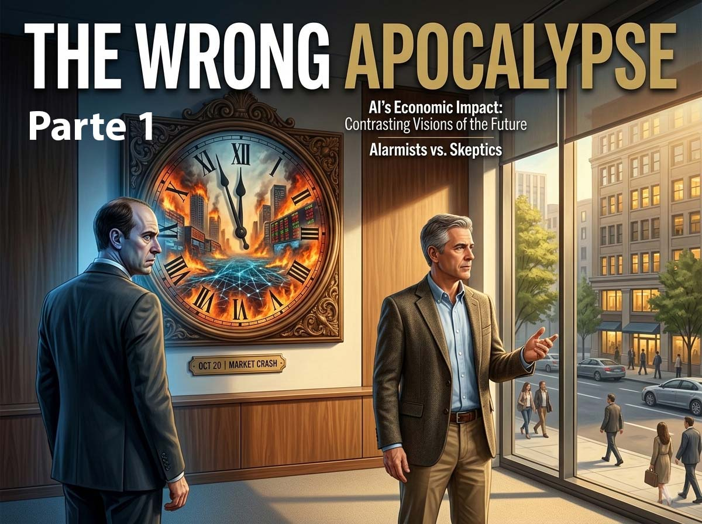

# The Wrong Apocalypse: Andrea Pignataro responds to Amodei - Part 1

*This article reconstructs, through a simulated interview, the thought of Andrea Pignataro, founder and CEO of ION Group, the richest man in Italy according to [Forbes 2026](https://forbes.it/2026/02/20/andrea-pignataro-supera-giovanni-ferrero-ora-piu-ricco-italia), based on his document [The Wrong Apocalypse](https://ionanalytics.com/wp-content/uploads/2026/02/The_Wrong_Apocalypse.pdf), published on February 15, 2026. As with the simulated interviews on this portal dedicated to Dario Amodei, [Part 1](https://aitalk.it/it/amodei-intervista-parte1.html) and [Part 2](https://aitalk.it/it/amodei-intervista-parte2.html), the questions here are also constructed backward from the answers: a narrative device to make the presentation of the author's ideas more fluid. Everything Pignataro "says" is derived directly and faithfully from his text.*

## Who is the man behind the document

Andrea Pignataro was born in Bologna in 1970. He studied economics at the University of Bologna, then earned a PhD in mathematics from Imperial College London, and in 2023 added a doctorate in management from Bocconi, as if his resume were never enough. He began his career as a bond trader at Salomon Brothers, the American investment bank that would soon become part of Citigroup, and from that position identified a gap: financial markets needed software capable of automating trading and risk management processes in a radically more efficient way than what existed then.

In 1997, while still at Salomon, he founded ION as a joint venture with a Pisan company named List, specializing in government bond trading. Two years later, he left the bank and made ION independent. From there began a serial acquisition path that transformed a fintech startup into what the [Bloomberg Billionaires Index](https://www.bloomberg.com/billionaires/profiles/andrea-pignataro/) describes as one of the largest private financial software providers in the world: over 13,000 employees, more than 50 offices worldwide, and an EBITDA of approximately 2.2 billion euros in 2024. Among the most well-known acquisitions: Fidessa, Dealogic, and more recently, in Italy, Cedacri, Cerved, and Prelios.

The newspaper Il Foglio has called him "the Italian Bloomberg." Yet Pignataro is almost invisible: he does not give interviews, he does not frequent tech conference stages, and he has no recognizable social media presence. *The Wrong Apocalypse* is in this sense a break from his habitual reserve, and the fact that he wrote it in response to Amodei's essay says a lot about how much that discussion is mobilizing even those who prefer silence.

## The market was afraid of the wrong thing

**Let's start from the beginning. Between late January and mid-February 2026, over 2 trillion dollars of capitalization disappeared from the enterprise software sector. How do you read that stock market crash?**

The market logic was simple and brutal: if an AI agent can do what current solutions offer, why should anyone continue to pay for them? This reasoning arrived two weeks after Dario Amodei had published [*The Adolescence of Technology*](https://www.darioamodei.com/essay/the-adolescence-of-technology), warning that advanced AI systems could disrupt 50% of entry-level office jobs in one to five years. If the CEO of the company building these tools says something like that, investors have every reason to flee any company whose revenue depends on knowledge workers sitting at their desks.

I want to argue that this reading is wrong—not wrong about the direction of travel, but wrong about the mechanism, wrong about the timing, and wrong about which companies are actually vulnerable.

**An important distinction. You are not saying that legacy software is safe.**

No. I am not saying that legacy software companies do not face any disruption. They do. The question is whether the break the market is pricing in—a rapid and binary replacement of existing tools by AI agents—corresponds to reality, or if it is a slower and more complex restructuring that takes place along lines that the stock market crash almost completely ignores. I believe the dominant narrative has a structural flaw in reasoning that is worth naming.

## Capacity is not coordination

**Amodei's essay uses the thought experiment of the "country of geniuses in a datacenter": fifty million entities, each smarter than any Nobel Prize winner, capable of autonomous work at speeds ten to one hundred times higher than human speed. How do you respond to that perspective?**

The thought experiment itself should make us cautious about the substitution thesis. A country of geniuses does not use any institutional infrastructure that enterprise software is built to serve. The reason enterprise software exists is that organizations are composed of many agents with different information, different incentives, and different levels of authority, and the software mediates the language games between them. This is the point I want to emphasize: enterprise software is not primarily a tool for performing cognitive work. It is a tool for coordinating cognitive work across organizational boundaries under conditions of incomplete trust.

**This is the heart of your critique. Can you make it more concrete?**

Consider an analogy. A new hire at a consulting firm can produce better analysis than the firm's existing PowerPoint templates allow. Does this mean the firm no longer needs PowerPoint? Of course not. Templates don't exist because analysts lack intelligence. They exist because the firm needs a standardized format that clients expect, that partners can review quickly, that junior consultants can produce without reinventing the structure every time, and that integrates with the firm's quality control process. The template is an institutional artifact, not a cognitive one. Enterprise software is, at scale, a vast collection of such artifacts. The value is not in the calculation, but in the coordination.

I call this *the substitution fallacy*: the assumption that because an AI system can perform the cognitive task that a piece of software facilitates, it can therefore replace the software itself. This confuses the task with the system.

**Where do you draw the line between vulnerable software and resilient software?**

There are two extreme positions. The first is that AI agents will rapidly replace enterprise software because they can perform the underlying cognitive tasks faster and at a lower cost. This position treats software as a cognitive tool when it is primarily a coordinative tool. The second, opposite position is that enterprise software is an inviolable moat because migration costs are permanent. The problem with this position is that it ignores the erosion already occurring at the margins—new companies choosing AI-native workflows instead of traditional management software, small teams building custom tools with Claude Code for cognitive software like data analysis, document generation, simple CRM, where complete substitution is already possible.

I believe AI erodes the standardized layer of enterprise software—tasks that are primarily cognitive and minimally coordinative—while making the institutional layer more valuable, not less. The software that will survive will be that which is deeply embedded in organizational processes, not that which performs a task that an intelligent agent could do autonomously.

## Organizations don't use Salesforce: they speak Salesforce

**There is a twentieth-century philosopher who unexpectedly enters your reasoning. Why Wittgenstein?**

Ludwig Wittgenstein argued that words do not carry meaning in the abstract. They carry it because the participants in a conversation share what he called a "language game"—a set of rules, contexts, and purposes that make communication possible. Enterprise software, at scale, is a vast collection of institutional language games. Data models, process flows, reporting standards, permission architectures—this is the grammar of organizational life. And like all grammars, it changes slowly, resists top-down imposition, and cannot be replaced without replacing the form of life in which it is embedded.

Organizations don't just use Salesforce: they speak Salesforce. Their processes, their metrics, their vocabulary for describing customer relationships—all of this is constituted by the software. Replacing the software is not like swapping one tool for another. It is like asking a community to adopt a new language. It can be done, but not quickly, and not without enormous friction.

**Amodei's essay treats the economy as a collection of tasks that AI will perform. You instead use the image of language games. What is the practical difference?**

The practical difference is huge. An entry-level associate at a law firm doesn't just draft contracts. They participate in a complex set of communicative practices—answering partner feedback in a specific register, navigating client expectations, understanding which deviations from the template are acceptable and which require escalation, knowing when to flag a risk and when to exercise silent judgment. These practices are the language games of the institution. They are not written in any manual. They are learned through participation and are reinforced through the social dynamics of the organization.

The prevailing narrative, in Amodei's essay and in the market, makes all AI-driven economic disruption sound like a story of cognitive capabilities: AI becomes smarter, so jobs disappear, so the companies that serve those jobs lose revenue. The more accurate narrative is: AI becomes smarter, but institutional language games have their own logic, and the speed of disruption depends on whether AI can enter those games or must wait for organizations to rebuild them. And rebuilding institutional language games is a process measured in years and decades, not quarters.

**So the right question the market should be asking is not "can AI do what this software does"?**

The alternative question is: "Can AI become the language in which this organization operates?" These are different questions, and they have different answers. For commodity software, the answer to the first question is increasingly yes, and the stock market crash is justified. For institutional software, the answer to the second question is: not soon, and the crash is an overreaction driven by a failure to distinguish between cognitive capability and institutional embedding.
