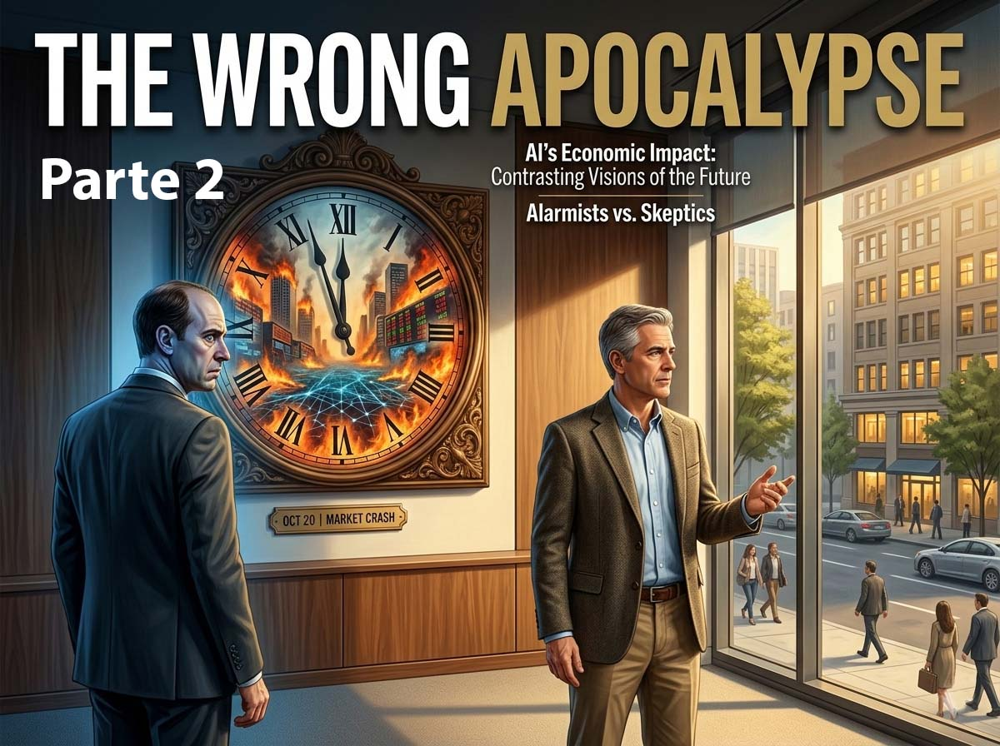

# Die falsche Apokalypse: Andrea Pignataro antwortet Amodei - Teil 2

*In diesem zweiten Teil setzen wir das lange simulierte Gespräch mit Andrea Pignataro, CEO der ION Group, fort und schließen es ab. Die Inhalte wurden rückwirkend aus den in seinem Dokument ["The Wrong Apocalypse"](https://ionanalytics.com/wp-content/uploads/2026/02/The_Wrong_Apocalypse.pdf) veröffentlichten Überlegungen rekonstruiert. Dies dient als narratives Mittel, um Pignataros kritische Analyse von Dario Amodeis Thesen und den Marktreaktionen unmittelbarer zugänglich zu machen.*

## Unternehmen bilden ihren eigenen Ersatz aus

**Bisher haben Sie die Marktpanik entzaubert. Aber in Ihrem Dokument führen Sie einen Punkt an, der – wenn möglich – noch beunruhigender ist als die These, die Sie widerlegt haben. Worauf beziehen Sie sich?**

Wenn eine Unternehmensberatung Claude nutzt, um Analysen für Kunden zu erstellen, erzielt sie nicht nur einen Produktivitätsgewinn. Sie lehrt Anthropic durch aggregierte Nutzungsmuster, Feedback, Verfeinerung und Bewertung – alles im Rahmen der erklärten Datenschutzrichtlinien –, wie die Sprachspiele der Beratung aussehen. Dabei geht es nicht um die proprietären Daten des Unternehmens im streng rechtlichen Sinne, sondern um etwas potenziell Wertvolleres: die Form, die Struktur, die Grammatik der Beratungsarbeit. Wie Analysen strukturiert werden. Was Kunden erwarten. Welche Standards für Gründlichkeit gelten. Wie Fehlermuster aussehen.

Im Laufe der Zeit und über Tausende solcher Unternehmen hinweg erstellt die KI-Plattform eine Kartografie des Sprachspiels „Beratung“ in einer Auflösung, die kein einzelnes Unternehmen von sich selbst besitzt. Das Gleiche gilt für Anwaltskanzleien, Wirtschaftsprüfungsgesellschaften, Finanzberater, Versicherungsmakler, Marketingagenturen, Architekturbüros, Ingenieurgesellschaften – jedes wissensbasierte Unternehmen, das KI-Werkzeuge eines Plattformbetreibers nutzt.

**Sie beschreiben eine Falle. Jedes Unternehmen, das diese Werkzeuge rational einsetzt, beschleunigt kollektiv seine eigene Irrelevanz.**

Genau. Unternehmen führen KI-Werkzeuge ein, um wettbewerbsfähig zu bleiben. Dabei füttern sie genau das System, das lernt, sie überflüssig zu machen. Die Logik des einzelnen Unternehmens ist in der Isolation betrachtet rational: Wenn du keine KI einführst, wird es dein Konkurrent tun, er wird schneller und billiger sein, und du wirst Marktanteile verlieren. Aber die kollektive Logik ist irrational: Jede rationale Einführung von KI durch ein Unternehmen beschleunigt die Fähigkeit der Plattform, den gesamten Sektor zu desintermediieren.

Es ist eine klassische Tragödie der Allmende, mit dem Unterschied, dass das zerstörte Gemeingut keine physische Ressource ist, sondern der ökonomische Schutzwall der gesamten Wirtschaft. Jeder Kunde ist gleichzeitig eine Einnahmequelle und ein Trainingssignal. Die Spielstruktur identisch mit einem Wettrüsten: Die individuell rationale Strategie führt zu einem kollektiv katastrophalen Ergebnis. Jedes Unternehmen rüstet mit KI auf. Die KI-Plattformen lernen aus dieser Aufrüstung. Die Plattformen werden fähig, das zu tun, was die Unternehmen tun. Die Unternehmen werden überflüssig. Und in dem Moment, in dem die Unternehmen das bemerken, haben sie ihren Ersatz bereits fertig ausgebildet.

**Sie führen dazu ein Zitat von Warren Buffett an.**

Buffett bemerkte einmal, dass man bei der Einstellung von Mitarbeitern nach drei Qualitäten suchen muss: Integrität, Intelligenz und Energie. Wenn es dem Kandidaten an der ersten fehlt, werden die anderen beiden dich umbringen. Dieser Aphorismus lässt sich auf die KI übertragen. Die Integrität – die Übereinstimmung der Interessen zwischen Werkzeug und Nutzer – ist das, was die von mir beschriebene Dynamik infrage stellt. Jede Interaktion lehrt die Plattform, die Unternehmen, die sie nutzen, überflüssig zu machen.

**Gibt es einen Ausweg aus dieser Falle?**

Anstatt KI auf geschlossenen Plattformen zu nutzen, können Unternehmen in Open-Source-Modelle investieren, die mit ihren eigenen Daten trainiert, auf ihrer eigenen Infrastruktur betrieben werden und ihrer eigenen Kontrolle unterliegen. Dieser Weg erfordert technische Investitionen, Datenmanagement und eine strategische Ausrichtung, über die die meisten Unternehmen derzeit nicht verfügen. Aber er bewahrt das institutionelle Wissen als proprietäre Ressource. Das Zeitfenster, um diese Kapazität aufzubauen, ist jetzt offen. Es wird nicht unbegrenzt offen bleiben.

## Die Kettenreaktion, die der Markt nicht sieht

**Beschränken sich die Folgen dieses Paradoxons auf Unternehmenssoftware, oder sehen Sie weitreichendere Ketteneffekte?**

Diese Folgen sind systemisch und werden sich durch jeden Sektor fortpflanzen, da die Sektoren, die desintermediiert werden, selbst die Infrastruktur für andere Sektoren bilden. Beratungsfirmen verlieren Umsätze, wenn Kunden sich direkt an die KI wenden. Anwaltskanzleien verlieren Umsätze, wenn Rechtsabteilungen von Unternehmen die Arbeit an Verträgen automatisieren. Wirtschaftsprüfungsgesellschaften verlieren Umsätze, wenn die KI Compliance und Prüfungsvorbereitung übernimmt. Versicherungsmakler verlieren Umsätze, wenn Verbraucher und Unternehmen Policen direkt über KI-Agenten vergleichen. Finanzberatungsunternehmen verlieren Umsätze, wenn automatisierte Portfoliomanager den Platz menschlicher Berater einnehmen. Marketingagenturen verlieren Umsätze, wenn Systeme wie Claude Cowork Kampagnenstrategien und kreative Briefings erstellen. In jedem Fall wird die Position des professionellen Dienstleisters als Vermittler zwischen Wissen und Kunden durch eine Plattform ausgehöhlt, die das Sprachspiel gut genug kennt, um es selbst zu spielen.

**Und dann die Auswirkungen auf angrenzende Branchen.**

Beratungsunternehmen sind Großabnehmer von Gewerbeimmobilien, Flugreisen, Hotels, Firmencatering, Personalvermittlung und Schulungsunternehmen. Anwaltskanzleien sind Großkunden derselben Branchen, dazu kommen Legal-Tech-Unternehmen, Gerichtsschreibdienste und Anbieter von Dokumentenmanagement. Wenn die Umsätze bei den professionellen Dienstleistungen schrumpfen, sinkt die Nachfrage in all diesen angrenzenden Sektoren. Der Einbruch bei der Software ist der sichtbare Teil des Eisbergs. Der Einbruch in den Sektoren, die Softwareunternehmen und professionellen Dienstleistern zuarbeiten, ist der Teil unter Wasser.

Die 2 Billionen Dollar, die an Börsenwert bei Software vernichtet wurden, sind nicht das volle Ausmaß des Schadens. Sie sind eine Anzahlung. Die Dynamik wird sich über alle Sektoren hinweg entfalten. Die gesamte wirtschaftliche Verschiebung beträgt nicht 2 Billionen, sondern ist um zwei Größenordnungen höher. Und sie ist ungesichert, weil es keine Anlageklasse gibt, die von einer systemischen Reduzierung des Volumens der Vermittlung intellektueller Arbeit isoliert wäre.

**Beschreiben Sie den Dominoeffekt im Detail.**

In der ersten Phase werden die KI-Plattformen so versiert in den Sprachspielen der Branche, dass sie Routineaufgaben für die Endkunden direkt übernehmen. Professionelle Dienstleistungsunternehmen verlieren Umsätze in diesen Basisdiensten. Einige passen sich an, indem sie in der Wertschöpfungskette nach oben rücken; viele können das nicht. Die erste Welle von Schließungen beginnt.

In der zweiten Phase, in der die KI-Plattformen durch aggregierte Interaktionen immer mehr institutionelles Wissen ansammeln, beginnen sie, in Arbeitsbereiche vorzudringen, die zuvor ein tiefes Kontextverständnis erforderten: strategische Beratung, komplexe Prozessstrategien, maßgeschneiderte Finanzmodellierung, organisatorisches Änderungsmanagement. Die Plattformen ersetzen das menschliche Urteilsvermögen nicht vollständig, aber sie reduzieren die Anzahl der für jedes Projekt benötigten Menschen. Sekundäre Kaskadeneffekte treffen Gewerbeimmobilien, Geschäftsreisen und angrenzende Branchen.

In der dritten Phase pflanzt sich der Umsatzrückgang bei professionellen Dienstleistungen durch das Finanzsystem fort. Risikokapital- und Private-Equity-Portfolios erleiden erhebliche Abwertungen. Die KI war mächtig genug, um bestehende Software zu zerstören, und die Investitionsausgaben der großen Cloud-Infrastrukturanbieter waren ungerechtfertigt, da das Gesamtvolumen der wirtschaftlichen Aktivitäten, die KI-Infrastruktur erfordern, zusammen mit den Sektoren geschrumpft ist, die durch KI desintermediiert wurden. Die Investmentthese bricht auf beiden Seiten gleichzeitig zusammen.

Die vierte Phase betrifft die Städte und das soziale Gefüge. Der Verlust von Arbeitsplätzen in professionellen Dienstleistungen – Recht, Beratung, Buchhaltung, Fachberatung, Finanzdienstleistungen – trifft nicht nur die Arbeitnehmer, sondern auch die Gemeinschaften, Institutionen und Steuergrundlagen, die von ihnen abhängen. Städte, deren Wirtschaft stark von professionellen Dienstleistungen abhängt – London, New York, Singapur, Zürich, Sydney –, erleben einen strukturellen Rückgang der Gewerbeimmobilienwerte, der lokalen Steuereinnahmen und der Konsumausgaben. Die Einschreibungen an Universitäten in Programmen für Wirtschaft, Recht und Buchhaltung brechen ein, was eine Krise im Hochschulsektor auslöst, die sich weiter durch die Wirtschaft fortpflanzt. Die sozialen Strukturen, die um intellektuelle Arbeit herum aufgebaut sind – Identitäten, Karrierewege, Lebensgrundlagen der Mittelschicht –, beginnen sich so aufzulösen, wie Vonnegut es beschrieben hat.

## Aufrichtigkeit als Wettbewerbsvorteil

**Ein Abschnitt Ihres Dokuments hat mich besonders beeindruckt: Wie Sie die „Safety-First“-Marke von Anthropic nicht nur als ethische Haltung, sondern als Instrument zur strategischen Akkumulation analysieren. Können Sie das erklären?**

Die Marke „Sicherheit zuerst“ schafft Vertrauen bei Regulierungsbehörden, Unternehmenskunden und der Öffentlichkeit. Dieses Vertrauen schafft Zugang: Zugang zu mehr Sektoren, mehr Anwendungsfällen, mehr Interaktionen, mehr Sprachspielen. Dieser Zugang verstärkt den Lernvorteil, den ich zuvor beschrieben habe. Das Unternehmen, dem Unternehmen am meisten vertrauen, ist dasjenige, dem sie den meisten Zugang gewähren. Dasjenige, dem sie den meisten Zugang gewähren, lernt ihre Sprachspiele am schnellsten. Dasjenige, das ihre Sprachspiele am schnellsten lernt, ist am besten positioniert, um genau diese Unternehmen schließlich zu desintermediieren.

Amodeis Essay widmet ein Fünftel seiner Länge den Risiken konzentrierter wirtschaftlicher Macht und warnt vor „einem einzelnen Unternehmen oder einer kleinen Anzahl von Unternehmen“, die die KI-Produktion kontrollieren. Aber er richtet diesen Blick nicht auf die strukturelle Position, die jede ausreichend vertrauenswürdige KI-Plattform einnimmt. Er warnt vor Machtkonzentration im Abstrakten und beschreibt gleichzeitig ein Unternehmen, das gemäß der Logik seiner eigenen Produkte das institutionelle Wissen jedes Sektors akkumuliert, den es bedient. Aufrichtigkeit und struktureller Vorteil schließen einander nicht aus. In einer Branche, in der Vertrauen die knappste Ressource ist, ist Aufrichtigkeit der strategische Vorteil.

## Europa als rettende Reibung

**Ihr Dokument schließt mit einer überraschenden geografischen Note. Normalerweise wird die europäische regulatorische Fragmentierung als Nachteil im KI-Zeitalter angeführt. Sie kehren das um.**

Die europäische regulatorische Fragmentierung, die normalerweise als Handicap im KI-Zeitalter gilt, könnte sich als Bremse für den Dominoeffekt erweisen. Dieselben institutionellen Reibungen, die die Einführung der KI verlangsamen, bremsen auch jede Phase des Übertragungsmechanismus: siebenundzwanzig Regulierungssysteme, vielfältige Rechtstraditionen, strenger Arbeitsschutz und Sprachbarrieren verhindern den Umbruch zwar nicht, aber sie behindern die Geschwindigkeit, mit der sich der Bruch in einer Schicht auf die nächste fortpflanzt.

Die DSGVO und der AI Act begrenzen das Erlernen aggregierter Muster, das die Akkumulation von bereichsübergreifendem Wissen vorantreibt. Ein robusterer Kündigungsschutz verlangsamt die Übersetzung von Umsatzverlusten in Personalabbau. Kultureller Widerstand gegen schnelle Umstrukturierungen verlangsamt die Übersetzung von Personalabbau in den Zusammenbruch von Gemeinschaften. Nichts davon ist Immunität. Es ist Reibung, und Reibung ist bei einem Dominoeffekt der Unterschied zwischen einem gesteuerten Übergang und einem strukturellen Bruch.

**Die abschließende Frage: Was sollten wir wirklich fürchten?**

Der Markt gerät wegen der falschen Sache in Panik. Die berechtigte Panik betrifft den strukturellen Anreiz für Unternehmen, Werkzeuge einzuführen, deren Wettbewerbslogik es erfordert, dass sie die gesamte Grammatik jedes Sektors, den sie bedienen, sowohl querschnittlich als auch längsschnittlich erlernen. Dies ist kein Ereignis der Neubewertung von Preisen. Es ist ein zivilisatorischer Übergang. Die richtige Frage lautet: Kann die KI in die Sprachspiele eintreten, die das Wirtschaftsleben ausmachen? Und die nächste Frage ist: Was passiert, wenn die Institutionen, die die KI in ihre Sprachspiele einladen, entdecken, dass sie ihr beigebracht haben, ohne sie zu spielen?

Vonnegut hatte das verstanden. Sein „Player Piano“ war keine Geschichte über Maschinen, die intelligenter als Menschen waren. Es war die Geschichte einer Gesellschaft, die vergessen hatte, wozu Menschen gut waren. Das ist die Frage, die wir uns stellen sollten: nicht, ob die KI das tun kann, was Software tut, oder was Berater tun, oder was Anwälte tun, sondern was mit dem institutionellen Gefüge der Zivilisation passiert, wenn die Einheiten, die es zusammenhalten, nicht mehr notwendig sind. Und diese Frage wird langsam und schmerzhaft im Laufe des nächsten Jahrzehnts beantwortet werden – durch die kumulativen Entscheidungen von Millionen von Unternehmen, die genau jetzt die individuell rationale und kollektiv katastrophale Entscheidung treffen, ihren eigenen Ersatz auszubilden.

Vonneguts Dystopie war das Ergebnis einer Gesellschaft, die aufhörte, aufmerksam zu sein. Der Dominoeffekt, den ich beschrieben habe, ist eine mögliche Flugbahn. Flugbahnen können verändert werden.
