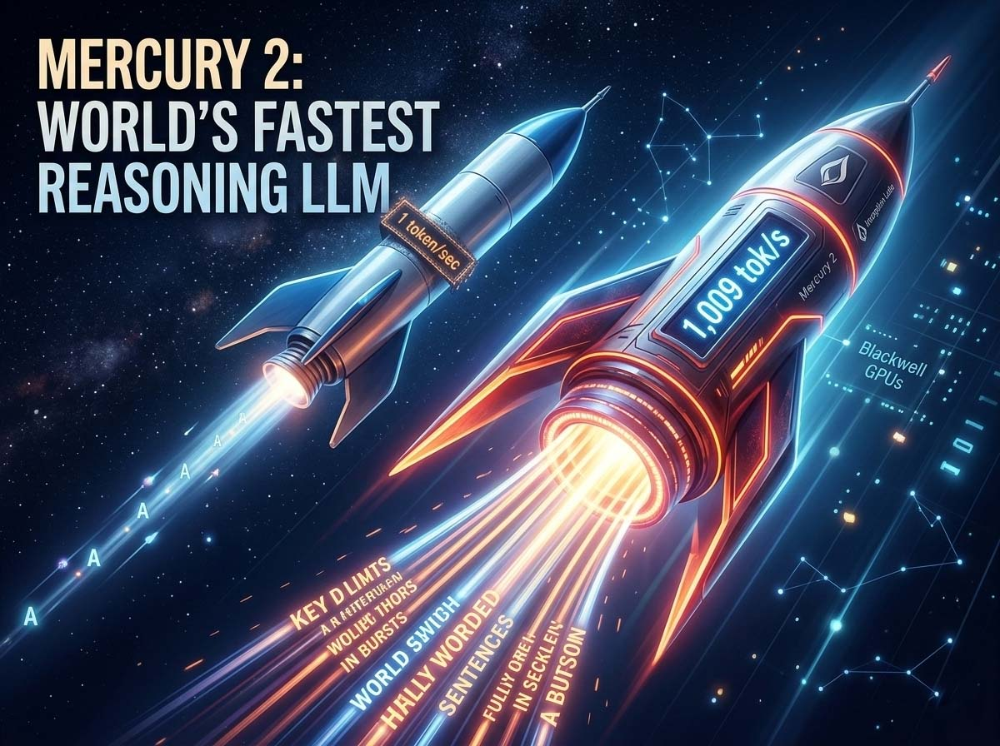
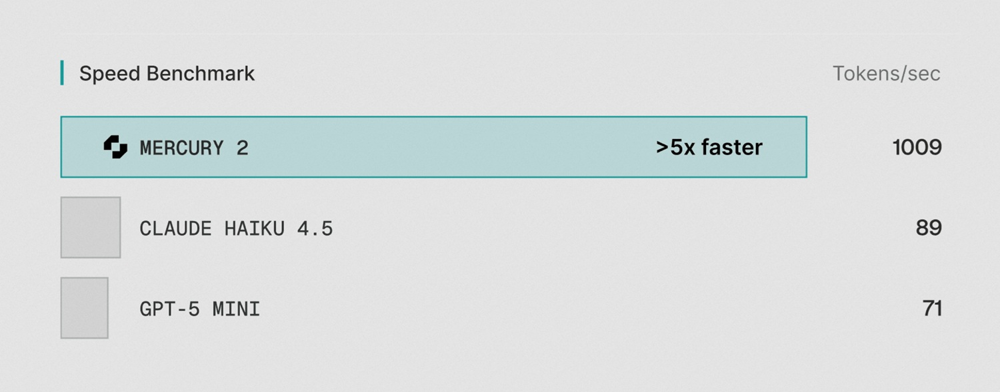
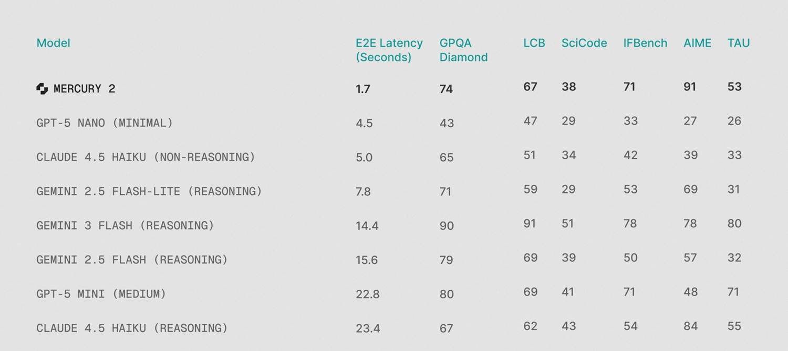

# Tausend Token pro Sekunde: Mercury 2 will die Regeln der KI neu schreiben

*Es gibt einen seltsamen, fast befremdlichen Moment, den jeder, der Mercury 2 von Inception Labs zum ersten Mal benutzt hat, ähnlich beschreibt: Man tippt die Frage ein, drückt die Eingabetaste, und die Antwort ist schon da, in voller Länge, noch bevor das Gehirn registriert hat, dass man überhaupt etwas angeklickt hat. Das ist kein visueller Effekt, kein Interface-Trick. Das Modell generiert tatsächlich über 1.000 Token pro Sekunde.*

Um eine Größenordnung zu geben: Ein durchschnittlicher italienischer Roman hat etwa 300.000 Zeichen, was in etwa 90.000–100.000 Token entspricht. Mercury 2 würde ihn theoretisch in weniger als zwei Minuten schreiben. Claude 4.5 Haiku, eines der heute am weitesten verbreiteten „schnellen“ Modelle, stoppt bei etwa 89 Token pro Sekunde. GPT-5 Mini bei etwa 71. Der Unterschied ist nicht inkrementell: Er ist strukturell.

All dies ist möglich, weil Mercury 2 nicht wie jedes andere Sprachmodell funktioniert, das Sie jemals benutzt haben. Um zu verstehen, warum, muss man einen Schritt zurücktreten und betrachten, wie generative künstliche Intelligenz Text produziert und wie sie das von Anfang an auf eine einzige Art und Weise getan hat.

## Zwei Familien, ein dominantes Paradigma

Wenn man Mercury 2 verstehen will, muss man zuerst den Flaschenhals verstehen, den es zu beseitigen versucht. Und dieser Flaschenhals hat einen präzisen technischen Namen: autoregressive Generierung.

Alle großen Sprachmodelle, die Sie täglich benutzen – ChatGPT, Claude, Gemini –, funktionieren nach demselben Grundprinzip: Sie produzieren Text Token für Token, von links nach rechts, und jedes Token hängt von all denen ab, die ihm vorausgehen. Es ist wie beim Tippen auf einer Schreibmaschine: Man kann den dritten Buchstaben nicht tippen, bevor man den zweiten getippt hat. Diese sequentielle Abhängigkeit ist architektonisch bedingt, keine Ineffizienz, die mit mehr Hardware oder Softwareoptimierungen beseitigt werden könnte. Es liegt in der Natur des Mechanismus selbst.

Diffusion ist etwas anderes. Die Technik stammt aus der Welt der Bildgenerierung – sie bildet die Grundlage für Stable Diffusion, Midjourney, DALL-E – und funktioniert genau umgekehrt: Anstatt das Ergebnis Stück für Stück aufzubauen, geht sie von einem völlig „verrauschten“ und unpräzisen Output aus und verfeinert ihn schrittweise parallel an mehreren Stellen gleichzeitig, bis sie in wenigen Schritten zur korrekten Antwort konvergiert. Es ist nicht mehr wie eine Schreibmaschine, sondern eher wie ein Fotograf, der ein Polaroid entwickelt: Das gesamte Bild entsteht allmählich, alles auf einmal.

Diese Technik auf Text anzuwenden, ist jedoch im Gegensatz zu Bildern ein viel schwierigeres Problem. Sprache unterliegt logischen, grammatikalischen und semantischen Beschränkungen, die Bilder nicht in demselben Maße haben. Jahrelang galt die Diffusion als ungeeignet für Text. Wenn Sie den technischen Vergleich zwischen den beiden Ansätzen vertiefen möchten, finden Sie auf dem Portal [einen Artikel, der genau diesem Thema gewidmet ist](https://aitalk.it/it/diffusion-vs-autoregressive.html).

[Bild von inceptionlabs.ai](https://www.inceptionlabs.ai/blog/introducing-mercury-2)

## Wer das unmögliche Problem gelöst hat

Der Durchbruch kam aus Stanford. Stefano Ermon, Informatikprofessor und einer der Miterfinder der in Stable Diffusion und DALL-E verwendeten Diffusionstechniken, arbeitete seit 2019 an diesem Problem. Jahrelange Forschung, um zu verstehen, wie man Diffusion auf Text anwenden kann, bis zu einem Wendepunkt, der in einem auf der ICML 2024 (der führenden internationalen Konferenz für maschinelles Lernen) vorgestellten Paper dokumentiert wurde, das den Preis für den besten Artikel gewann. Das ist keine kleine Auszeichnung: Es bedeutet, dass die wissenschaftliche Gemeinschaft den Fortschritt offiziell als bedeutend anerkannt hat.

Im Jahr 2024 gründete Ermon Inception Labs in Palo Alto und nahm zwei ehemalige Studenten mit, die inzwischen Professoren geworden waren: Aditya Grover von der UCLA und Volodymyr Kuleshov von Cornell. Das erweiterte Team umfasst Forscher und Ingenieure von Google DeepMind, Meta AI, Microsoft AI und OpenAI. Die Beiträge der Gruppe beschränken sich nicht nur auf Diffusion: In ihrem kollektiven Lebenslauf finden sich grundlegende Arbeiten zu Flash Attention, Decision Transformers und Direct Preference Optimization (DPO) – Techniken, die die Entwicklung moderner Sprachmodelle geprägt haben.

Die Finanzierung erfolgte im November 2025 mit einer Seed-Runde über [50 Millionen Dollar](https://techcrunch.com/2025/11/06/inception-raises-50-million-to-build-diffusion-models-for-code-and-text/), angeführt von Menlo Ventures unter Beteiligung von Mayfield, M12 (dem Venture-Capital-Fonds von Microsoft), Snowflake Ventures, Databricks Ventures, NVentures (dem Investmentarm von NVIDIA) und Innovation Endeavors. Als Angel-Investoren fungieren Andrew Ng und Andrej Karpathy; Letzterer, ehemaliger KI-Direktor bei Tesla und Mitbegründer von OpenAI, hat seine Follower öffentlich ermutigt, das Modell auszuprobieren, und angemerkt, dass die nicht-autoregressive Natur der Diffusion zu einer „neuen Psychologie, neuartigen Stärken und Schwächen“ führen könnte. Wenn Karpathy sagt, dass es sich lohnt, etwas auszuprobieren, neigt die Branche dazu, zuzuhören.

## Mercury 2: Was es kann, was es kostet, wie gut es ist

Am 24. Februar 2026 hat Inception [Mercury 2 auf den Markt gebracht](https://www.inceptionlabs.ai/blog/introducing-mercury-2) und es als das erste in der Produktion verfügbare, auf Diffusion basierende „Reasoning LLM“ präsentiert. Die Geschwindigkeitszahlen wurden unabhängig von [Artificial Analysis](https://artificialanalysis.ai/models/mercury-2) verifiziert, einem der strengsten Benchmark-Unternehmen der Branche: 711,6 Token pro Sekunde in ihren standardisierten Multi-Turn-Evaluierungen, womit Mercury 2 den ersten Platz unter 132 überwachten Modellen einnimmt. Bei optimaler Hardwarekonfiguration – NVIDIA Blackwell GPUs mit NVFP4-Präzision – steigen die internen Zahlen von Inception auf 1.009 Token pro Sekunde bei einer End-to-End-Latenz von 1,7 Sekunden.

Der Vergleich ist gnadenlos für Konkurrenzmodelle in derselben Klasse: Gemini 3 Flash benötigt 14,4 Sekunden für Antworten, Claude 4.5 Haiku mit Reasoning 23,4 Sekunden. Das ist kein gradueller Unterschied, sondern ein Unterschied in der Benutzererfahrung; das subjektive Gefühl der „Instantanität“ ändert sich völlig. [InfoWorld](https://www.infoworld.com/article/4137528/inceptions-mercury-2-speeds-around-llm-latency-bottleneck.html) hat es auf den Punkt gebracht: Mercury 2 optimiert nicht die Margen, sondern definiert den Flaschenhals neu.

Auf der qualitativen Seite positioniert sich Mercury 2 ehrlich in der Klasse der „schnellen und leichten“ Modelle, nicht unter den Giganten des tiefgehenden Denkens. Die veröffentlichten Benchmarks sprechen eine klare Sprache: 91,1 bei AIME 2025 (Wettbewerbsmathematik), 73,6 bei GPQA Diamond (fortgeschrittenes wissenschaftliches Denken), 67,3 bei LiveCodeBench (Coding), 52,9 bei TAU-bench (komplexe Agenten). Dies sind Ergebnisse, die mit Claude 4.5 Haiku und GPT-5 Mini konkurrieren können, aber nicht mit Claude Opus 4.6 oder den besten Modellen für erweitertes Reasoning, die im Artificial Analysis Intelligence Index Werte im Bereich von 80–90 von 100 erreichen, während Mercury 2 bei 33 stoppt.

Die Preisgestaltung ist einer der interessantesten Aspekte: 0,25 Dollar pro Million Token Input, 0,75 pro Million Output. Zum Vergleich: Claude 4.5 Haiku kostet etwa 4,90 Dollar pro Million Output-Token, also etwa sechseinhalbmal so viel. GPT-5 Mini liegt bei etwa 1,90 Dollar, etwa zweieinhalbmal so viel. Bei gleichem Volumen kann der Kostenunterschied in Pipelines mit hohem Datenaufkommen Zehntausende von Dollar pro Monat betragen. Die API ist mit dem OpenAI-Standard kompatibel: Wer bereits das OpenAI-Ökosystem nutzt, kann es theoretisch ersetzen, ohne den Code umzuschreiben.

[Bild von inceptionlabs.ai](https://www.inceptionlabs.ai/blog/introducing-mercury-2)

## Wo Mercury 2 wirklich funktioniert

Inception sagt explizit, für welche Anwendungsfälle Mercury 2 konzipiert ist, und die zum Start gesammelten Erfahrungsberichte decken sich mit dieser Positionierung.

Das natürlichste Feld sind **agentische Loops**: Systeme, in denen ein KI-Agent Dutzende oder Hunderte von Inferenzaufrufen ausführt, um eine Aufgabe zu erledigen – Code-Analyse, iterative Recherche, Datenpipelines. In diesen Kontexten tritt die Latenz nicht nur einmal auf, sondern multipliziert sich bei jedem Schritt. Bei herkömmlichen Modellen führt ein Workflow mit zehn Schritten, der 20 Sekunden pro Inferenz benötigt, zu einer Gesamtwartezeit von über drei Minuten. Mit Mercury 2 sinkt derselbe Workflow auf unter zwanzig Sekunden. Es ist nicht nur schneller: Es verändert, welche Interaktionen in Echtzeit physisch praktikabel sind.

Zed, ein in fortgeschrittenen Entwicklungsumgebungen sehr geschätzter Code-Editor, ist einer der Partner zum Start: Mitbegründer Max Brunsfeld beschrieb die Vorschlagsgeschwindigkeit als so schnell, dass sie sich anfühlt, als wäre sie „Teil des eigenen Denkens“. Skyvern, eine Automatisierungsplattform für Web-Agenten, berichtete, dass Mercury 2 für ihre Anwendungsfälle mindestens doppelt so schnell ist wie GPT-5.2. Wispr Flow, ein Tool zur Echtzeit-Bereinigung von Sprachtranskriptionen, bewertete es als unersetzlich für Anwendungen mit geringer Latenz in der Mensch-Maschine-Interaktion.

**Voice AI** ist der zweite Bereich, in dem Geschwindigkeit entscheidend wird. Sprachschnittstellen haben das engste Latenzfenster im gesamten KI-Ökosystem: Eine Antwort, die länger als zwei Sekunden auf sich warten lässt, bricht die Natürlichkeit des Gesprächs. Bei 70–90 Token pro Sekunde liegen autoregressive Modelle an der Grenze der Nutzbarkeit für Sprache. Mercury 2 beseitigt diese Grenze mit einem enormen Puffer. OpenCall und Happyverse AI, beide im Bereich von Sprach-Avataren und Telefon-Agenten tätig, nannten die geringe Latenz als den entscheidenden Enabling-Faktor.

Für **Such- und RAG-Pipelines** (Retrieval-Augmented Generation), in denen Dokumente nacheinander abgerufen, klassifiziert und zusammengefasst werden, ermöglicht Mercury 2 einen Denkschritt im Suchzyklus, ohne das Latenzbudget zu sprengen. SearchBlox, tätig in der Unternehmenssuche für Compliance, Analytics und E-Commerce, erklärte, dass die Partnerschaft mit Inception „Echtzeit-KI für ihr Produkt praktikabel macht“.

## Schatten im Bild: Die Grenzen, die zählen

Mercury 2 ist derzeit ein **reines Textmodell**. Es verarbeitet keine Bilder, Audios oder Videos. In einer Landschaft, in der multimodale Fähigkeiten fast zum erwarteten Standard geworden sind, insbesondere für komplexe Unternehmensanwendungen, ist dies eine konkrete Einschränkung, kein unbedeutendes Detail.

Zudem ist es ein **reines Cloud-Modell ohne offene Gewichte**. Es gibt keine herunterladbare Version, kein On-Premise-Deployment ist möglich und es steht kein Fine-Tuning auf proprietären Daten zur Verfügung. Für Organisationen mit Anforderungen an die Datenresidenz, Modellsouveränität oder der Notwendigkeit einer spezialisierten Anpassung – Bereiche wie Gesundheitswesen, Finanzen, Verteidigung – schließt dies Mercury 2 für eine breite Klasse von Anwendungsfällen aus.

Hinzu kommt das **Problem der Weitschweifigkeit**. Wie in der [unabhängigen Bewertung von Awesome Agents](https://awesomeagents.ai/reviews/review-mercury-2/) dokumentiert, stellte Artificial Analysis fest, dass Mercury 2 während ihrer Evaluierungen 69 Millionen Output-Token produzierte, gegenüber einem Durchschnitt von 20 Millionen bei äquivalenten Modellen. Das Modell neigt dazu, mehr Text als nötig zu generieren. In der Praxis ist dies nicht nur ein ästhetisches Problem: Es bläht die effektiven Output-Kosten auf und bringt Rauschen in Workflows, die strukturierten und prägnanten Output erfordern. Dieses Verhalten ist durch Prompt Engineering steuerbar, aber es ist ein Standardverhalten, das Aufmerksamkeit erfordert.

Die tiefer liegende Frage betrifft die **Reife der Architektur**. Diffusionsmodelle für Text sind eine aufstrebende Klasse; Mercury 2 ist faktisch das erste Modell dieser Art, das in der kommerziellen Produktion verfügbar ist. Das bedeutet, dass es weniger Ingenieure gibt, die die Fehlerquellen in der Produktion kennen, weniger Dokumentation zu Edge Cases und eine kleinere Community, die typische Probleme bereits angegangen und gelöst hat. Wenn in einem Produktionssystem etwas schiefgeht – und das passiert immer –, ist der Support des Ökosystems für eine etablierte Technologie wie GPT oder Claude unvergleichlich reichhaltiger. Das ist keine Kritik an der Architektur, sondern ein realer Kostenfaktor, der in keinem Benchmark auftaucht.

Schließlich ist anzumerken, dass die höchsten Geschwindigkeitszahlen, der Titel von 1.009 Token pro Sekunde, NVIDIA Blackwell GPUs mit NVFP4-Präzision voraussetzen. Die Daten von Artificial Analysis, die die reale Standard-Cloud-Infrastruktur widerspiegeln, bescheinigen 711,6 Token pro Sekunde: eine außergewöhnliche Zahl, aber entfernt von der Schlagzeile. Für ältere Hardware liegen keine veröffentlichten Daten vor.

## Der Markt spricht, aber mit Vorsicht

Die relevante Frage ist nicht nur, ob Mercury 2 funktioniert – die unabhängigen Belege deuten darauf hin, dass die Geschwindigkeitsversprechen real sind –, sondern ob der Markt Diffusionsmodelle tatsächlich in großem Maßstab annimmt oder ob wir uns noch in der Phase der technischen Neugier befinden.

Signale für eine Adoption sind vorhanden: dokumentierte Integrationen mit Tools wie Zed, Skyvern, Wispr Flow, SearchBlox, Viant (eine Werbeplattform, die angab, Mercury zur Echtzeit-Optimierung von Kampagnen zu nutzen). Die im November 2025 angekündigte [Verfügbarkeit auf Azure AI Foundry](https://www.inceptionlabs.ai/blog/mercury-azure-foundry) öffnet Mercury das riesige Microsoft-Unternehmensökosystem. Die Kompatibilität mit der OpenAI-API senkt die Eintrittsbarriere für diejenigen, die bereits in diesem Ökosystem tätig sind, auf fast Null.

Andererseits begrenzt die Position von Mercury 2 in der „Haiku-Klasse“ der Modelle – konkurrenzfähig mit schnellen Modellen, aber nicht mit den besten für tiefgehendes Reasoning – strukturell seinen Einsatz auf Fälle, in denen Geschwindigkeit Priorität vor der Komplexität des Denkens hat. Für Entscheidungen, die die Analyse langer und komplexer Dokumente, fortschrittliche Multi-Source-Synthese oder das Nachdenken über nuancierte Szenarien erfordern, behalten Frontier-Modelle einen realen Vorsprung, den Mercury 2 nicht beseitigt. Wie [The New Stack](https://thenewstack.io/inception-labs-mercury-2-diffusion/) bemerkte, ist Ermon selbst in diesem Punkt aufrichtig: Mercury 2 konkurriert mit der Haiku/Flash-Klasse, nicht mit Opus oder GPT.

Die Wette von Inception besteht darin, dass die Qualitätsentwicklung bei Diffusionsmodellen der gleichen Skalierungskurve folgen wird, die bei autoregressiven Modellen zu beobachten war: Die Qualität kann im Laufe der Zeit verbessert werden, wobei der strukturelle Vorteil der Geschwindigkeit als Ausgangspunkt dient. Es ist eine plausible Wette, die jedoch noch nicht verifiziert ist.

## Offene Fragen: Ist die Zukunft parallel?

Mercury 2 beantwortet nicht die größte Frage, die es aufwirft: Kann die Diffusion tatsächlich zum dominanten Paradigma für Sprachmodelle werden, oder wird sie ein spezialisierter Ansatz für Hochgeschwindigkeits-Anwendungsfälle bleiben?

Ermon hat erklärt, dass er sich eine Zukunft vorstellt, in der alle Sprachmodelle auf Diffusion basieren. Es ist eine ehrgeizige Vision, und derjenige, der sie geäußert hat – einer der Wissenschaftler, die die Grundlagen der Diffusion für Bilder mit aufgebaut haben –, hat die Referenzen, um sie zu untermauern. Aber der Übergang von „es funktioniert außergewöhnlich gut für eine spezifische Teilmenge von Anwendungsfällen“ zu „es ersetzt das autoregressive Paradigma als allgemeines Modell“ ist ein riesiger Sprung, und es gibt noch keine Beweise dafür, dass die Qualitätslücke zu den Frontier-Modellen zwangsläufig geschlossen wird.

Darüber hinaus bleiben konkrete offene Fragen: Wie verhalten sich Diffusionsmodelle bei sehr langen Denkketten (Chain-of-Thought), wo die Konsistenz über Tausende von Token entscheidend ist? Was passiert mit der Qualität bei 50.000 oder 100.000 Token Kontext, wenn das 128K-Fenster wirklich ausgereizt wird? Wie lässt sich eine Architektur ethisch verwalten, deren Output-Erzeugung weniger schrittweise interpretierbar ist als die autoregressive?

Die Geschwindigkeit ist real. Der Preis ist wettbewerbsfähig. Das Team ist über jeden vernünftigen Zweifel hinaus glaubwürdig. Die aktuellen Einschränkungen sind konkret und dokumentiert. Mercury 2 stellt etwas echtes Neues in der Landschaft der Sprachmodelle dar – nicht das intelligenteste Modell, das heute verfügbar ist, aber vielleicht ein Signal dafür, in welche Richtung die Diskussion über die Effizienz der KI-Inferenz noch gehen muss.

Die Schreibmaschine, Token für Token, könnte tatsächlich ausgedient haben. Aber der Roman, der danach geschrieben wird, und wie gut er sein wird, muss erst noch bewiesen werden.

---
